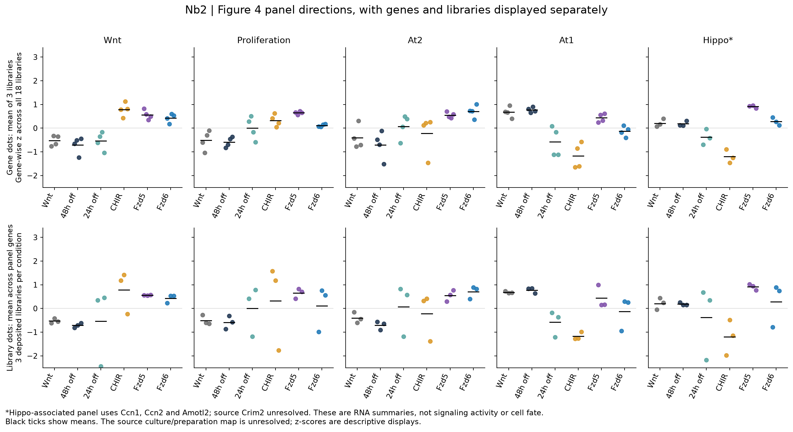
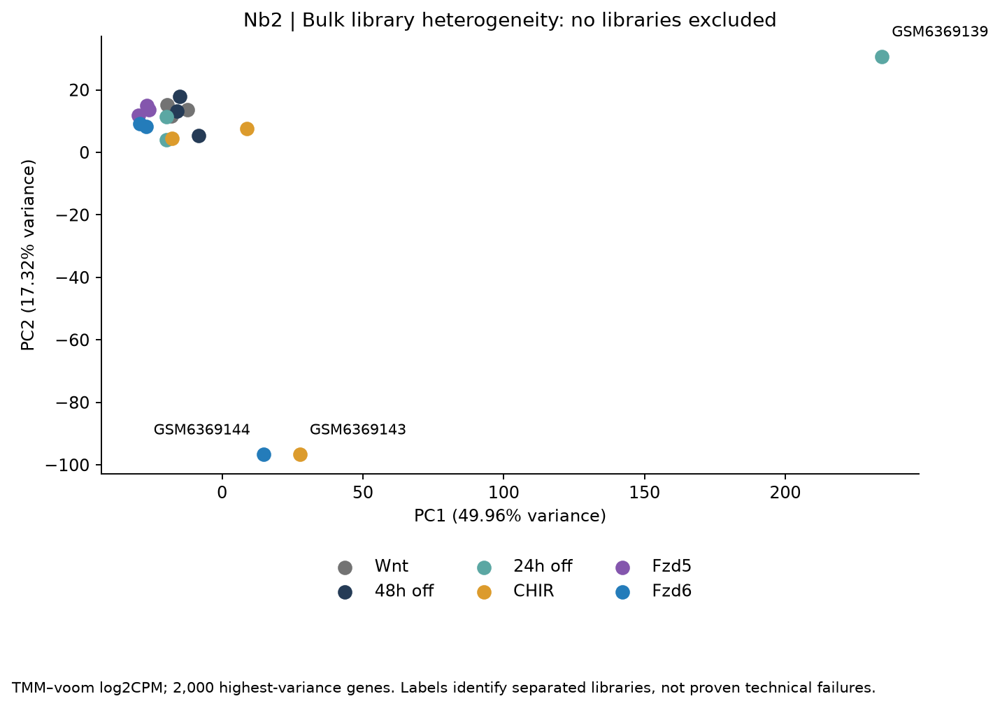
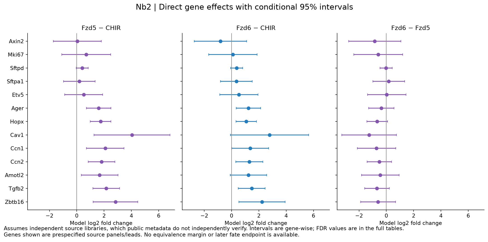
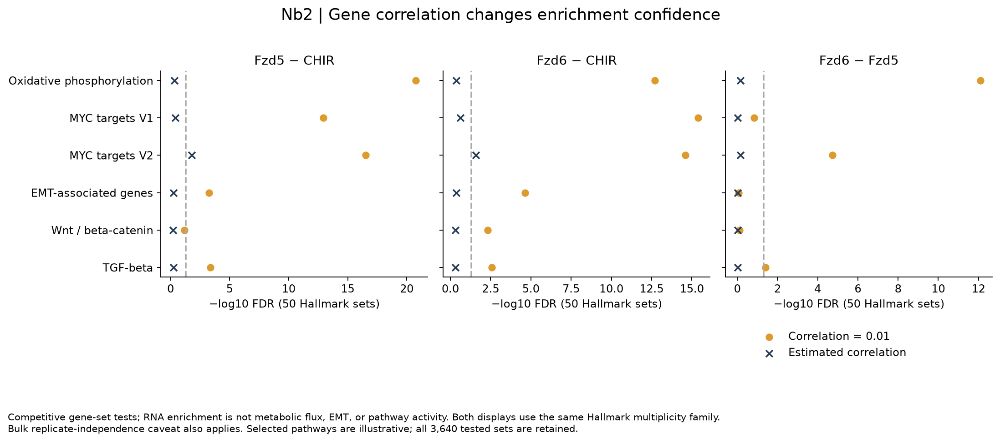
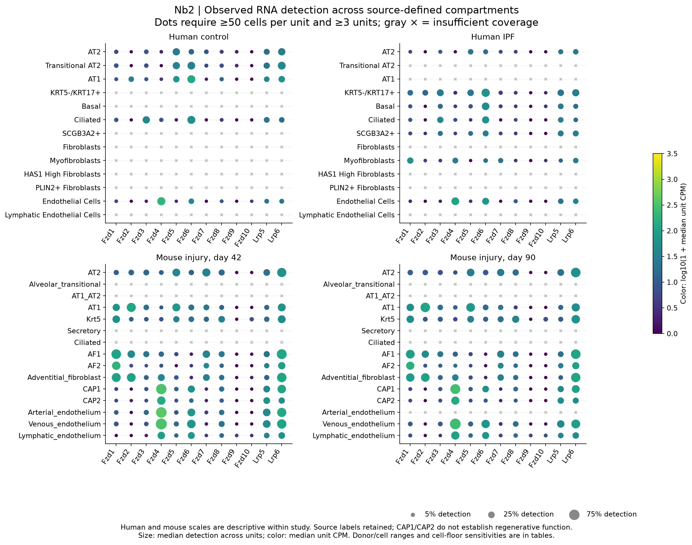
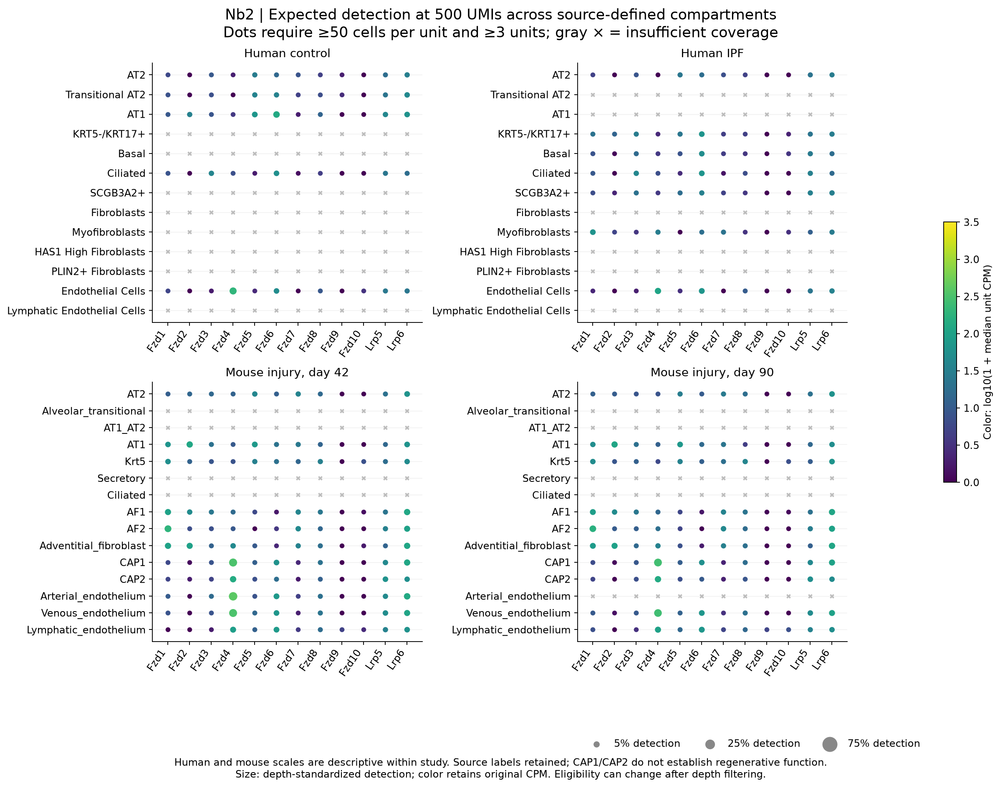

# Nb2 figure gallery

The later [branch-analysis gallery](branch_analysis/FIGURES.md) adds five figures
for library influence, the contextual reference, epithelial, fibroblast and
vascular branches. All remain within the paper's analysis package.

These are repository reanalyses, with source reproduction and exploratory context
distinguished in [the results](RESULTS.md). Figures show deposited libraries or
source sample-level summaries; none establishes receptor function or cell fate.

## Source panel directions

Top: genes averaged over libraries. Bottom: individual libraries summarized over
genes. Crim2 is unresolved; the Hippo panel contains three resolved genes. Methods,
effect units and all contrasts: [bulk report](trials/bulk_v1/REPORT.md).

## Library heterogeneity

The flagged libraries were retained. PCA separation alone is not a technical
failure criterion and does not justify a guessed batch or pairing model.

## Direct contrasts and conditional uncertainty

Intervals assume the source libraries are independent. Public metadata do not
independently verify their preparation identities. These are gene-wise intervals,
with complete multiplicity-adjusted outputs in the trial tables.

## Enrichment sensitivity

The displayed settings use the same 50-set Hallmark multiplicity family. Oxidative
phosphorylation is sensitive to the correlation assumption. RNA enrichment does
not measure metabolic flux or a causal pathway.

## Receptor context, observed detection

Unit medians, with at least 50 cells per unit/state and at least three eligible
units. Gray crosses indicate inadequate coverage. Human source reuse and mouse
extension are not independent validation. Mouse days 42/90 were selected for
display based on unit coverage; other days are retained in the tables.

## Receptor context, standardized detection

Point size is analytic expected detection after sampling 500 UMIs per eligible
cell; color retains original CPM. Depth-eligible cells must separately meet the
coverage floor. Read [the atlas report](trials/atlas_v1/REPORT.md) before comparing
states, disease groups or species.
