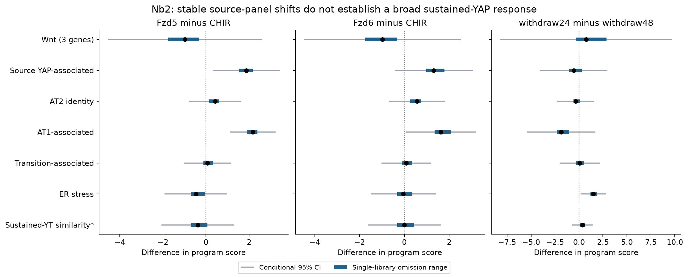
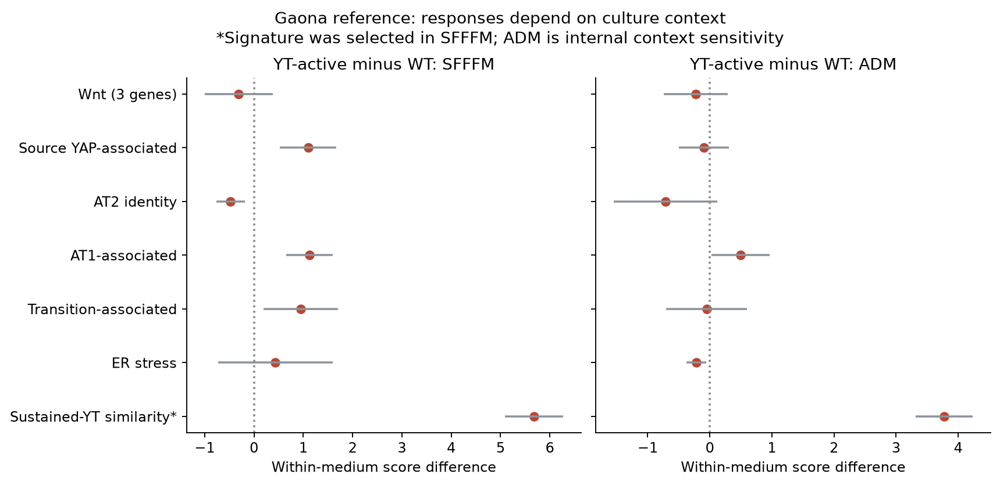
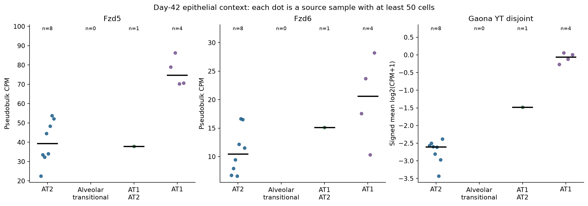
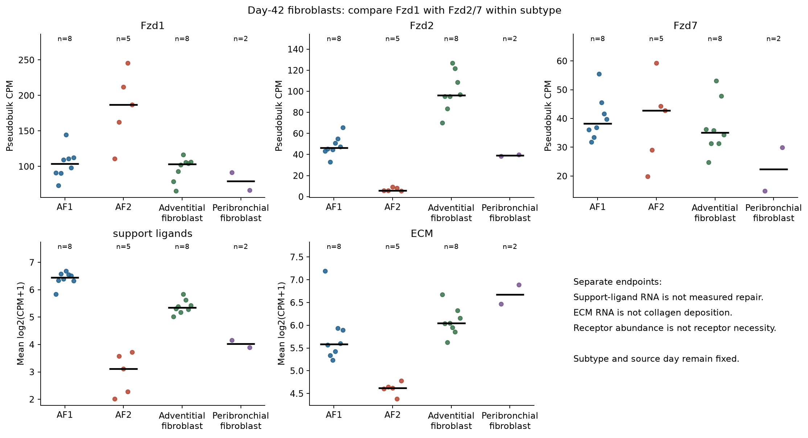
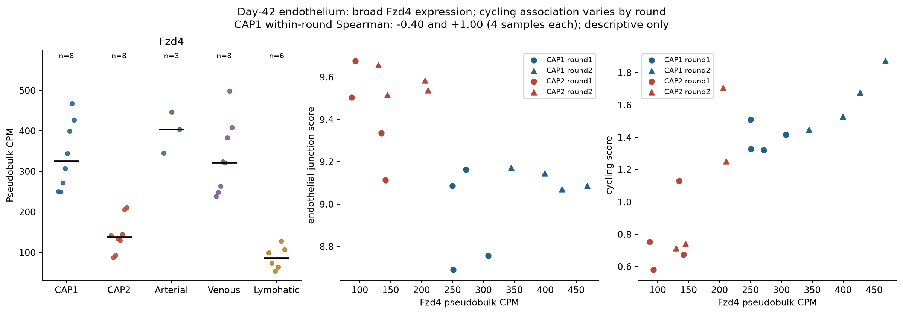

# Nb2 branch-analysis figures

All five figures have PNG and editable SVG versions in
[trials/extension_v1/figures](trials/extension_v1/figures). They are generated from
saved tables by [04_figures.py](scripts/04_figures.py). No fitted curve is added
to the atlas sample scatterplots. The [results](RESULTS.md) own the interpretation.

## Source response and library influence

Black points are differences between three source libraries per arm. Gray ranges
are Welch95% intervals conditional on unverified independent preparations; blue
ranges omit one library at a time with normalization fixed. The blue ranges are
not confidence intervals. All bounds are shown. Scores are mean log2CPM, except
the signed sustained-YT similarity score (up mean minus down mean); * denotes
the disjoint Gaona-derived list, with34 up/47 down genes mapped in Nb2.
Panels and comparator arms were specified before these new outputs. Source:
[bulk_program_effects.tsv](trials/extension_v1/tables/bulk_program_effects.tsv).

## Contextual sustained-YAP/TAZ comparator

Separate YT-active minus WT contrasts in SFFFM (3 versus3 source-reported mice)
and ADM (4 versus4). Gray intervals are conditional Welch95% diagnostics. The
signature was selected on SFFFM, so its apparent separation and intervals in that
medium are selection-conditioned, not validation. ADM is an internal context
check; cross-medium animal pairing is unresolved. The reference is a Stk3/4-loss
response, not a direct-target activity score or classifier of persistent fibrosis.
List membership differs in Nb2, so effect magnitudes across studies are not treated
as calibrated biological differences. [Membership](trials/extension_v1/tables/bulk_panel_membership.tsv).

## Epithelial state context

Each dot is one source sample/state with>=50 cells after predicted-doublet removal.
Black bars are medians; n is the number of source units, not cells. Empty
transitional and singleton AT1_AT2 categories explicitly show inadequate coverage.
CPM uses the all-gene count-layer denominator. The reference score uses signed
mean log2(CPM+1). No significance or drug-response prediction is attached to these
state profiles. AT1's higher reference score is a specificity warning, not a
maladaptive-state assignment. [Coverage](trials/extension_v1/tables/mouse_unit_coverage.tsv).

## Fibroblast subtype context

Same unit/floor rules. Upper panels show receptor CPM; lower panels show distinct
mean-log2(CPM+1) programs. Support ligands and ECM genes can increase together.
The five matched AF1/AF2 pairs, rather than unmatched subtype medians, support
the directional result. The two peribronchial samples are shown descriptively
and are not an eligible cohort pattern. Floor100 has no AF1/AF2 pairs.
[Paired estimates](trials/extension_v1/tables/mouse_paired_summary.tsv).

## Vascular expression and experimental-round rival

Left: source-unit Fzd4 profiles, medians and coverage. Right: day42 CAP1/CAP2
sample values, with round1 (2021-10-21) and round2 (2022-07-06) distinguished by
marker shape. Program scores use mean log2(CPM+1). Within-CAP1 cycling association
is positive when pooled but opposite between rounds (−0.40 versus+1.00, four
samples each). This post hoc check limits interpretation; a different shape is
not another independent cohort. No lineage, vascular performance or receptor
perturbation outcome is present. [Audit](trials/extension_v1/tables/vascular_depth_round_audit.tsv).
