# Nb3: research figure gallery

Numbered multipanel figures from the recorded reproduction and extension
results, with 300-dpi PNG, editable SVG and PDF exports. Dense gene scatter
layers are rasterized within otherwise vector PDFs. The shared repository
palette, article-local ownership, captions and render records follow the
England/Cardoso/Yu study packages. The [initial figures](FIGURES_INITIAL.md)
and frozen result tables retain their original bytes.

Read the [reproduction](reports/REPRODUCTION_REVIEW.md),
[extension](reports/EXTENSION_REVIEW.md) and
[additional-analysis plan](reports/PRE_RQ_ANALYSIS_PLAN.md).
**Human S5 numeric DE is not reproduced**; see the
[source audit](reports/CONCORDANCE_AUDIT.md). Count-derived human observations
remain separate. Wells share preparations; wells and targets are not
independent biological replicate counts. Marker panels measure RNA, not
pathway activation, cell fractions, immune recruitment or fate.

**Original package:** [11-page figure atlas](figures/Nb3_complete_figure_atlas_v2.pdf).
The separate [external E5 pilot](#figure-9-external-e5-epithelial-response-pilot)
adds Figure 9; the original atlas and numerical outputs are unchanged.
Base package:
[renderer](scripts/13_publication_figures.py) and
[input/output hashes](figures/publication_v1/render_record.json).
The versioned `source_data/` directory contains all 25 plotted-value tables,
including target/control counts and technical intervals where applicable.

## Figure 1. Imaging reconstruction across focal perturbations

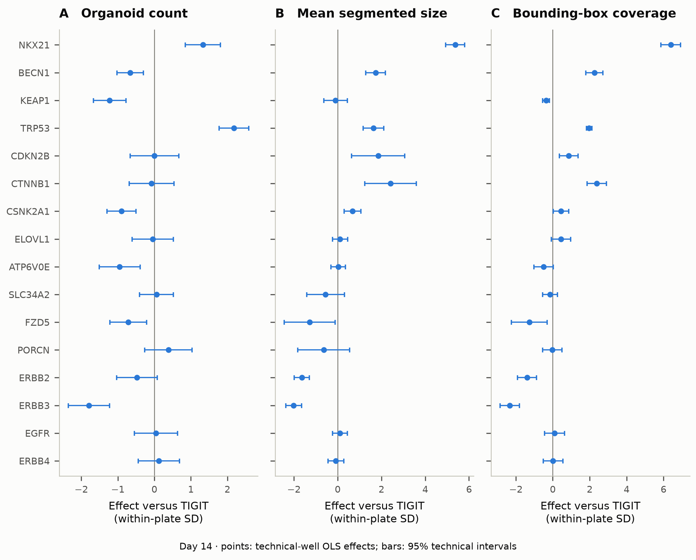

[PDF](figures/publication_v1/Nb3_F01_imaging.pdf) · [SVG](figures/publication_v1/Nb3_F01_imaging.svg) · [Data](figures/publication_v1/source_data/F01_imaging.tsv)

**A–C**, day-14 organoid count, mean segmented size and bounding-box union
coverage for the unchanged 16-target focal set. Points are within-plate
standardized effects versus same-plate TIGIT; bars are unadjusted 95% OLS
intervals over technical wells. Size retains the deposited measurement scale.
CTNNB1 is an activating edit. These endpoints do not measure mature alveolar
function. Per-target sample counts and plate identities are in the data table.

## Figure 2. Source concordance and the unresolved S5 discrepancy

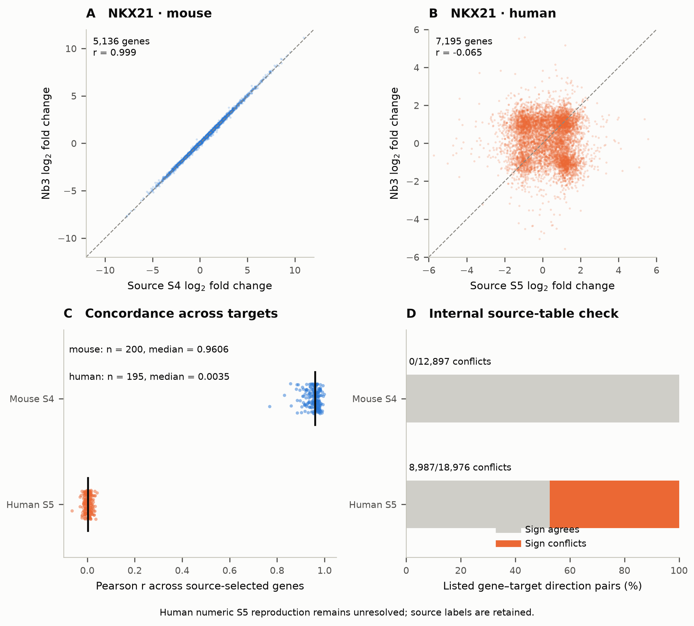

[PDF](figures/publication_v1/Nb3_F02_source_concordance.pdf) · [SVG](figures/publication_v1/Nb3_F02_source_concordance.svg) · [Target correlations](figures/publication_v1/source_data/F02_target_concordance.tsv) · [Source consistency](figures/publication_v1/source_data/F02_source_consistency.tsv)

**A–B**, source versus reconstructed NKX21 log2 fold changes, joined by exact
stable gene ID (5,136 mouse and 7,195 human source-selected genes); dashed lines
indicate equality. **C**, correlations for 200 mouse and 195 human targets;
black ticks mark medians, and vertical jitter is display only. **D**, source
up/down lists versus their own numeric logFC signs: 0/12,897 mouse and
8,987/18,976 human conflicts. This internal check is independent of Nb3's model.
Source-selected universes are not unbiased genome-wide validation sets.
The unresolved human labels and coefficients have not been repaired by guesswork.

## Figure 3. Compartment-specific marker-panel contrasts

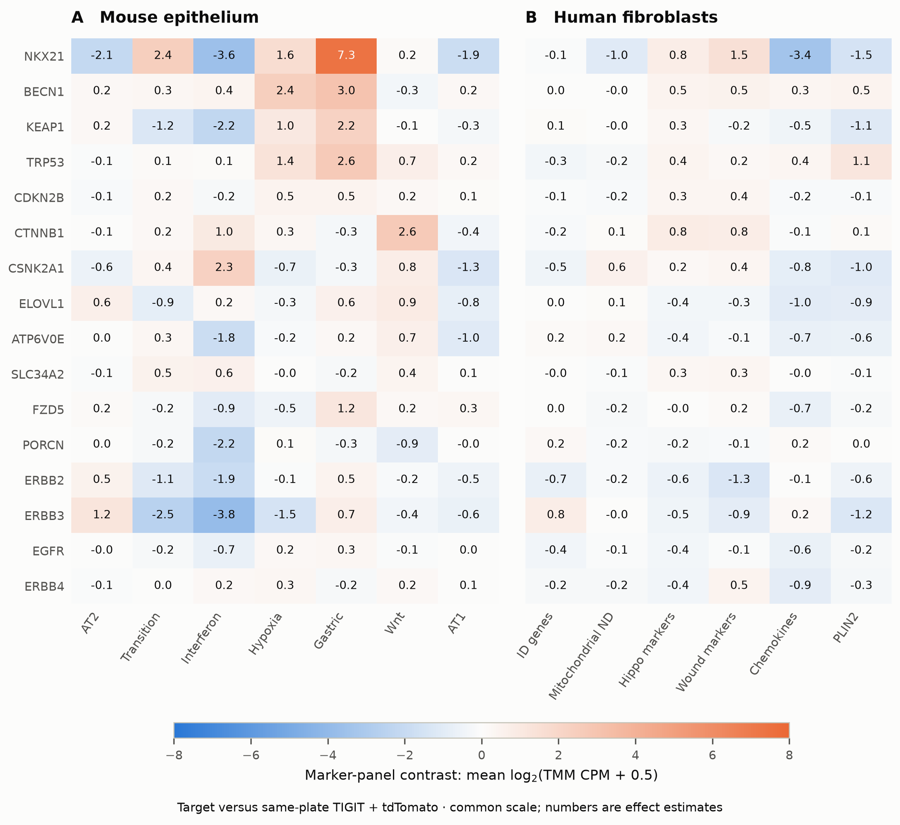

[PDF](figures/publication_v1/Nb3_F03_fixed_panels.pdf) · [SVG](figures/publication_v1/Nb3_F03_fixed_panels.svg) · [Data and intervals](figures/publication_v1/source_data/F03_fixed_panels.tsv)

**A**, seven epithelial panels; **B**, six fibroblast panels, across 16 targets.
Values are target-minus-same-plate TIGIT/tdTomato contrasts of mean
log2(TMM CPM + 0.5), on one common signed scale. Duplicate-symbol CPM was summed
before logging. Complete definitions are frozen in the v1 contract and S7
amendment. Mitochondrial ND comprises three ND genes; PLIN2 is a single-gene
sentinel. Named marker lists are not complete pathways. Separate species
normalizations do not support a cross-species RNA abundance ratio.

## Figure 4. Epithelial identity and paired fibroblast responses

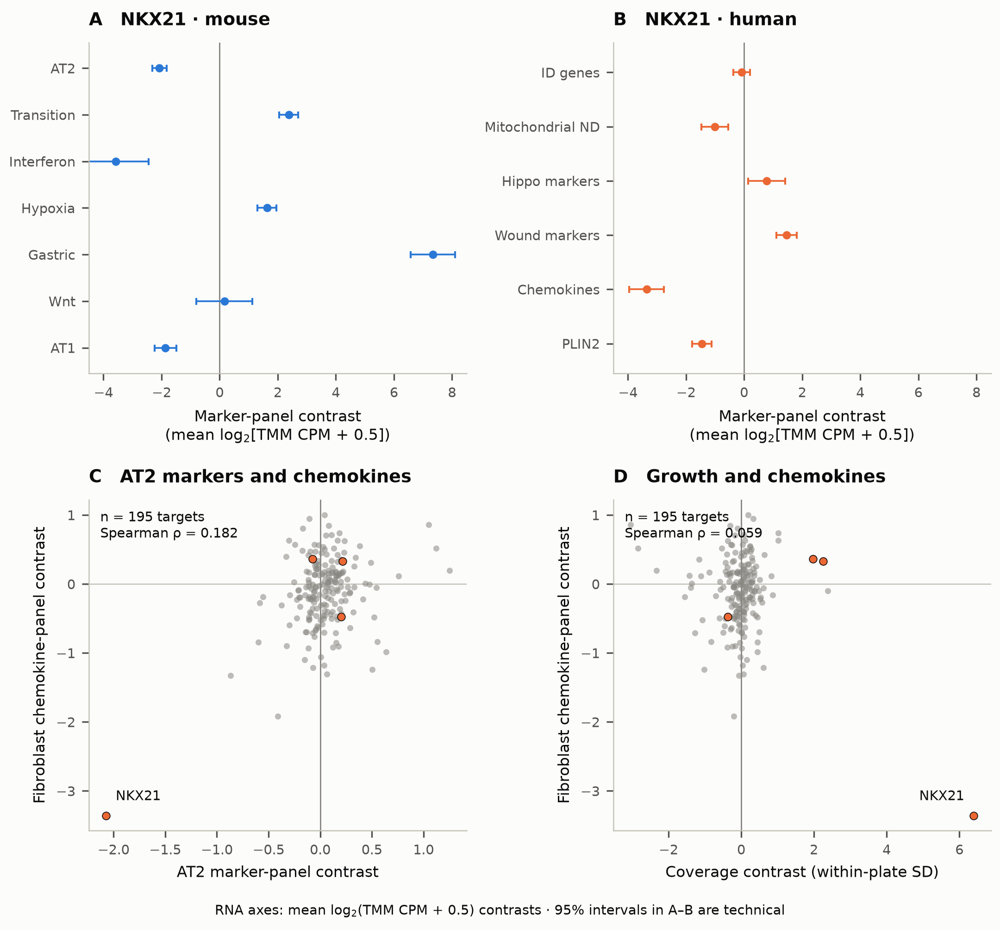

[PDF](figures/publication_v1/Nb3_F04_paired_niche.pdf) · [SVG](figures/publication_v1/Nb3_F04_paired_niche.svg) · [NKX21](figures/publication_v1/source_data/F04_NKX21_panels.tsv) · [AT2 association](figures/publication_v1/source_data/F04_association_1.tsv) · [Growth association](figures/publication_v1/source_data/F04_association_2.tsv)

**A–B**, NKX21 effects with technical 95% intervals: four target wells and
30 mouse/27 human references. **C–D**, chemokine versus AT2-marker or coverage
contrasts across 195 eligible targets. Orange points mark the previously
nominated NKX21, TRP53, BECN1 and KEAP1 targets; only NKX21 is labelled. No
regression or causal-mediation line is fitted. A strong focal phenotype
coexists with modest cross-target association. Neither establishes immune
recruitment or a growth-independent mechanism.

## Figure 5. Candidate state patterns and component activities

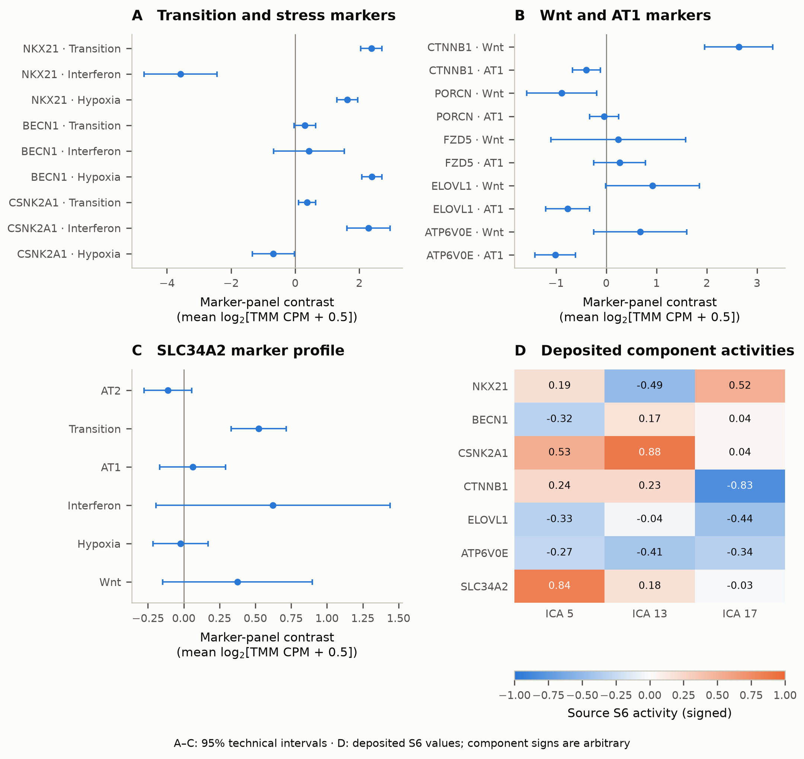

[PDF](figures/publication_v1/Nb3_F05_candidate_patterns.pdf) · [SVG](figures/publication_v1/Nb3_F05_candidate_patterns.svg) · [Transition/stress](figures/publication_v1/source_data/F05_panel_A.tsv) · [Wnt/AT1](figures/publication_v1/source_data/F05_panel_B.tsv) · [SLC34A2](figures/publication_v1/source_data/F05_panel_C.tsv) · [ICA](figures/publication_v1/source_data/F05_source_ICA.tsv)

**A**, transition, interferon and hypoxia marker contrasts for NKX21, BECN1 and
CSNK2A1. **B**, Wnt/AT1 contrasts, retaining broad ELOVL1/ATP6V0E Wnt intervals
and the FZD5 counterexample. **C**, SLC34A2's marker profile. **A–C** show
technical 95% intervals, with sample counts in the source tables. **D**, signed
S6 component activities, with no ICA refit. Signs are arbitrary and require
the projections in Figure S2. Bulk patterns do not establish two trajectories
or molecular mechanisms.

## Figure 6. Receptor expression and growth context

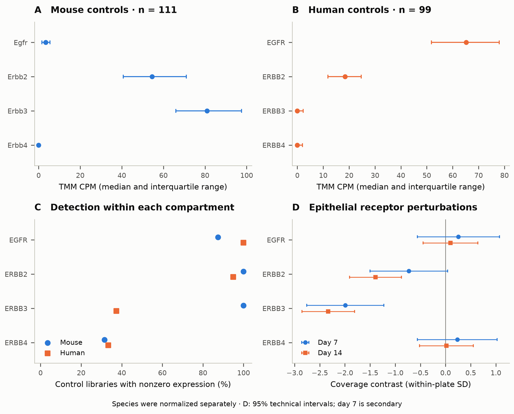

[PDF](figures/publication_v1/Nb3_F06_receptor_context.pdf) · [SVG](figures/publication_v1/Nb3_F06_receptor_context.svg) · [Expression](figures/publication_v1/source_data/F06_receptor_expression.tsv) · [Day 7](figures/publication_v1/source_data/F06_receptor_growth_day07.tsv) · [Day 14](figures/publication_v1/source_data/F06_receptor_growth_day14.tsv)

**A–B**, receptor CPM median and interquartile range in 111 mouse/99 human
control libraries; bars summarize distributions, not confidence. **C**,
nonzero-expression frequency. **D**, coverage contrasts at secondary day 7
and primary day 14 with technical 95% intervals. Expression does not establish
receptor protein/function, and mouse bulk does not distinguish AT2 from AT1.
A small EGFR growth contrast does not establish dispensability. No DepMap or
clinical fibrosis result is inferred.

## Figure 7. Local sensitivity and paired-depth follow-up

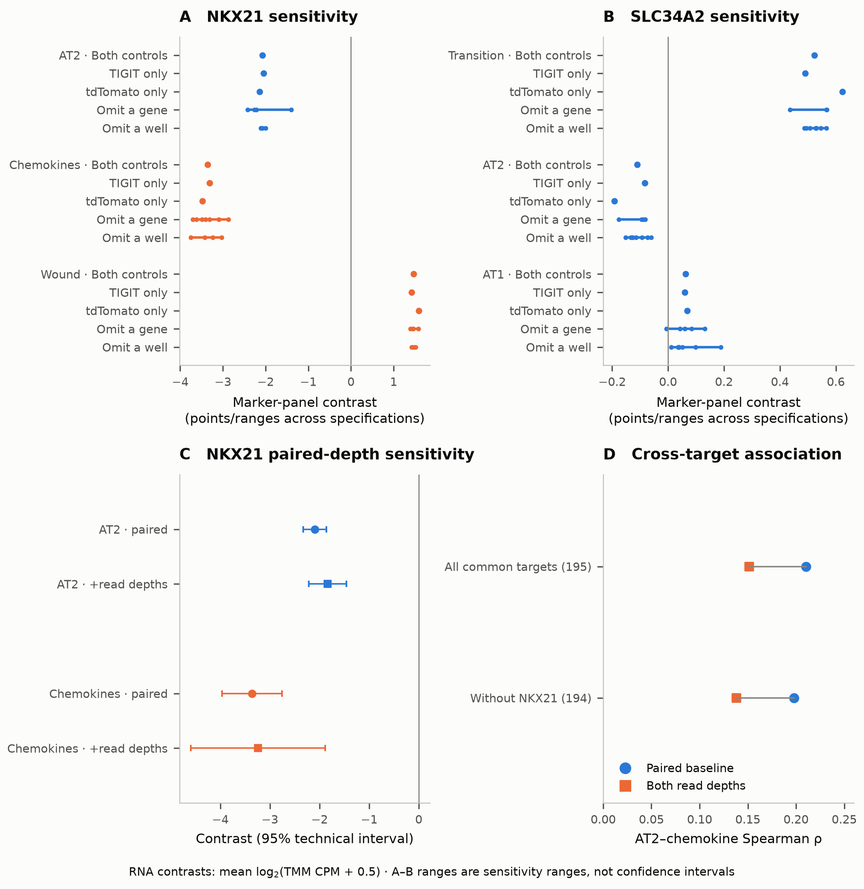

[PDF](figures/followup_v1/Nb3_F07_followup_sensitivity.pdf) · [SVG](figures/followup_v1/Nb3_F07_followup_sensitivity.svg) · [Marker data](figures/followup_v1/source_data/F07_panel_sensitivities.tsv) · [Depth contrasts](figures/followup_v1/source_data/F07_NKX21_depth.tsv) · [Associations](figures/followup_v1/source_data/F07_depth_associations.tsv)

**A–B**, combined controls, TIGIT-only, tdTomato-only, single-marker omission
and single-target-well omission for NKX21 and SLC34A2. Lines span specification
estimates and are **not confidence intervals**. Blue/orange identify mouse/human
compartments. NKX21 has four target wells; SLC34A2 has eight, with technical
nesting retained. **C**, paired NKX21 contrasts before/after both log read depths
enter the model, with 95% technical intervals. **D**, associations across the
same 195 targets or 194 without NKX21. Read depth may be downstream of
perturbation; conditioning does not identify a direct effect. All ineligible
omission cases remain in the full sensitivity table.

## Figure 8. Hallmark context and correlation sensitivity

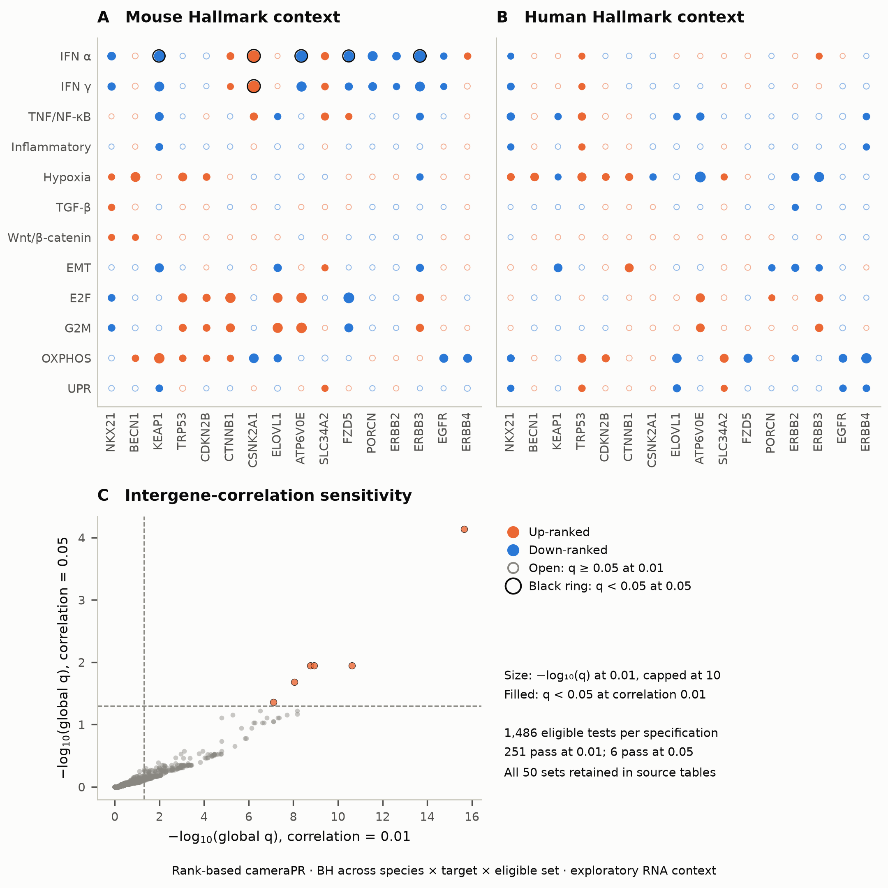

[PDF](figures/followup_v1/Nb3_F08_hallmark_context.pdf) · [SVG](figures/followup_v1/Nb3_F08_hallmark_context.svg) · [All comparisons](figures/followup_v1/source_data/F08_all_enrichment_comparisons.tsv) · [Coverage](runs/followup_v1/hallmark_coverage.tsv)

**A–B**, 12 themes related to v1's questions, across all 16 targets per species.
This includes null Wnt results; it is not a selection of significant sets.
All 50 assessed sets remain in the tables. Orange/blue indicate up/down rank
enrichment. Dot area is 9 + 3 × min(−log10 q, 10) points squared at fixed
intergene correlation 0.01. Filled dots meet global BH q < 0.05 there; black
rings meet q < 0.05 at correlation 0.05. **C**, all 1,486 eligible comparisons
per specification; dashed lines denote q = 0.05. Threshold-passing entries
fall from 251 to six. These correlations are assumptions, not estimates from
independent biological replicates. Dot size is not biological effect size or
causal pathway activity.

Follow-up: [renderer](scripts/15_followup_figures.py), [hashes](figures/followup_v1/render_record.json), [223-check verification](reports/Nb3_followup_verification.json), [findings](reports/FOLLOWUP_RESULTS.md).

Final S3 title-layout correction: [receipt](figures/publication_v1/S03_layout_v2/layout_revision.json). Numerical values and original exports are preserved.

## Figure 9. External E5 epithelial-response pilot

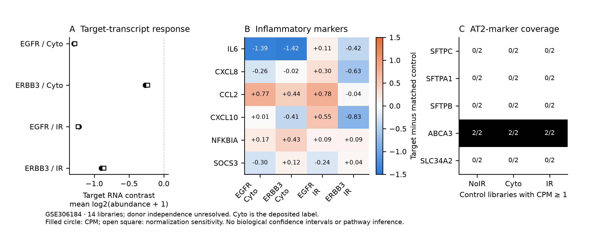

[PDF](figures/E5_external_v2/Nb3_F09_E5_external_pilot.pdf) · [SVG](figures/E5_external_v2/Nb3_F09_E5_external_pilot.svg) · [Report](reports/E5_EXTERNAL_FEASIBILITY.md) · [Gene contrasts](runs/E5_external_v1/gene_contrasts.tsv) · [Plotted values](runs/E5_external_v1/selected_normalized_values.tsv) · [Design/QC](runs/E5_external_v1/sample_design_qc.tsv)

**A**, target-transcript contrasts under EGFR/ERBB3 knockdown versus matched
controls, with CPM and prespecified normalization sensitivity. **B**, all six
fixed inflammatory-marker contrasts, in mean log2(CPM + 1) units; mixed gene
directions remain visible. **C**, AT2-marker detection among two control
libraries per source context at CPM ≥ 1. GSE306184 has 14 deposited libraries;
independent donors and protocol details remain unresolved. `Cyto` is the
deposited label; `IR` denotes irradiation. No uninjured knockdown exists.
No biological confidence intervals or pathway/fate conclusions are implied.
The first export clipped left labels; v2 widens the margin and preserves v1.
[Renderer](scripts/20_e5_external_figure.py), [layout revision](scripts/21_e5_layout_revision.py),
[render hashes](figures/E5_external_v2/render_record.json).

## Figure S1. QC and scaling sensitivity

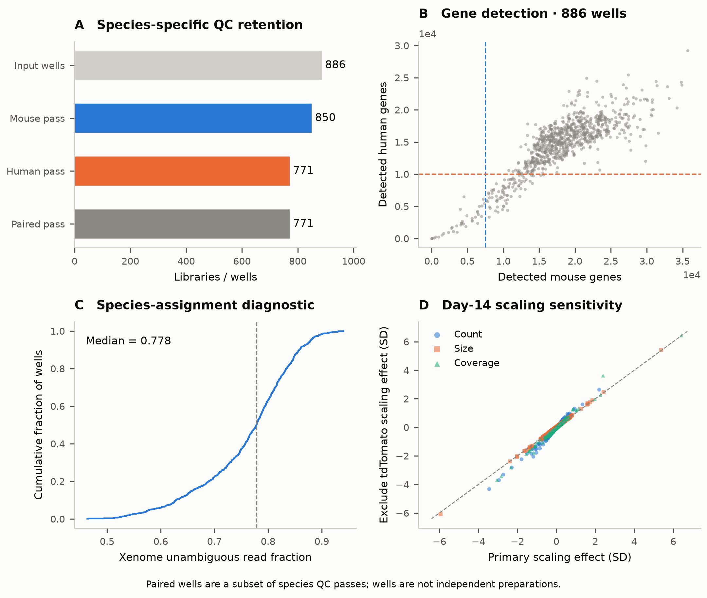

[PDF](figures/publication_v1/Nb3_S01_QC_and_scaling.pdf) · [SVG](figures/publication_v1/Nb3_S01_QC_and_scaling.svg) · [Retention](figures/publication_v1/source_data/S01_retention.tsv) · [Detection](figures/publication_v1/source_data/S01_gene_detection.tsv) · [Xenome](figures/publication_v1/source_data/S01_xenome.tsv) · [Scaling](figures/publication_v1/source_data/S01_imaging_scaling.tsv)

**A**, 886 input wells, 850 mouse QC passes, 771 human passes and their 771-well
intersection; groups overlap. **B**, genes with at least one read per species;
cutoffs are 7,500 mouse and 10,000 human genes. **C**, empirical cumulative
Xenome unambiguous-read fraction with median. RNA fractions are not cell
fractions. **D**, 201 target effects per endpoint under primary versus
already-run tdTomato-excluded scaling at day 14; dashed line indicates equality.

## Figure S2. Deposited projections and budding-associated coefficients

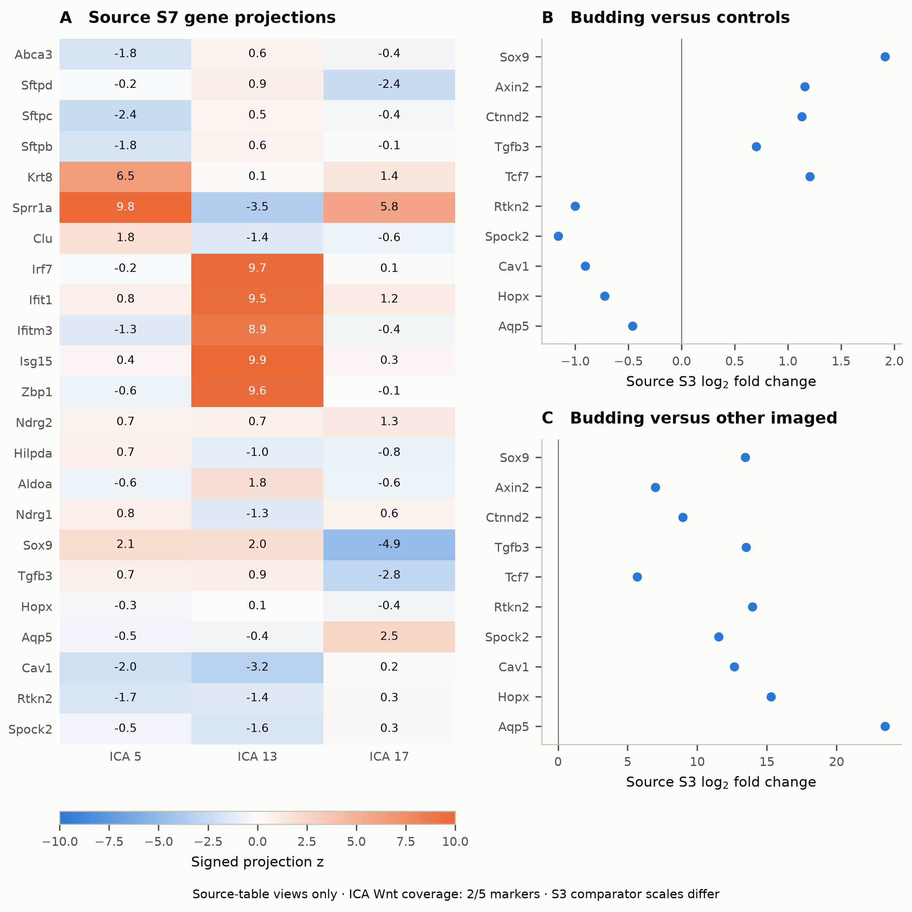

[PDF](figures/publication_v1/Nb3_S02_source_components_and_budding.pdf) · [SVG](figures/publication_v1/Nb3_S02_source_components_and_budding.svg) · [Projections](figures/publication_v1/source_data/S02_ICA_projections.tsv) · [Budding](figures/publication_v1/source_data/S02_budding_source.tsv)

**A**, S7 projection z values for 23 available marker genes in ICA 5/13/17.
Only Sox9 and Tgfb3 from the five-gene Wnt panel occur in this source universe;
no full-Wnt average is inferred. **B–C**, S3 Wnt/AT1 coefficients for budding
versus controls and versus other imaged targets. Markedly different source
coefficient scales are retained on separately labelled axes. Source p/q values
remain in the table; new uncertainty is not invented. Original morphology
assignment and image segmentation have not been independently regenerated.

## Figure S3. Depth and target-influence diagnostics

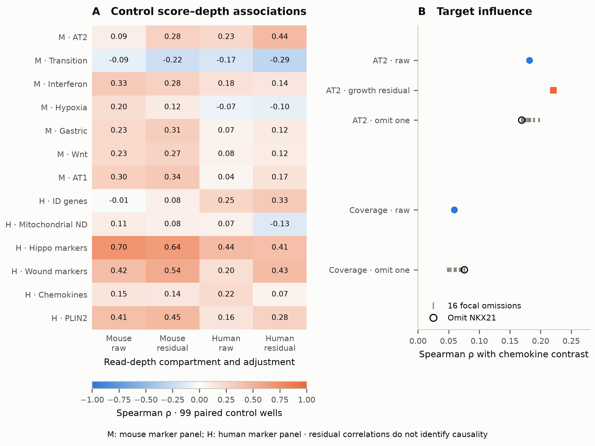

[PDF](figures/publication_v1/S03_layout_v2/Nb3_S03_depth_and_influence.pdf) · [SVG](figures/publication_v1/S03_layout_v2/Nb3_S03_depth_and_influence.svg) · [Depth](figures/publication_v1/source_data/S03_depth_diagnostics.tsv) · [Omissions](figures/publication_v1/source_data/S03_leave_target_out.tsv) · [Associations](figures/publication_v1/source_data/S03_associations.tsv)

**A**, marker-score versus log read-depth Spearman correlation in 99 paired
control wells, before/after plate residualization. M/H identify the score's
compartment; columns identify the depth compartment. **B**, raw AT2/chemokine
and coverage/chemokine associations, coverage-residual AT2/chemokine association,
and omission of each focal target. Open circles identify NKX21 omission.
Primary n = 195 targets; omission n = 194. These are influence checks, not
replication. Residual correlations do not identify a direct mechanism. The new
paired-depth refits are reported separately in the follow-up results.

