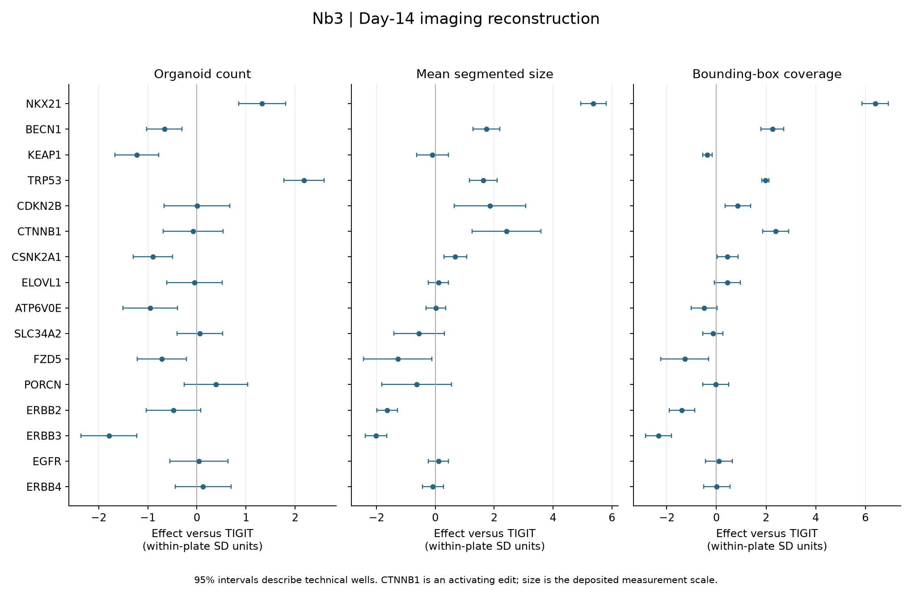
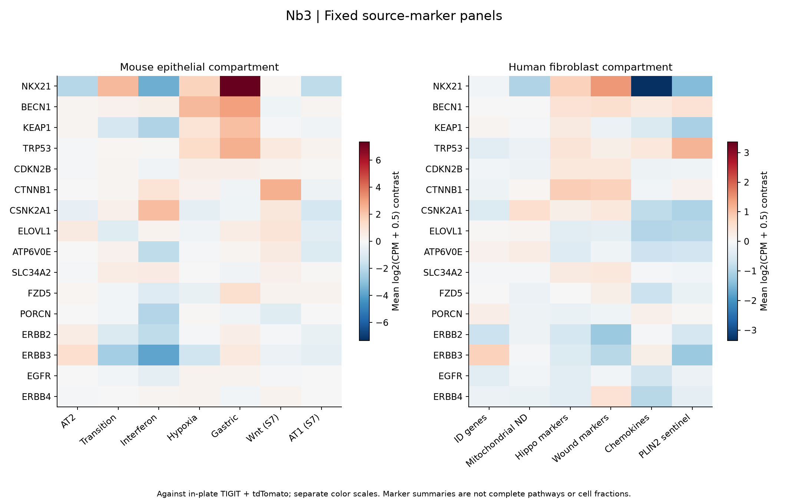
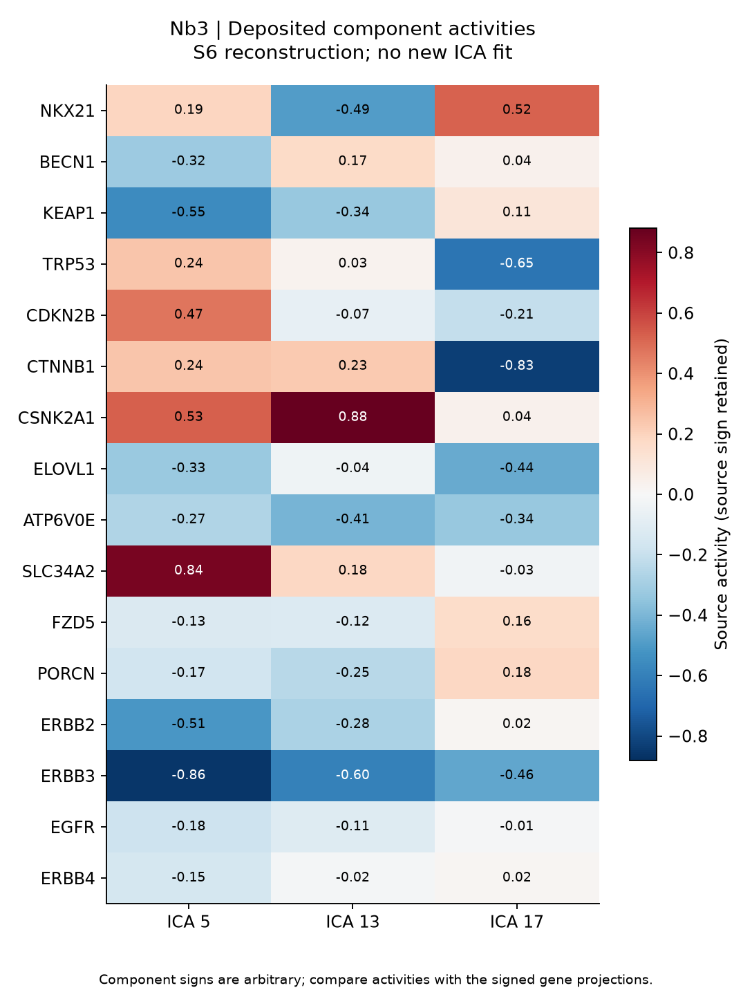
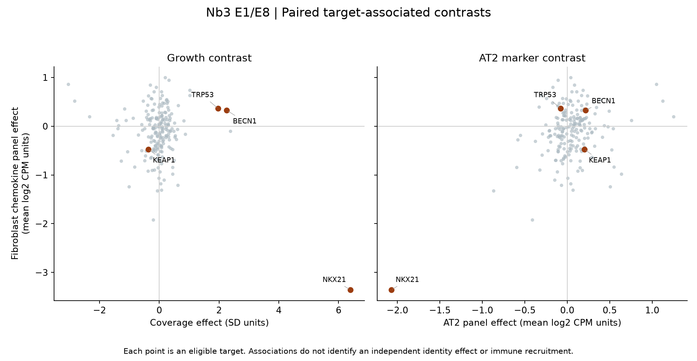

# Nb3 figures

These figures were generated from recorded v1 outputs. Read the
[reproduction review](reports/REPRODUCTION_REVIEW.md) and
[extension review](reports/EXTENSION_REVIEW.md) with them. Targets share culture
preparations; neither well counts nor target counts establish independent
biological replication. PNG and PDF exports have the same content.

Human S5 numeric DE is not reproduced: its source concordance and internal
direction checks fail. The count-derived fibroblast figures below remain
descriptive Nb3 outputs; see the [audit](reports/CONCORDANCE_AUDIT.md).

## Imaging reconstruction

[PDF](figures/Nb3_R1_imaging.pdf). Declared within-plate scaling, same-plate TIGIT
reference and technical-well intervals. Size is the deposited measurement scale;
coverage is bounding-box union coverage. CTNNB1 is an activating edit.

## Fixed source-marker panels

[PDF](figures/Nb3_R4_fixed_panels.pdf). Same-plate TIGIT/tdTomato contrasts of
mean log2(TMM CPM + 0.5). The two color scales differ. Source marker panels are
not complete pathways, cell fractions, or exact reconstructions of the authors'
high/low-growth heatmap groups. All numerical effects and technical intervals
are in the [panel table](runs/R4_v1/fixed_panel_effects.tsv).

## Deposited component activities

[PDF](figures/Nb3_R3_source_ICA.pdf). Values come directly from S6, with source
component identities and signs retained. This is not a fresh JADE/cPCA fit.
Interpret the signs with [gene projections](runs/R3_v1/source_ICA_panel_projections.tsv),
and note missing genes in the source ICA universe.

## Paired target-associated contrasts

[PDF](figures/Nb3_E1_E8_associations_v2.pdf). Each point is an eligible target.
The large NKX21 phenotype does not establish an independent identity mechanism.
The [association table](runs/extensions_v1/target_associations.tsv) and
[leave-target-out checks](runs/extensions_v1/leave_target_out.tsv) report the
broader, modest relationships; depth and target/plate/guide confounding remain.

Generation: [10_figures.py](scripts/10_figures.py).
Byte provenance: [figure manifest](figures/manifest.json) and
[label-layout revision](figures/layout_revision.json). The initial association
export is preserved; the displayed revision separates overlapping labels only.
