# Nb4: research figure gallery

Fifteen figures from the executed source reconstruction, sensitivities, external pilot, genome-wide visual analysis and sequential RQ diagnostics. White backgrounds, consistent assay colors, panel letters, donor points, explicit units and 300-dpi PNG plus SVG/PDF exports follow the neighboring Nb1, England and Nb3 galleries. Dense cell layers are rasterized within vector figures.

[Complete 15-page PDF atlas](figures/rq_sequence_v2/Nb4_complete_atlas.pdf) · [Original 12-page atlas](figures/gallery_v2/Nb4_figure_atlas.pdf) · [Reproduction](reports/REPRODUCTION_REVIEW.md) · [Follow-up](reports/FOLLOWUP_RESULTS.md) · [Genome-wide analysis](reports/EXTENDED_VISUAL_ANALYSIS.md) · [RQ derivation](reports/RQ_DERIVATION.md)

These are descriptive and exploratory figures. Donor counts, coverage holds, annotation exposure and gene-set nulls are stated in each caption; no repair mechanism or population-level significance follows from visual separation.

## Figure 1. Matched donor coverage

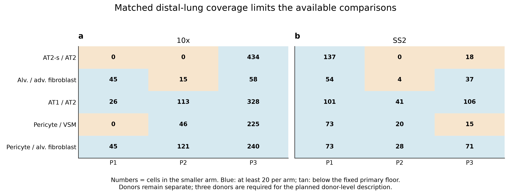

Biological comparisons require each cell population to be represented within the same donor and anatomical setting. This panel asks which atlas observations can be examined beyond pooled-cell patterns. AT1 identity and pericyte context have broader matched coverage, whereas the signaling AT2 and fibroblast comparisons are constrained by sparse sampling. The coverage map therefore determines where the atlas can support donor-level description and where an apparent pattern must remain provisional.

[PNG](figures/publication_v1/01_donor_coverage.png) · [SVG](figures/publication_v1/01_donor_coverage.svg) · [PDF](figures/publication_v1/01_donor_coverage.pdf) · [Data](runs/metadata_v1/coverage.tsv)

Methods, biological units and interpretation limits

Numbers give the smaller cell count in each paired distal-lung contrast. Blue meets the fixed 20-cell floor. Counts are not independent biological replicates; AT2-s and source fibroblast contrasts fail the planned three-donor gate. Pericyte/VSM coverage differs by assay.

## Figure 2. AT2 source-marker dot plot

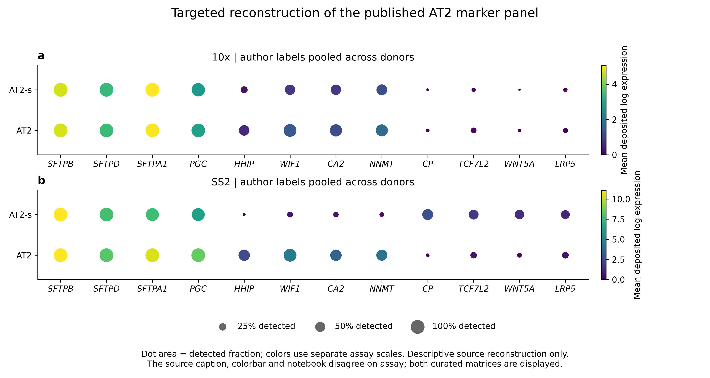

The signaling AT2 label raises the question of whether a specialized molecular state exists within otherwise recognizable surfactant-producing epithelium. The marker panel places shared AT2 identity beside the signaling-associated features used in the original study. Their appearance depends on the sequencing assay, emphasizing that a pooled molecular signature alone cannot establish a conserved stem-cell population or a distinct regenerative fate.

[PNG](figures/publication_v1/02_AT2_source_panel.png) · [SVG](figures/publication_v1/02_AT2_source_panel.svg) · [PDF](figures/publication_v1/02_AT2_source_panel.pdf) · [Data](runs/reproduction_v1/source_pooled_expression.tsv)

Methods, biological units and interpretation limits

Dot area is the fraction with a positive raw count; color is mean deposited X, on separate assay scales. Author AT2/AT2-s labels are pooled for source reconstruction, not inference. The source caption/notebook/scale inconsistency is retained by displaying both assays. No imputed expression or gene-wise color z-score is used.

## Figure 3. Fibroblast contrasts across assays and cohorts

Alveolar and adventitial fibroblasts occupy different tissue environments, so their immune-related RNA should not be assumed to represent one interchangeable fibroblast program. C3 shows a consistent adventitial bias across the eligible source and external comparisons, while the chemokine patterns vary with cohort and sampling context. This supports a focused subtype-associated C3 observation and argues against generalizing it to a uniform immune response across fibroblasts.

[PNG](figures/publication_v1/03_fibroblast_transfer.png) · [SVG](figures/publication_v1/03_fibroblast_transfer.svg) · [PDF](figures/publication_v1/03_fibroblast_transfer.pdf) · [Data](runs/external_pilot_v1/donor_effects.tsv)

Methods, biological units and interpretation limits

Each point is one donor; bars are arithmetic donor means, not confidence intervals. Source distal 10x and SS2 have P1/P3, two donors per assay, not four unique donors. External cells have four donors and nuclei two. Effects are alveolar minus adventitial log2(CPM+1); external donors average matched location/assay/protocol strata. C3 retains direction; nuclear CXCL2 reverses. Source values are in runs/reproduction_v1/paired_effects.tsv.

## Figure 4. MYRF and TBX5 comparator sensitivity

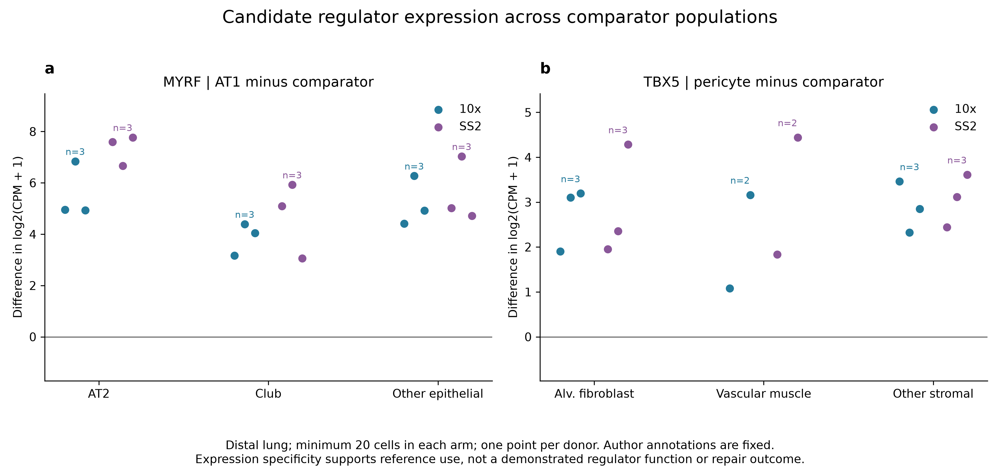

A candidate identity regulator becomes more informative when its expression distinguishes the focal population from several plausible alternatives. MYRF remains associated with AT1 identity, and TBX5 with pericyte identity, across the tested comparators. These patterns support their use as reference features when interpreting epithelial maturation and mural-cell context. They do not establish that either factor controls those biological functions.

[PNG](figures/publication_v1/04_regulator_context.png) · [SVG](figures/publication_v1/04_regulator_context.svg) · [PDF](figures/publication_v1/04_regulator_context.pdf) · [Data](runs/followup_v1/alternative_comparators.tsv)

Methods, biological units and interpretation limits

Distal donor-specific contrasts at the primary 20-cell floor. MYRF compares AT1 with AT2, Club and other epithelium; TBX5 compares pericytes with alveolar fibroblasts, vascular muscle and other stroma. Broad comparators exclude the focal type. Points are descriptive; author-label dependence remains. Expression does not demonstrate regulator function.

## Figure 5. Equal-depth detection diagnostic

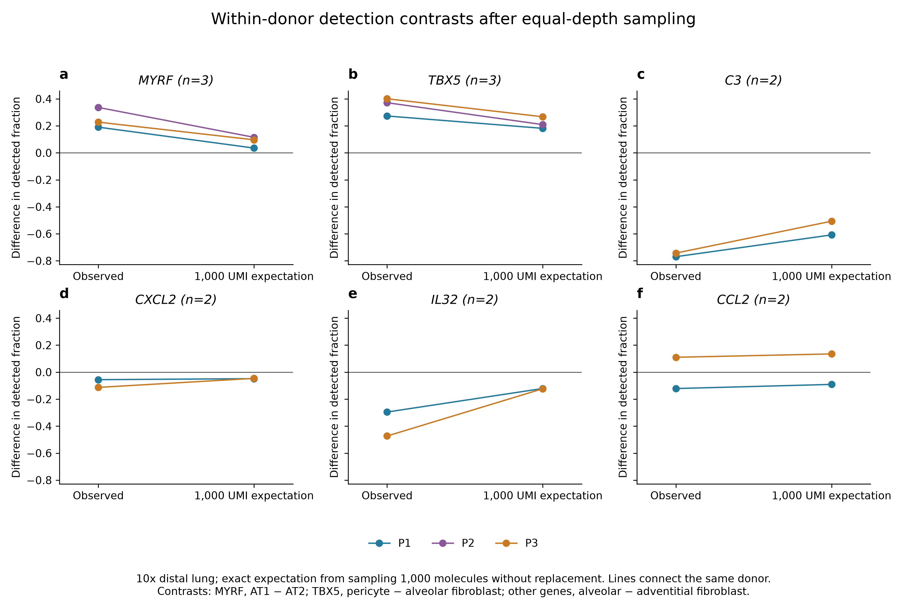

Greater RNA capture can make a gene appear more characteristic of one population simply because it is more readily detected. This comparison asks whether selected identity and fibroblast contrasts persist when detection is evaluated at a common molecular depth. The MYRF, TBX5 and C3 directions are retained, whereas CCL2 remains heterogeneous. The result separates these selected expression patterns from one technical explanation without resolving their biological cause.

[PNG](figures/publication_v1/05_depth_sensitivity.png) · [SVG](figures/publication_v1/05_depth_sensitivity.svg) · [PDF](figures/publication_v1/05_depth_sensitivity.pdf) · [Data](runs/followup_v1/depth_standardized_detection.tsv)

Methods, biological units and interpretation limits

Lines join the same donor before and after exact hypergeometric expectation at 1,000 assigned 10x molecules. Only cells with at least that library size and paired populations with at least 20 retained cells enter. This is conditional finite-sampling expectation, not repeated experimental sampling, SS2 conversion or a confidence interval. MYRF/TBX5 have three donors; fibroblast panels have two.

## Figure 6. Deposited atlas t-SNE

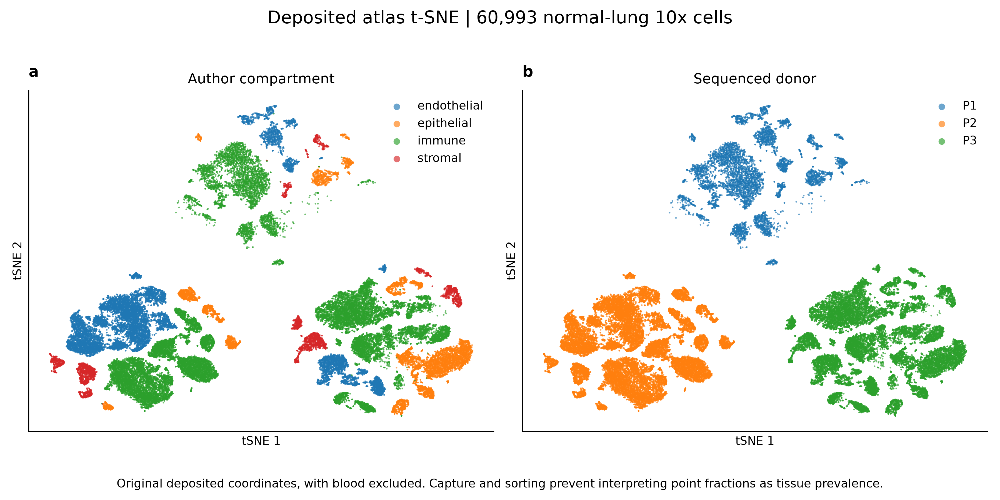

The atlas places epithelial, endothelial, immune and stromal populations within the broader cellular organization of the lung. Viewing the same deposited map by donor exposes the sampling structure underlying that organization. The display provides context for choosing compartment-specific comparisons; apparent distances between donor maps should not be interpreted as biological transitions or as evidence of physical proximity in tissue.

[PNG](figures/extended_v2/06_deposited_atlas_tsne.png) · [SVG](figures/extended_v2/06_deposited_atlas_tsne.svg) · [PDF](figures/extended_v2/06_deposited_atlas_tsne.pdf) · [Data](runs/extended_visual_v1/deposited_tsne.tsv)

Methods, biological units and interpretation limits

The existing source coordinates for 60,993 normal-lung 10x cells are colored by compartment and donor. These are t-SNE coordinates, not UMAP. Blood is excluded. Compartment enrichment and capture prevent interpreting plotted cell proportions as native tissue prevalence.

## Figure 7. New stromal UMAP with technical context

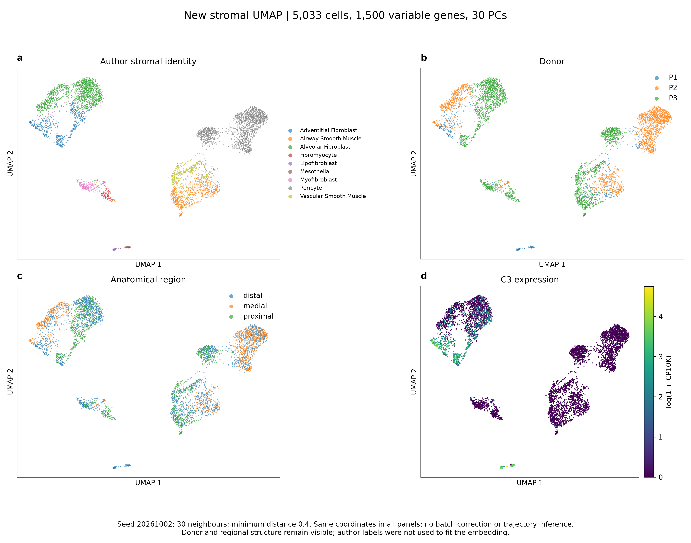

Lung stroma contains several related but functionally distinct fibroblast and mural populations. This exploratory map asks how their expression relationships align with author identity, anatomical origin and donor context, and where C3-associated expression lies within those relationships. Donor and regional overlays make alternative explanations visible. The map is a guide to heterogeneity, not a newly inferred lineage hierarchy or a reconstruction of the tissue niche.

[PNG](figures/extended_v2/07_stromal_umap.png) · [SVG](figures/extended_v2/07_stromal_umap.svg) · [PDF](figures/extended_v2/07_stromal_umap.pdf) · [Data](runs/extended_visual_v1/stromal_umap.tsv)

Methods, biological units and interpretation limits

One exploratory projection of 5,033 normal-lung stromal cells, shown by author identity, donor, anatomical region and C3 log1p(CP10K). It uses 1,500 mean-bin-normalized dispersion genes, 30 centered unscaled PCs, 30 neighbors, minimum distance 0.4 and seed 20261002. Labels were not used in the fit. No batch correction, new clusters, trajectory or prevalence estimate is inferred. Dense point layers are rasterized in vector exports.

## Figure 8. Paired fibroblast pseudobulk PCA

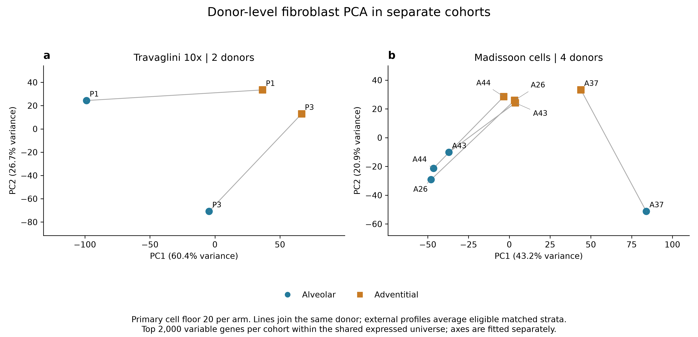

Before interpreting a subtype contrast, it is useful to ask whether subtype identity organizes donor-level expression and whether that organization is consistent across donors. Paired profiles reveal both alveolar–adventitial differences and substantial donor variation, particularly in the external atlas. The separate cohort views make that variation visible without forcing different studies into a shared coordinate system or treating subtype identity as the only source of variation.

[PNG](figures/refinement_v1/08_donor_pca.png) · [SVG](figures/refinement_v1/08_donor_pca.svg) · [PDF](figures/refinement_v1/08_donor_pca.pdf) · [Data](runs/extended_visual_v1/pseudobulk_pca.tsv)

Methods, biological units and interpretation limits

Separate cohort fits on 2,000 high-variance genes from the shared expressed universe. Source: two donors, four subtype profiles. External: four donors, eight profiles, averaging log profiles equally over eligible matched strata. Lines join donor pairs. Centered log2(CPM+1) is not gene-scaled. Axes and variance percentages belong to separate fits; no common coordinate or cross-study distance is claimed.

## Figure 9. Genome-wide cross-cohort contrast agreement

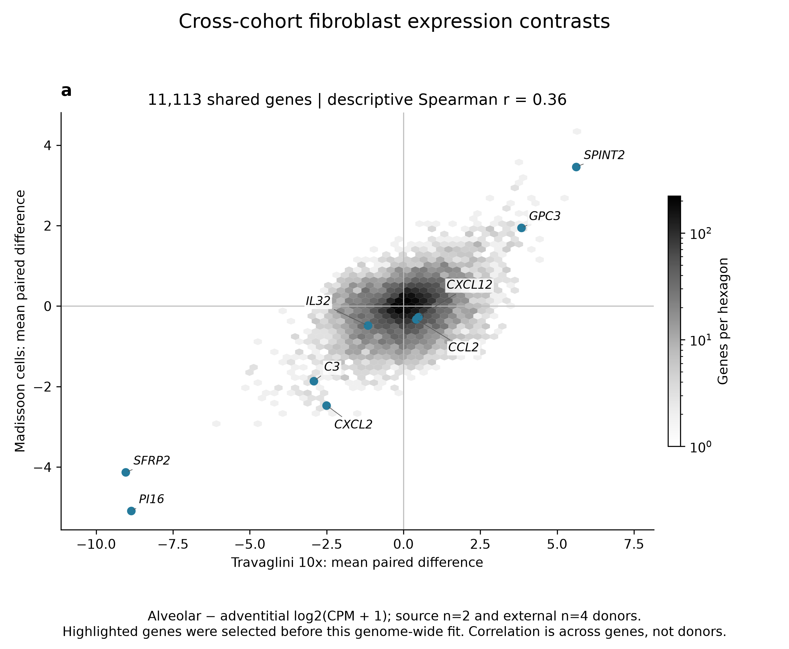

A focused marker result is more persuasive when placed within the broader pattern of agreement between studies. This comparison asks how much of the alveolar–adventitial expression contrast transfers beyond the selected genes. The highlighted identity markers and C3 are interpreted against incomplete genome-wide agreement, while heterogeneous chemokines remain visible. The figure distinguishes a transferable focal observation from a claim that the two atlases describe an identical molecular program.

[PNG](figures/refinement_v1/09_genomewide_transfer.png) · [SVG](figures/refinement_v1/09_genomewide_transfer.svg) · [PDF](figures/refinement_v1/09_genomewide_transfer.pdf) · [Data](runs/extended_visual_v1/source_gene_ranking.tsv)

Methods, biological units and interpretation limits

Mean paired alveolar-minus-adventitial log2(CPM+1) contrasts for 11,113 shared expression-eligible genes. Source has two donors and external four. Hexbin shade represents log point count. The nine highlighted genes were selected before this fit. Spearman correlation is descriptive across dependent genes, not donor-level evidence. External values are in runs/extended_visual_v1/external_gene_ranking.tsv.

## Figure 10. Exploratory Hallmark GSEA

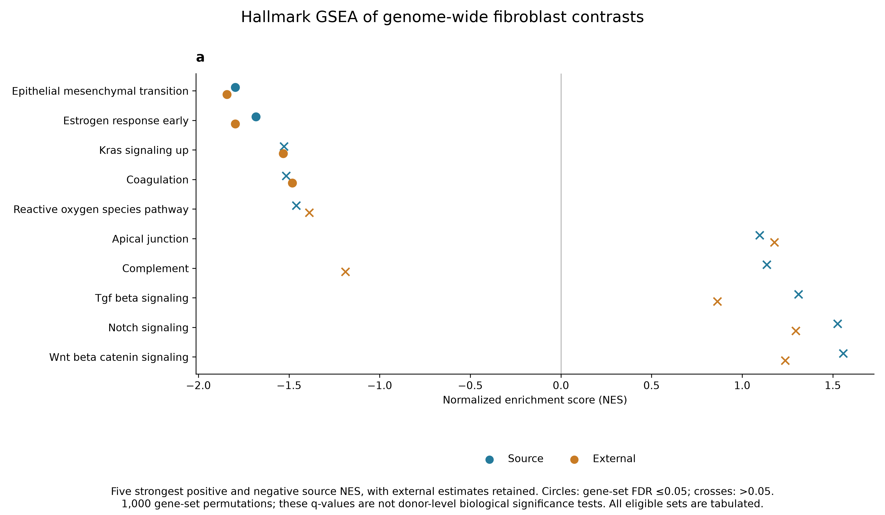

Coordinated gene sets ask a broader biological question than individual markers: do related molecular functions change together between fibroblast subtypes? The pathway comparison reveals both shared and cohort-dependent patterns, placing immune-related observations alongside structural and signaling annotations. A pathway name is an interpretive label for a gene set, not a direct measurement of pathway activation, epithelial transition or physiological function in fibroblasts.

[PNG](figures/refinement_v1/10_hallmark_gsea.png) · [SVG](figures/refinement_v1/10_hallmark_gsea.svg) · [PDF](figures/refinement_v1/10_hallmark_gsea.pdf) · [Data](runs/extended_visual_v1/hallmark_gsea.tsv)

Methods, biological units and interpretation limits

Five most positive and five most negative source NES, with external results kept for those same sets. Circle/cross distinguishes competitive gene-set FDR at 0.05. The rank is mean paired log2(CPM+1) difference, not a cell-level test statistic. MSigDB 2024.1.Hs, weight 1, 1,000 gene-set permutations, sizes 15–500 and seed 20261002. All size-eligible sets are tabulated. This null does not test donor-population reproducibility; zero engine permutation p-values do not mean zero probability.

## Figure 11. GO biological-process annotation

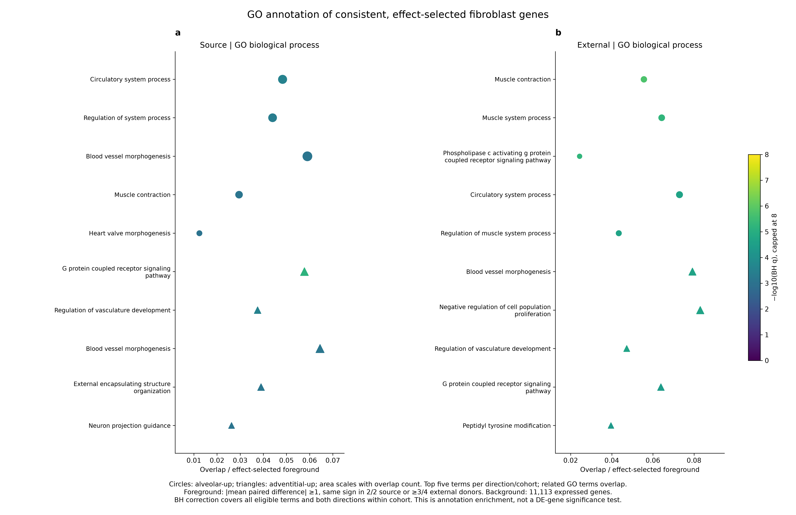

The functional annotations ask which established biological processes help contextualize the subtype-associated genes. Vascular, contractile and extracellular-structure terms connect the expression contrast to plausible stromal roles and help organize subsequent hypotheses. Related ontology terms often describe overlapping genes, so their appearance should not be read as several independent mechanisms or as direct evidence of tissue function.

[PNG](figures/extended_v2/11_go_biological_process.png) · [SVG](figures/extended_v2/11_go_biological_process.svg) · [PDF](figures/extended_v2/11_go_biological_process.pdf) · [Data](runs/extended_visual_v1/go_bp_ora.tsv)

Methods, biological units and interpretation limits

Effect-selected foregrounds require absolute mean paired difference at least 1 and sign agreement in both source donors or at least three of four external donors. Background is 11,113 shared expressed genes. Hypergeometric overlap is BH-adjusted over all eligible terms and both directions within cohort. Top five terms per direction/cohort are shown; complete results and exact display selection are retained. Circles denote alveolar-up and triangles adventitial-up. Overlapping GO terms are not independent mechanisms; annotations are not measured functions.

## Figure 12. Complement-set generalization check

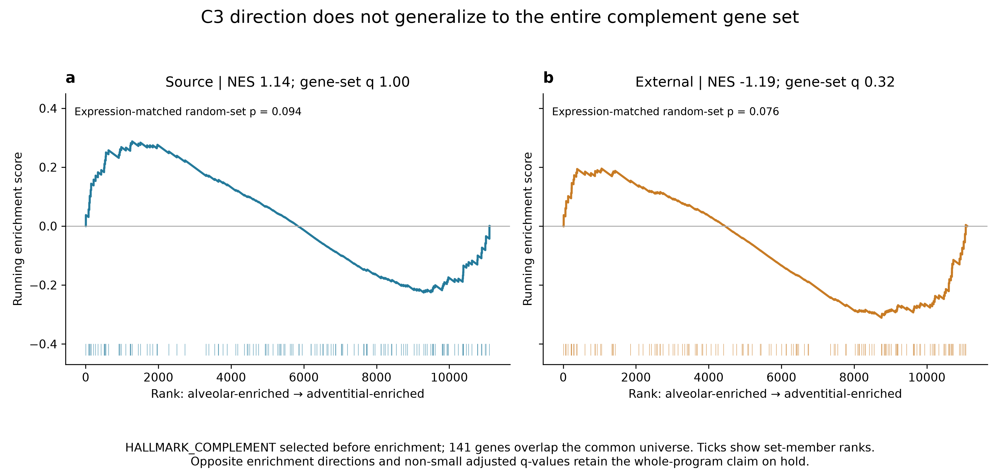

The reproducible C3 contrast motivates a specific challenge: does it reflect coordinated behavior of the broader complement program? The two cohorts do not show a concordant whole-set pattern. This limits the interpretation of C3 as a surrogate for complement activity and narrows the next research question toward a subtype-specific C3-associated response. Failure to generalize the marker is informative for hypothesis design; it does not establish the absence of complement biology.

[PNG](figures/extended_v2/12_complement_running_enrichment.png) · [SVG](figures/extended_v2/12_complement_running_enrichment.svg) · [PDF](figures/extended_v2/12_complement_running_enrichment.pdf) · [Data](runs/extended_visual_v1/complement_running_curves.tsv)

Methods, biological units and interpretation limits

HALLMARK_COMPLEMENT was selected before this analysis. Curves show weighted running enrichment across the genome-wide rank; ticks identify its 141 eligible genes. Source ES is positive and external ES negative. Neither cohort supports small adjusted gene-set q-values for this set. The additional 1,000 expression-matched random sets use a plus-one two-sided empirical p-value. C3-associated RNA therefore cannot be substituted for a coherent complement program.

## Figure 13. Captured composition and C3 expression

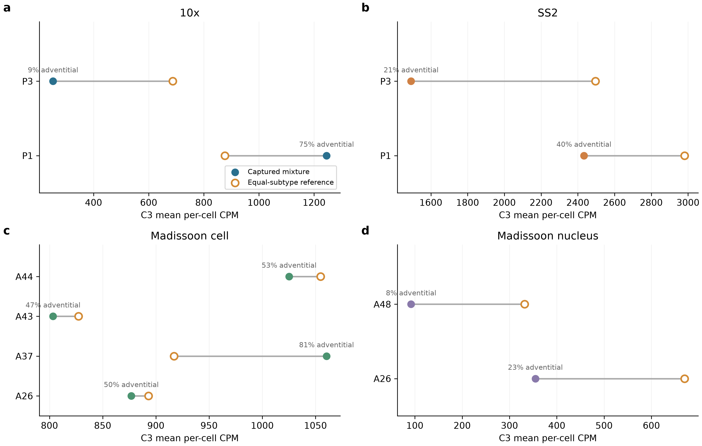

Apparent stromal C3 abundance reflects both the identity of the captured fibroblasts and their expression within each subtype. Comparing each captured mixture with a common subtype reference shows why a pooled signal can change without a corresponding change in the same fibroblast population. This motivates separate measurement of subtype abundance and attributed output when testing responses to epithelial identity.

[PNG](figures/rq_sequence_v2/13_composition_accounting.png) · [SVG](figures/rq_sequence_v2/13_composition_accounting.svg) · [PDF](figures/rq_sequence_v2/13_composition_accounting.pdf) · [Data](runs/rq1_composition_v1/donor_accounting.tsv)

Methods, biological units and interpretation limits

Points compare observed mean per-cell C3 CPM with a 50:50 alveolar/adventitial reference. Lines join estimates for the same donor; percentages describe captured cells, not tissue abundance. Primary floor: 20 cells per subtype within matched strata. External strata are averaged equally within donor. Axes differ by assay; absolute cross-assay expression comparisons are not justified. Library-weighted accounting and the lower-floor sensitivity are archived.

## Figure 14. C3 and chemokine responses require separate endpoints

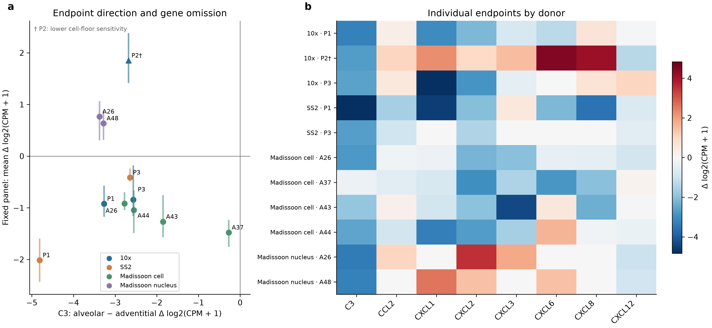

C3-associated fibroblast identity does not imply a uniform chemokine program. Primary cell comparisons share an overall subtype direction, while nuclear sampling contexts and the lower-coverage source donor reveal opposing patterns. Keeping the individual chemokines visible prevents a stable complement-associated marker from being interpreted as general immune-signaling competence.

[PNG](figures/rq_sequence_v2/14_endpoint_separation.png) · [SVG](figures/rq_sequence_v2/14_endpoint_separation.svg) · [PDF](figures/rq_sequence_v2/14_endpoint_separation.pdf) · [Data](runs/rq1b_endpoint_v1/panel_sensitivity.tsv)

Methods, biological units and interpretation limits

Effects are alveolar minus adventitial log2(CPM+1); the fixed panel averages the seven inherited A22 gene effects. Vertical ranges are leave-one-gene-out diagnostics, not confidence intervals. Primary donors meet 20 cells per subtype; the triangle and dagger identify P2 at the declared 10-cell sensitivity floor. The heat map displays those same donors and genes. Context differences do not identify a causal effect of capture method; neither RNA panel measures secretion or recipient function.

## Figure 15. MYRF reference specificity and the mature-outcome gap

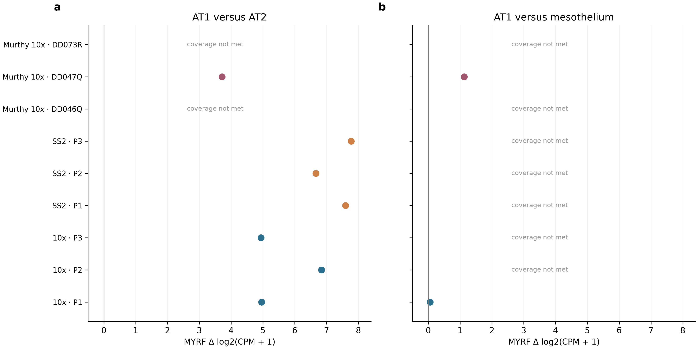

MYRF distinguishes AT1 from AT2 more clearly than it separates AT1 from mesothelial context in the available comparisons. Retaining the sparsely represented donor comparisons makes the boundary between a useful reference marker and a validated maturation component explicit. A mature-contribution question requires a linked biological outcome beyond the RNA identities displayed here.

[PNG](figures/rq_sequence_v2/15_myrf_reference.png) · [SVG](figures/rq_sequence_v2/15_myrf_reference.svg) · [PDF](figures/rq_sequence_v2/15_myrf_reference.pdf) · [Data](runs/rq2_myrf_v1/donor_effects.tsv)

Methods, biological units and interpretation limits

Primary floor: 20 cells in each comparator population. Points show individual donor log2(CPM+1) differences; both panels share the x scale. Coverage failures are displayed rather than interpreted as zero effects. Source assays measure the same three donors. Murthy labels are repository-derived candidates, and only DD047Q supplies an eligible AT1 comparison; no three-donor external confirmation follows. No linked protein, morphology or traced-output endpoint was used.

## Render and data provenance

Renderers: [Figures 1–5](scripts/09_make_figures.py), [Figures 6–12](scripts/12_extended_figures.py), [label refinements](scripts/14_refine_figures.py), [gallery builder](scripts/13_build_gallery.py). Each finalized figure directory has input/output hashes and a code snapshot. [Source renders](figures/publication_v1/run_record.json), [extended renders](figures/extended_v2/run_record.json), [refinements](figures/refinement_v1/run_record.json), [atlas assembly](figures/gallery_v2/run_record.json).

The initial execution_v1 figures are retained as historical drafts. extended_v1 was an incomplete rendering attempt that stopped during a diagnostic for a size-filtered gene set; extended_v2 is the finalized version. Numerical analyses were not rerun for that rendering correction.

Figures 13–15: [RQ renderer](scripts/18_rq_figures.py), [final render record](figures/rq_sequence_v2/run_record.json), [sequential results](reports/RQ_SEQUENCE_RESULTS.md). Version 1 is retained; version 2 displays the predeclared P2 sensitivity and failed coverage explicitly. No numerical fits changed.
