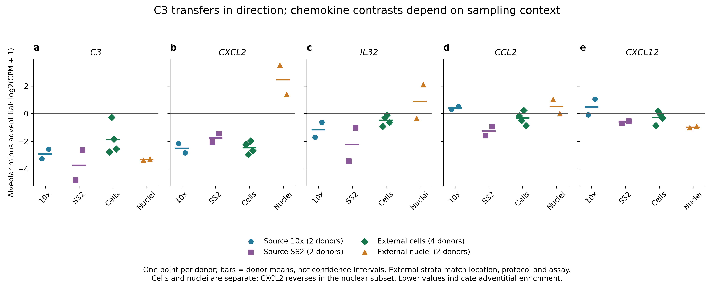

# Nb4: Travaglini, Nabhan et al. 2020 human lung atlas

**Gate 2N, item N3 · reading completed 2 October 2026 · bounded analysis complete.**
The requested folder name is preserved. **Nb4** is the owner-selected analysis
label; early immutable `TN2020` records belong to this same analysis. Nb3 remains
the separate Nabhan 2026 study.

[A molecular cell atlas of the human lung from single-cell RNA sequencing](https://doi.org/10.1038/s41586-020-2922-4),
Nature 587, 619–625, joint first authors Travaglini and Nabhan.

This package reconstructs selected source results, audits donor/assay coverage,
executes sensitivity branches and tests fibroblast contrasts in a second atlas.
It is a **partial reproduction using a curated public release**, not a complete
refit of original clustering, differential-expression, spatial or species analyses.

| Start here | Contents |
|---|---|
| [Figure gallery](FIGURES.md) | 15 numbered research figures, PNG/SVG/PDF, captions and plotted-data links |
| [Reproduction review](reports/REPRODUCTION_REVIEW.md) | Source concordance, measurement, recoveries and failed gates |
| [Follow-up results](reports/FOLLOWUP_RESULTS.md) | Donor/assay/depth checks and independent-atlas pilot |
| [Genome-wide visual analysis](reports/EXTENDED_VISUAL_ANALYSIS.md) | t-SNE, new UMAP, donor PCA, GSEA and GO |
| [Sequential RQ results](reports/RQ_SEQUENCE_RESULTS.md) | Three count-based branches, narrowing decisions, preserved endpoint gates |
| [RQ pipelines](reports/RQ_PIPELINES.md) | Frozen scope, ordered execution and cross-study evidence |
| [RQ derivation](reports/RQ_DERIVATION.md) | Narrowed candidates, rivals and next discriminating evidence |
| [Execution and verification](EXECUTION.md) | Commands, software, immutable runs and verification |
| [Public datasets](DATASETS.md) | Used versus inspected sources, versions, hashes and access limits |
| [Source synthesis](SOURCE_SYNTHESIS.md) / [note reconciliation](NOTE_RECONCILIATION.md) | Paper reading card and corrections to hand-made notes |
| [Repository context](REPOSITORY_CONTEXT.md) / [original plan](ANALYSIS_TRIAL_PLAN.md) | Hierarchy, neighboring precedents and original gates |
| [Original candidates](CANDIDATE_HYPOTHESES.md) / [initial intake](reports/INTAKE.md) | Historical pre-execution reasoning |

**Sequential RQ follow-through completed 3 October 2026:** composition accounting, fixed chemokine-endpoint comparison and MYRF reference diagnostics. Read the [full results](reports/RQ_SEQUENCE_RESULTS.md) before interpreting these as tests of epithelial intervention or mature contribution.

## Current evidence

The public matrices contain **75,071 cells**, matching the sum of Supplementary
Table 2 population rows but differing from the printed 75,066 total. MYRF/AT1
and TBX5/pericyte contrasts persist across eligible donors and alternative
comparators. Matched-region AT2-s contrasts remain too sparse for the planned
three-donor description.

C3 is adventitial-enriched in eligible original fibroblast comparisons and all
four eligible single-cell donors in Madissoon et al. The broader Hallmark
complement set does **not** transfer coherently. Chemokine directions depend on
assay, donor and cell/nucleus sampling. This motivates a conditional A22/A13
question about **subtype-specific C3-associated responses**, not an established
complement mechanism.

## Figure gallery

[Open all 15 figures and captions](FIGURES.md): source coverage, marker dot plots,
external transfer, depth controls, deposited t-SNE, new stromal UMAP, donor PCA,
genome-wide agreement, GSEA and GO.

## Workflow and ownership

`config/` holds specifications and manifests; `scripts/` executable analysis;
`runs/` immutable evidence; `reports/` interpretation; `figures/` generated
exports and render records. Source PDFs, private notes, matrices and cached
arrays remain in ignored `raw_data/travaglini_nabhan_2020/`. Existing MSigDB
files are reused from `raw_data/msigdb/`; source payloads are not redistributed.

Shared question ownership remains in [RQ_Specified](../../RQ_Specified/README.md)
and the [canonical register](../../RESEARCH_QUESTIONS.md). No new A-number or
claim grade is assigned. Paper-specific outcomes remain here; shared indexes
contain navigation and dataset provenance.
