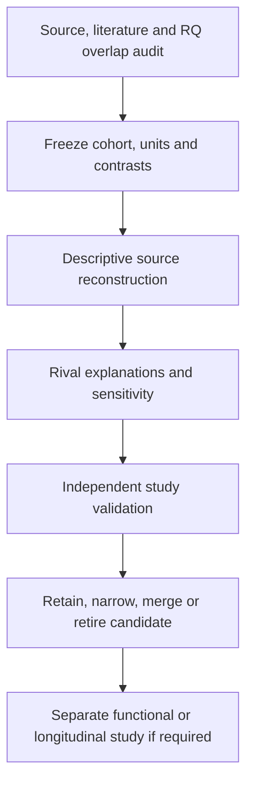

# Nb4: broader proposal analysis plan

**Structured 3 October 2026. Status: planning; no new analysis executed in this revision.**

The owner's notes motivate nine candidate families. The earlier completed
[Nb4-RQ1/RQ1b/RQ2 sequence](../RQ_SEQUENCE_RESULTS.md) addressed narrower
A22/A13 and A8 extensions; it did not exhaust the atlas. These new **Nb4-P01–P09**
identifiers denote proposals, not accepted canonical RQs or A24/A25 assignments.
The 2020 atlas remains a discovery reference; newer cohorts can test transfer
and distinguish questions already answered by later work.

## Questions and execution order

| Order | Plan | Focused question | Existing RQ relationship | First unresolved requirement |
|---|---|---|---|---|
| 1 | [P01 — mouse–human transfer](P01_model_transfer.md) | Does species-dependent marker choice change alveolar cell annotation or program interpretation? | Cross-cutting A0/A4/A7/A8/A19; transfer measurement is potentially distinct | Mouse animal/pool, age, orthology and label-reference audit |
| 2 | [P03 — disease context](P03_disease_context.md) | In IPF, which expression differences reflect cell identity, within-state change or captured composition? | A6/A13/A22 for immune/stromal mechanisms; broader attribution could be distinct | Requalify Adams/Habermann matrices, diagnosis, donors and state crosswalk |
| 3 | [P04 — tissue association](P04_immune_tissue_association.md) | Is a lung-associated immune program shared across lineages beyond subtype and activation? | A3/A6 adjacent; tissue association is a different contrast | Only two source lung–blood donor pairs; independent paired cohort needed |
| 4 | [P05 — identity versus state](P05_immune_identity_state.md) | Are IGSF21/EREG/TREM2-labelled populations reproducible identities or recurring states? | A3/A6 adjacent; keep separate from epithelial A1 | Myeloid identity crosswalk and independent cohort coverage |
| 5 | [P07 — regional epithelium](P07_regional_epithelial_identity.md) | Does diseased distal epithelium redeploy a normal regional basal program? | A0/A5/A11 adjacency; route shared plasticity back to existing owners | Measured region and independent pathology labels |
| 6 | [P06 — AT2 heterogeneity](P06_at2_heterogeneity.md) | Does AT2-s represent a reproducible subdivision or continuous signaling/metabolic variation? | A4/A7/A19; species arm uses P01 | Source rare-population coverage failed the earlier matched comparison |
| 7 | [P08 — vascular/mural specialization](P08_vascular_mural_specialization.md) | Is TBX5-associated pericyte expression regional identity or contractile-response variation? | A21 adjacent endothelial function; different cell/endpoint | Vessel-bed labels and mural-cell coverage |
| 8 | [P02 — expression redistribution](P02_evolutionary_redistribution.md) | Can similar aggregate expression conceal a different cellular source across species? | Potentially distinct; separate from P01 classification performance | P01 unit/orthology audit; third-species qualification for evolutionary context |
| 9 | [P09 — fibroblast sensory candidate](P09_fibroblast_sensory.md) | Is SCN7A/GRIA1 expression a reproducible fibroblast feature with a testable sensory interpretation? | A13/A20/A22 adjacent; function remains separate | Specificity, ambient/doublet and spatial coexpression evidence |

This is a priority queue, not a requirement to finish every blocked branch.
At each turn, execute the next eligible stage, record a concrete hold for
missing data, and continue to the next proposal. P02 reuses P01's audited
species inputs, but it does not require a positive P01 result. P07 can reuse
P03's disease-source audit without requiring an IPF association to be positive.
[Queue and stage dependencies](../../config/proposal_plan_v1.json) are
machine-readable planning metadata, not an executable workflow.

## Common pipeline and evidence contract

1. **S0 — qualify sources and novelty.** Use the [source ledger](SOURCES.md).
   Record accession/release/hash, layer semantics, gene identifiers, individual
   and pool IDs, anatomy, assay, disease definition, prior exposure and study
   overlap. Inspect original publications, supplements and newer direct tests
   of the precise hypothesis. A recent atlas is a resource, not proof of novelty.
   Record what is already answered and what discriminator remains.
2. **S1 — freeze an executable contract.** Before new fitting, create a versioned
   configuration with exact sample/cell joins, inclusion rules, primary contrast,
   reference labels, gene universe, score formula, folds, methods, covariates,
   cell/depth eligibility floors and failure rules. These plans are
   source-informed hypotheses, not preregistrations on unseen data. Dataset
   thresholds must follow a coverage/precision audit conducted without choosing
   the desired biological effect.
3. **S2 — measure at the biological unit.** Pseudobulk raw counts within
   donor × cell class × region × condition × assay, retaining technical nesting.
   Match within a donor only where pairing exists; do not pair unrelated IPF
   cases and controls. Technical assays and cell resamples do not add donors.
   Use full measured-gene library denominators; missing features are not zero.
   Fit count models only where the design is identifiable and residual
   replication exists. With sparse units, show individual effects and limits,
   rather than cell-level biological P values.
4. **S3 — challenge interpretation.** Each plan names its key rival. Preserve
   unadjusted and justified adjusted estimates; do not regress away a mediator
   and call the remainder causal. Recompute fixed contrasts under label,
   reference, depth, region and gene-panel sensitivities. Embeddings and
   integrated values support visualization/annotation, not raw-count inference.
5. **S4 — test transport.** Freeze discovery choices before independent-cohort
   fitting. Trace original donors through integrated atlases and exclude
   discovery/source overlap. Use cohort-specific effects before any justified
   synthesis. Held-out source donors test internal transport, not independent
   study replication; cohorts already explored remain exposed validation.
6. **S5 — make a question decision.** Retain a narrower association when the
   planned effect is independently reproduced and survives the decisive rival;
   merge with an existing RQ when phenotype and discriminating endpoint coincide;
   retire the proposed discriminator when supported evidence contradicts it.
   Missing data mean hold, not biological rejection. A null with wide uncertainty
   is inconclusive; equivalence requires a predeclared meaningful margin and
   sufficient precision. Mechanistic, fate and residency claims require the
   distinct measurements listed in the relevant plan.

For estimable gene-level analyses, declare the complete primary testing family
and control BH FDR at 0.05 within that family, reporting all eligible tests,
effect sizes and uncertainty. This is an exploratory screening rule, not
automatic RQ promotion. Gene sets require version, membership, coverage and
a measured/tested background. GO or GSEA follows an interpretable contrast;
pathway enrichment does not establish activity. Avoid selecting favorable
sets after inspecting the plots.

## Figures, outputs and promotion

Each proposal includes intended figures and a biological caption focus.
Generate only figures supported by real eligible data. Use the existing
[gallery](../../FIGURES.md) style: clear panel labels, consistent cell-class
colors, readable legends, donor observations, biological rationale first and
units/statistics in technical details. Export PNG/SVG/PDF plus plotted-data
tables. PCA diagnoses donor/assay structure; UMAP shows neighborhoods; neither
proves a new cell type, trajectory or function.

For each executed stage, deposit its frozen configuration under `config/`,
code under `scripts/`, immutable receipt/tables under `runs/`, interpretation
under `reports/`, and exports under `figures/`, using `proposal_pXX_v1`
names and explicit superseding versions. Record input hashes, code/config
hashes, environment, seed, sample exclusions, unit counts, outputs and hashes.
Create those run folders when execution occurs, not as empty evidence.
Link new figures from FIGURES.md and the article README. Add a source to
[the public dataset inventory](../../../../docs/DATASETS.md) as **used** only
after its numerical use is recorded.

Promotion to the canonical register requires a distinct biological question,
a nonredundant comparison against existing A0–A23 ownership, a feasible
discriminator, a literature novelty assessment, and an explicit recorded
scientific decision. Feasibility problems should narrow the next experiment,
not erase an interesting question. No new canonical number is assigned here.

The common contract follows
[research architecture](../../../../docs/RESEARCH_ARCHITECTURE.md) and
[measurement contracts](../../../../docs/RQ_MEASUREMENT_CONTRACTS.md).
The earlier immutable runs and their negative/inconclusive results remain
unchanged. Main README stays universal.

## Conditional supplements — subsequent 3 October continuation

The [nine conditional supplements](../../../../docs/research_dossiers/packages_2026-10-03/NB4.md)
develop the existing candidates without changing their source gates, ownership
or numerical status. Owner scientific review remains pending.
