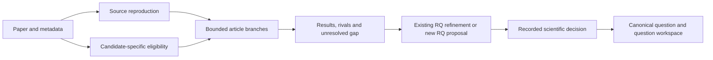

# Nb5 exploratory branch register

Draft 3 October 2026. Eight article-local frames are available for further
analysis and RQ development. P02 preserves the owner's microglial direction;
the other seven are agent-proposed frames for review, not owner-selected RQs.
None has run or received scientific acceptance. Numbering is not a priority rank.

## Hierarchy and ownership

Paper reproduction checks fidelity. A branch asks an additional question with
its own estimand and alternatives. RQ development follows the evidence and
novelty/measurement review; it is not an automatic promotion after execution.
A failed source reproduction can itself motivate measurement work, but its
unresolved mismatch must remain visible and may prevent downstream inference.
All existing A0–A23 remain available and their holds/negative results persist.

## Branches beyond source reproduction

| ID and frame | Next decision | Main data dependency | Possible RQ destination |
|---|---|---|---|
| [P01 Composition and expression](branches/P01_composition_expression.md) | Abundance versus within-state measurement | Mouse/type counts and compatible expression scale | A bounded organ-specific mechanism only after absolute abundance/function evidence; composition method remains paper-local |
| [P02 Microglial intermediate state](branches/P02_microglial_intermediate_state.md) | Distinct state versus endpoint mixture | Brain region, microglial identities, animals; independent disease cohort later | Owner's CNS candidate; no automatic lung or A-series assignment |
| [P03 Lung ageing and injury context](branches/P03_lung_age_injury_context.md) | Is ageing a plausible rival for a fixed endpoint? | Compatible lung identities, ages and study-specific contrasts | Potential A3 refinement; preserve all current endpoint and transport limits |
| [P04 Shared and organ-specific ageing](branches/P04_shared_organ_specific_ageing.md) | Common association versus tissue-context dependence | Cross-organ animal map and defensible identity comparison | New context question or existing state question only after specific evidence |
| [P05 Marker and assay specificity](branches/P05_marker_and_assay_specificity.md) | Is the endpoint qualified for biological interpretation? | Marker IDs, depth, assay, type and animal linkage | Usually a measurement prerequisite, not a new biological RQ |
| [P06 Clonality and sampling](branches/P06_clonality_sampling.md) | Repertoire concentration versus observation bias | Cell–clonotype–mouse joins and assembly denominators | Distinct repertoire-function question if independent function becomes available |
| [P07 Sex dependence](branches/P07_sex_age_interaction.md) | Shared versus sex-specific contrast | Cross-classified independent mice and estimable interaction | Conditional population/context refinement; no hormonal mechanism inferred |
| [P08 Age shape and selection](branches/P08_age_shape_and_selection.md) | Binary age contrast versus interval-specific follow-up | Independent mice across comparable age strata | Age-window question requiring separate cohort/longitudinal evidence |

P01 asks what contributes to a signal; P05 asks whether its measurement is
interpretable. P04 compares organs, P07 sex interactions, and P08 age shape.
P02 evaluates state structure; P06 evaluates receptor-defined clonality.
P03 supplies conditional context for existing lung work. Sharing metadata or
cells across these branches does not create additional replication.

## Execution dependencies

- **Metadata tier:** M0 qualifies all eight branches, recording eligible,
  descriptive-only or held comparisons with exact reasons. Missing fields
  can close one branch without forcing another to be preferred.
- **Expression tier:** P01/P02/P04/P05 may proceed only under their own complete
  contracts. P07/P08 require additional design support. No broad factorial scan
  over every tissue, gene, sex and age is authorized by the branch register.
- **Companion-data tier:** P06 needs source clonotype assignments, not just an
  H5AD file. P03 needs a compatible independent injury/context comparison.
  P02 disease transfer needs a separately qualified cohort and overlap audit.

Mutation-burden inference, raw receptor reassembly, ageing clocks and laboratory
interventions remain outside the initial scope. Their larger input and
identification requirements are not hidden behind an expression score.

## Evidence needed for RQ focusing

For each executed branch, write one bounded synthesis containing the current
result/receipt, strongest remaining rival, exact missing discriminator,
primary precedent, source reuse, feasible independent test and proposed action.
An informative null, incompatibility or failed gate stays in that record.

Then distinguish four proposed outcomes: retain as a measurement check;
refine an existing RQ without changing its historical evidence; propose a
distinct RQ; or hold further analysis. A distinct RQ needs a biological gap
that is not just a reworded source result, a measured endpoint, independent
units, a test that could oppose it and an honest access/precision assessment.
Do not set an arbitrary effect margin or manufacture a mechanistic mediator.

Use [RESEARCH_QUESTIONS.md](../../RESEARCH_QUESTIONS.md) and the
[registry](../../analysis/research/registry.json) to check current ownership.
Any new global ID, human retain/reject decision or claim-grade change needs its
recorded authority. Accepted question-specific execution belongs under
`RQ_Specified/`; the source reproduction and exploratory evidence stay here.
