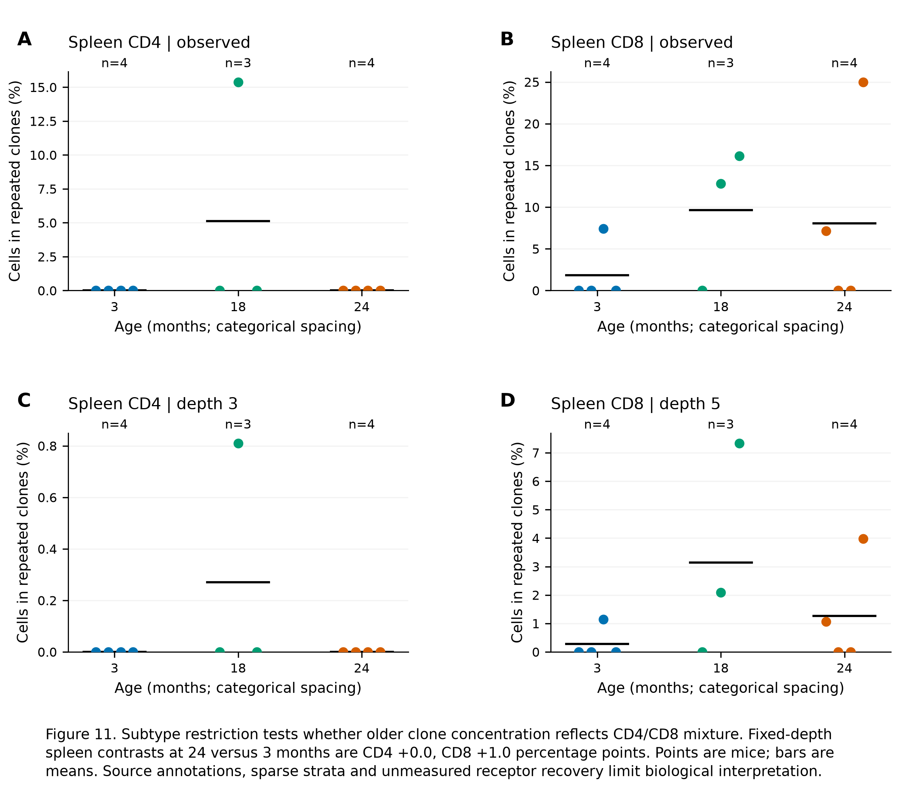

# Nb5 extension completion audit and subtype follow-up

3 October 2026. Some extensions were unfinished. The earlier statement that
P01/P06 were complete referred to their frozen stage-1 designs, not every
biological question in those branches. This continuation closes a source-recovery
job and executes the newly feasible CD4/CD8 follow-up. It does **not** call the
microglial state-versus-mixture model complete.

## What was recovered

The author's [official public object directory](https://czb-tabula-muris-senis.s3.us-west-2.amazonaws.com/?list-type=2&prefix=Data-objects/)
contains a different brain release from the first Figshare intake. The
[full atlas metadata](https://czb-tabula-muris-senis.s3.us-west-2.amazonaws.com/Metadata/tabula-muris-senis-full-metadata.csv)
and [raw FACS metadata](https://czb-tabula-muris-senis.s3.us-west-2.amazonaws.com/Metadata/tabula-muris-senis-facs-official-raw-obj__cell-metadata.csv)
also retain identifiers and annotations absent from Table 9 alone. These are
reused study data, not new animals or independent replication.

The frozen [qualification v2](config/completion_metadata_v2.json) asks whether
these sources resolve missing expression, population and animal identities.
Its rival is a release/naming mismatch mistaken for missing biology; endpoints
are exact joins, expression scale and mouse/age/region coverage. No biological
effect model is fitted in that run.

- The official brain object contains **13,417 cells and 22,966 genes**, with
  6/4/4 mice at 3/18/24 months. Its `raw.X` is nonnegative and integer-valued;
  every row total exactly equals the deposited `n_counts`. `X` remains a
  clipped transformed layer. This resolves the missing all-age count-valued
  representation; it does not establish UMI counts or remove processing effects.
- Removing the explicit terminal `-facs` suffix matches **13,417/13,576**
  case-object cells, including **all 13,130 source-labelled microglia**.
  Cortex, cerebellum, hippocampus and striatum labels are available; missing
  mouse-region combinations and sex imbalance remain explicit. This is a
  cell-identity bridge, not a mapping of deposited cluster numbers to every
  final-paper state label.
- The repertoire bridge matches **5,926/6,011** source rows to official
  annotations. Older IDs are matched through complete sequencing-library IDs
  in the raw metadata, retaining alignment-reference and concatenation rules;
  no well/plate-prefix or fuzzy matching is used. All known age, mouse and
  tissue fields agree. Unmatched rows remain available.
- **19,032/19,101** previously analysed kidney cells match official annotations.
  The matched 24-month cells still carry immune annotations. This does not
  restore a renal epithelial denominator or establish epithelial cell loss.

Evidence: [qualification](../../analysis/research/runs/nb5_completion_metadata_v2/qualification.json),
[layers](../../analysis/research/runs/nb5_completion_metadata_v2/brain_layers.tsv),
[brain design](../../analysis/research/runs/nb5_completion_metadata_v2/brain_design.tsv),
[brain covariates](../../analysis/research/runs/nb5_completion_metadata_v2/brain_covariates.tsv),
[case bridge](../../analysis/research/runs/nb5_completion_metadata_v2/case_brain_join.tsv),
[repertoire bridge](../../analysis/research/runs/nb5_completion_metadata_v2/repertoire_annotation_join.tsv)
and [kidney annotation support](../../analysis/research/runs/nb5_completion_metadata_v2/kidney_annotation_support.tsv).

## Completed biological follow-up: CD4/CD8 repertoire concentration

**Question and decision:** does the older tissue-local clone concentration
persist inside the same broad CD4/CD8 annotation, making a change in their
relative proportions insufficient as the sole explanation? The strongest
remaining rivals are finer naive/memory/activation-state composition and
age-dependent receptor recovery, not just tissue mixture.

The unit is the mouse. The endpoint is the fraction of reconstructed cells in
a clone repeated within that mouse, tissue and annotation. The exact prior
6,000 mapped-cell cohort is retained; newly bridged formerly unassigned rows
do not silently enter the biological denominator. The source repertoire also
contains other and non-T-cell annotations; this subset changes the biological
population and denominator explicitly. All six combinations of
thymus/spleen/marrow and CD4/CD8 were fixed before computing these endpoints.
Eligibility requires two mice at each age and a minimum conditional sampling
depth of two cells, solely for a defined descriptive calculation.

Only the two spleen comparisons meet these rules, with **4/3/4 mice** at
3/18/24 months. Common depths are only **3 CD4 cells and 5 CD8 cells per mouse**.
Marrow CD4 has a minimum of one cell; the other three combinations lack the
exact labels. No threshold was lowered or annotation merged to obtain a result.

| Spleen endpoint, equal-mouse mean (%) | 3 months | 18 months | 24 months |
|---|---:|---:|---:|
| CD4, observed within-subtype repetition | 0.000 | 5.128 | 0.000 |
| CD4, expected at depth 3 | 0.000 | 0.270 | 0.000 |
| CD8, observed within-subtype repetition | 1.852 | 9.650 | 8.036 |
| CD8, expected at depth 5 | 0.285 | 3.141 | 1.260 |

At common depth, CD8 older-minus-young contrasts are **+2.856 percentage
points at 18 months and +0.975 at 24 months**. Their single-mouse-deletion
ranges remain positive (+0.762 to +4.427 and +0.068 to +1.395 pp), but these
are sensitivity ranges, not confidence intervals. CD4 has no observed
24-versus-3-month difference; its 18-month observation comes from one mouse
and disappears when that mouse is omitted. Zero observed repeats is not proof
of absent biological expansion, especially at these small depths.

**Biological reading:** the spleen CD8 pattern is not accounted for solely by
changing broad CD4/CD8 proportions in this reconstructed sample. The pattern
does not generalize to CD4 or establish a uniform age trajectory. These broad
annotations do not make activation/memory states equivalent. Conditional
rarefaction controls reconstructed-cell yield, not sequencing depth, receptor
recovery probability, absolute clone abundance or immune function. This
all-sex descriptive comparison also retains the source age/sex imbalance; it
is not an age effect adjusted for sex.

[PNG](../../analysis/research/runs/nb5_subtype_biological_v1/11_subtype_repertoire.png)
· [PDF](../../analysis/research/runs/nb5_subtype_biological_v1/11_subtype_repertoire.pdf)
· [SVG](../../analysis/research/runs/nb5_subtype_biological_v1/11_subtype_repertoire.svg)
· [mouse values](../../analysis/research/runs/nb5_subtype_biological_v1/subtype_mouse.tsv)
· [all eligibility outcomes](../../analysis/research/runs/nb5_subtype_biological_v1/subtype_support.tsv)
· [contrasts](../../analysis/research/runs/nb5_subtype_biological_v1/subtype_contrasts.tsv)
· [deletions](../../analysis/research/runs/nb5_subtype_biological_v1/leave_one_mouse_out.tsv).

## Remaining work and how it can be completed

These are execution dependencies, not a ranking of RQs. No global question,
human retain/reject decision or claim grade changes.

| Branch/job | Current status | Concrete completion route | What that would still not establish |
|---|---|---|---|
| P01/P05 lung/bladder composition versus expression | Frozen biological stage complete | Existing within-type, fixed-composition and mouse-deletion results can inform RQ development now. Additional absolute abundance or functional work is a new stage. | Senescence, secretion or absolute cell loss from RNA alone. |
| P02 all-age input recovery | Completed in this continuation | Use the official count-valued layer and exact case-cell bridge; retain region, sex and processing provenance. | Final-paper cluster naming or an intermediate state. |
| P02 distinct-state versus mixture comparison | **Still unrun; input availability is no longer the main blocker** | Freeze the actual competing models, region/sex handling, feature family and mouse-held-out evaluation. Learn transformations and state definitions within training mice; compare predictive adequacy against explicit endpoint-mixture and continuum rivals. Retain all folds and failed support. Cohort/processing confounding must constrain interpretation. | A cell's transition, reversibility, disease benefit or independent validation. |
| P06 tissue-local and CD4/CD8 comparisons | Both frozen stages complete; some strata fail eligibility | The next biological discriminator is receptor-recovery-qualified, finer-state-matched T-cell evidence with adequate independent animals. Existing public receptor assembly fields can support a separate recovery audit, but cannot supply missing fine-state identity or function by themselves. | Absolute clonal expansion or immune performance. |
| P01/P08 whole-kidney comparison | Still held | Obtain a comparable renal epithelial population at 24 months, or freeze a deliberately immune-only question. Official relabeling of the current cells does not restore the missing population. | Whole-organ epithelial loss from a sampled-cell denominator. |
| P03 lung ageing versus injury | Proposed, not an unfinished computation | Qualify a compatible independently sampled injury/control cohort, matched population and timing; then freeze a transport contrast. | Injury equivalence or repair function from an ageing score. |
| P04 shared versus organ-specific ageing | Proposed; population qualification remains | Fix homologous populations, assay and gene universe across the intended organs before fitting contrasts. Use an independent cohort for a subsequent transport claim. | A novel conserved mechanism from broad atlas signature overlap. |
| P07 sex dependence | 3-versus-24 interaction unsupported | Add comparable old females, or explicitly design a different 3-versus-18 estimand where both sexes are supported. Keep the original missing stratum visible. | A complete lifespan sex interaction. |
| P08 age shape and selection | Descriptive age support partly recovered; inferential curve unrun | Freeze an age-specific descriptive contrast on a qualified population; justify any more complex curve and separate cohort/survival selection with additional evidence. | Longitudinal change or a trajectory from cross-sectional age groups. |

The immediate technical continuation is therefore the **P02 model specification
and execution**, using the recovered inputs. It should no longer be parked
under a generic missing-expression hold. Completing every proposed branch is
not required before deriving an RQ; a bounded observation, its strongest rival
and a feasible independent discriminator are the useful output.

## Provenance, validation and limitations

Qualification v1 was frozen at `279384d`; its restricted joins were retained.
The explicit naming amendment v2 was frozen at `e25a107`. The biological
subtype contract/code were frozen at `9b2a2c8` after annotation-coverage exposure
and before subtype clone outcomes. All three executions are exposed and reuse
the source study. No failed support or unfavorable result was removed.

The three receipts verify. Exact cohort and clone-size reconstruction,
independent repeated-cell counting, conditional-depth bounds and exhaustive
small-sample calculations passed. Targeted identity tests reject ambiguous,
age-conflicting, mouse-conflicting and tissue-conflicting joins and retain
unmatched rows. Figure 11 was visually inspected: its 44-word, three-line
embedded caption fits; PNG metadata records 300 dpi and the one-page PDF
contains the caption. Required integration checks are in the
[execution ledger](EXECUTION_VALIDATION.md).
