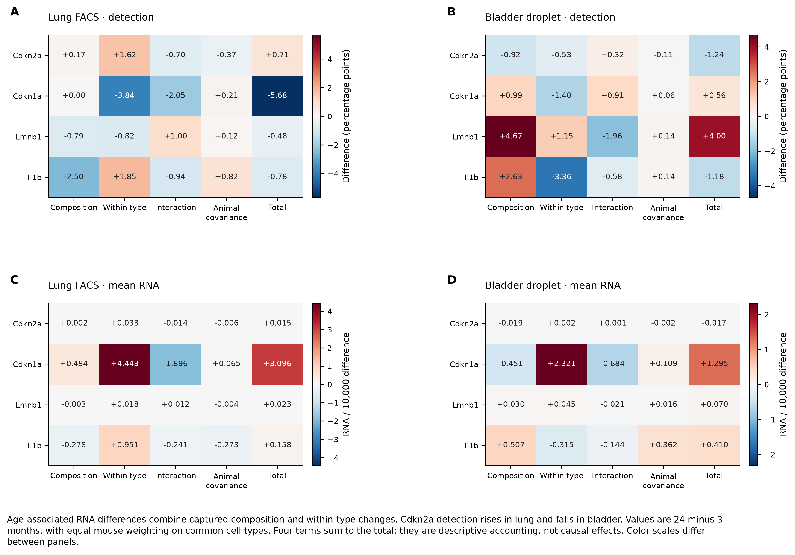
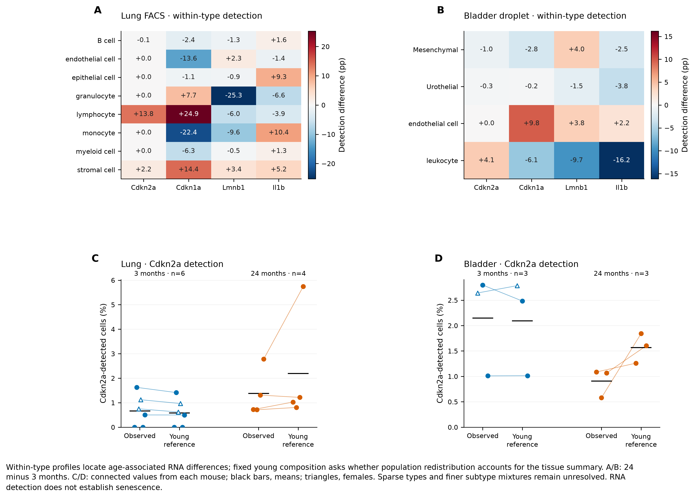
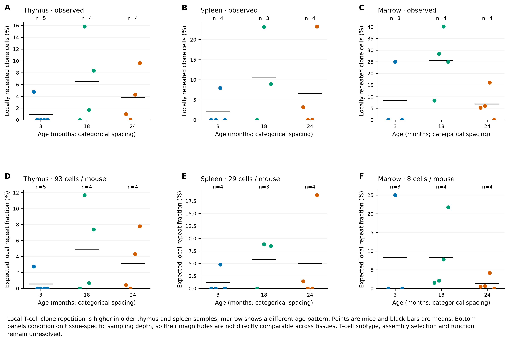
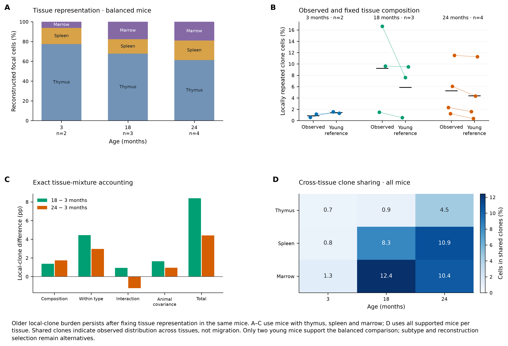

# Nb5 biological extension figures

3 October 2026. Figures 7–10 extend the [original six plates](FIGURES.md).
All PNGs contain concise biological purpose/result captions in the established
article style; expanded explanations are below. Every plate has PNG at 300 dpi,
SVG and PDF exports. All four PNGs were visually checked.

[Four-page figure PDF](../../analysis/research/runs/nb5_biological_figures_v1/nb5_biological_extensions.pdf) ·
[Biological results and limits](EXTENSION_RESULTS.md) ·
[Design](EXTENSION_STAGE1.md) ·
[Rendering receipt](../../analysis/research/runs/nb5_biological_figures_v1/receipt.json).

## Figure 7. Composition and within-type RNA contributions

The four accounting terms distinguish population redistribution from within-annotation RNA differences. The top row uses detection percentage points; the bottom uses normalized mean RNA. Every row sums to its total before rounding. Lung and bladder can have opposite Cdkn2a patterns, and detection need not track mean expression. All-sex mouse means use the same supported cell universe; omitted types and male-only sensitivity remain in the tables.

[PNG](../../analysis/research/runs/nb5_biological_figures_v1/07_tissue_rna_accounting.png) · [SVG](../../analysis/research/runs/nb5_biological_figures_v1/07_tissue_rna_accounting.svg) · [PDF](../../analysis/research/runs/nb5_biological_figures_v1/07_tissue_rna_accounting.pdf).

## Figure 8. Within-type profiles and fixed-composition animal estimates

The upper panels show where within-annotation detection changes occur for the four fixed display genes. The lower panels connect each mouse’s observed common-universe Cdkn2a fraction with its value under the same young-reference composition. Lines connect two summaries of one mouse, not longitudinal observations. Lung’s broad lymphocyte label and sparse populations require finer identity and independent measurements before functional interpretation.

[PNG](../../analysis/research/runs/nb5_biological_figures_v1/08_within_type_and_mouse_profiles.png) · [SVG](../../analysis/research/runs/nb5_biological_figures_v1/08_within_type_and_mouse_profiles.svg) · [PDF](../../analysis/research/runs/nb5_biological_figures_v1/08_within_type_and_mouse_profiles.pdf).

## Figure 9. Tissue-local T-cell clonality across ages

The biological comparison is local repetition within each tissue, with clones and cells nested within mouse. The bottom row conditions on a common reconstruction depth separately for each tissue. Older thymus and spleen means remain higher, while marrow has a different age pattern. The plots retain every mouse and zero; unequal depths, subtype composition and reconstruction selection prevent interpreting these as direct immune-function comparisons.

[PNG](../../analysis/research/runs/nb5_biological_figures_v1/09_compartment_local_clonality.png) · [SVG](../../analysis/research/runs/nb5_biological_figures_v1/09_compartment_local_clonality.svg) · [PDF](../../analysis/research/runs/nb5_biological_figures_v1/09_compartment_local_clonality.pdf).

## Figure 10. Compartment representation and cross-tissue clone sharing

Panels A–C use the same mice with all three focal tissues. Changes in tissue representation account for part of the observed difference, but older local-repeat means remain higher under the fixed young reference. The accounting includes interactions and animal covariance rather than assuming that a standardized change is a causal effect. Panel D uses every supported mouse per tissue and reports cross-tissue sharing, which does not establish migration.

[PNG](../../analysis/research/runs/nb5_biological_figures_v1/10_repertoire_compartment_accounting.png) · [SVG](../../analysis/research/runs/nb5_biological_figures_v1/10_repertoire_compartment_accounting.svg) · [PDF](../../analysis/research/runs/nb5_biological_figures_v1/10_repertoire_compartment_accounting.pdf).
