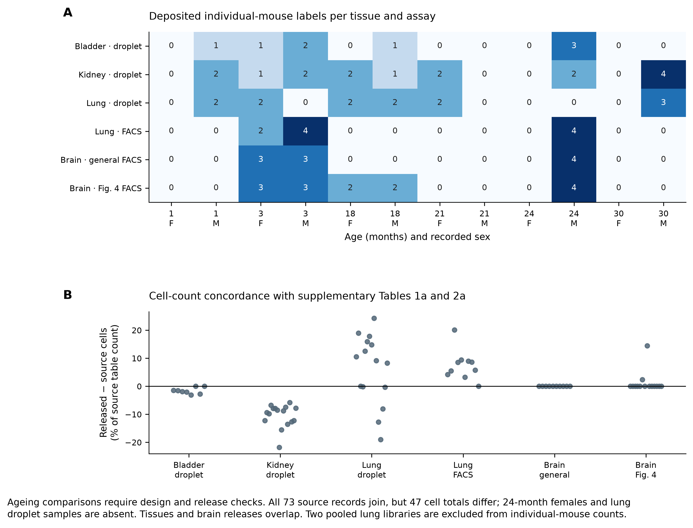
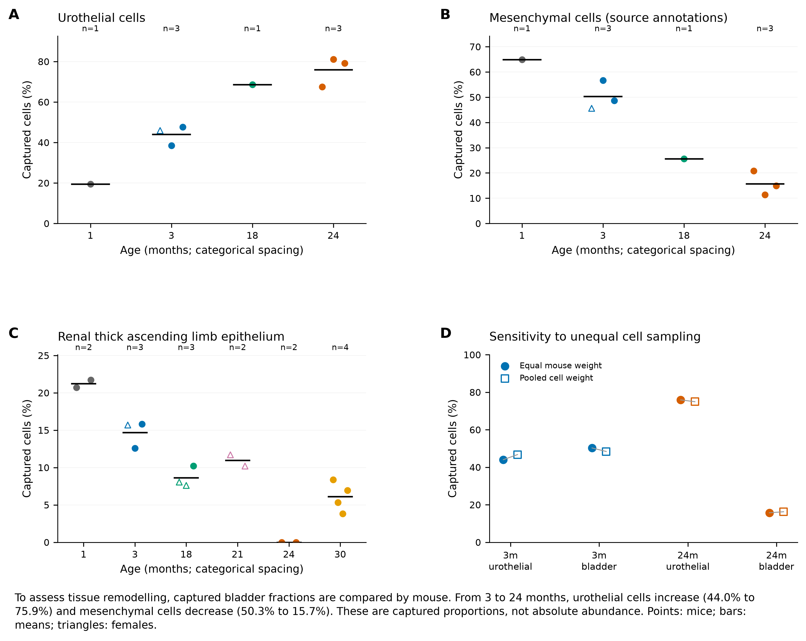
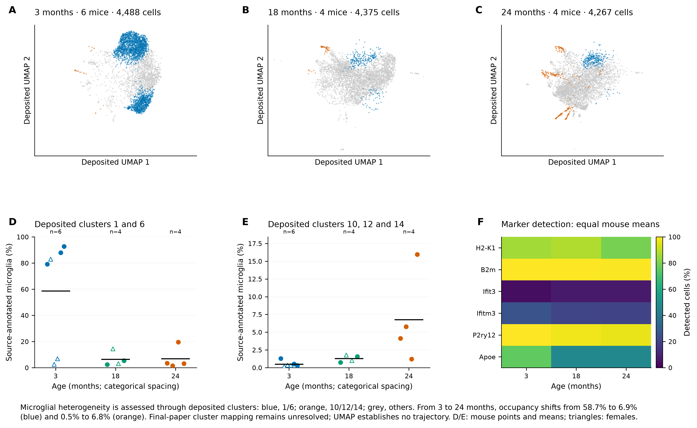
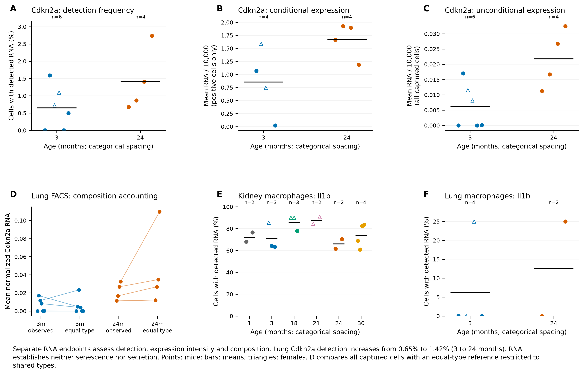
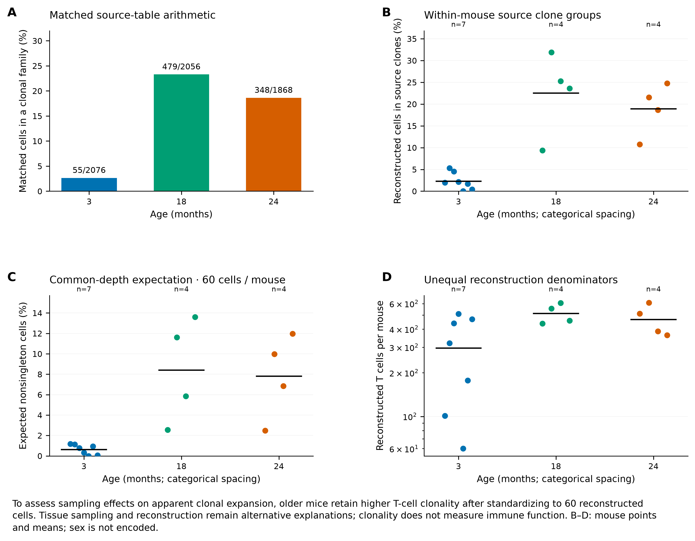
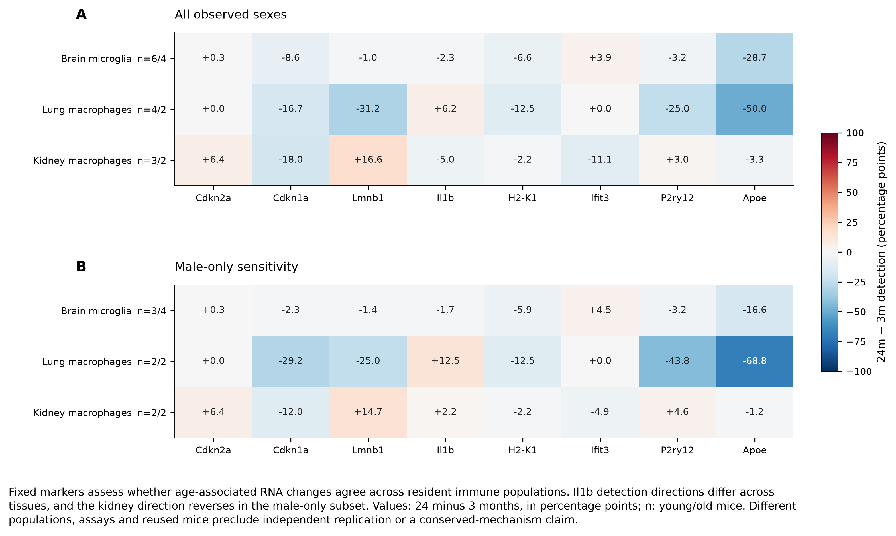

# Nb5 research figure gallery

**Additional biological plates:** [figures 7–10](EXTENSION_FIGURES.md) and
[their results](EXTENSION_RESULTS.md) are available separately.

Current edition of figures 1–6: **version 3**, 3 October 2026. All six PNG, SVG and PDF plates
use compact, 2–3-line captions (39–51 words) covering biological purpose,
the main observed result and its essential limit. Detailed explanations remain
below each figure. Numerical panels and selections are unchanged.

[Current six-page PDF](../../analysis/research/runs/nb5_figures_v3/nb5_figure_set.pdf) ·
[Results](RESULTS.md) · [Extension feasibility](EXTENSION_ASSESSMENT.md) ·
[Version 3 rendering receipt](../../analysis/research/runs/nb5_figures_v3/receipt.json).

The short 9-point footnotes follow the established
[Nb4 extended figures](../gate2_N3_travaglini_nabhan_lung_atlas_2020/scripts/12_extended_figures.py)
and [Nb2 figures](../gate2_N1_nabhan_2023/scripts/05_figures.py).
White backgrounds, panel labels and explicit mouse units are retained.
PNG exports are 300 dpi; SVG/PDF retain vector text and axes, with rasterized
dense UMAP points. No significance stars or cell-based confidence intervals
are introduced. Every PNG was visually inspected; caption clipping and panel
separation checks passed. The six-page PDF contains every compact caption.

Version 3 supersedes the long-caption version 2 for presentation. The
[full-caption v2 PDF](../../analysis/research/runs/nb5_figures_v2/nb5_figure_set.pdf)
and [original v1 PDF](../../analysis/research/runs/nb5_figures_v1/nb5_figure_set.pdf)
remain immutable archives.

## Figure 1. Source qualification defines which ageing comparisons are supported.

Rationale: An apparent age-associated cellular change can reflect the animals sampled, sex composition or a different data release. Establishing the biological units and source concordance is therefore necessary before interpreting ageing effects.

A, numbers of deposited individual-mouse labels by tissue, assay, age and recorded sex. Two pooled young lung droplet libraries are excluded from these counts; tissues, assays and the two brain objects can share mice. B, each point is the difference between a released tissue–mouse cell count and supplementary Table 1a or 2a, expressed as a percentage of the supplementary count.

Results: All 73 source records join, but 47 have different cell totals. No 24-month female is represented in these objects, and lung droplet has no 24-month sample. The Figure 4 brain deposit adds 18-month observations absent from the general brain object. These gaps restrict sex-interaction and cross-assay contrasts; repeated tissues and releases do not supply independent replication. The figure qualifies the design and does not measure a biological ageing effect.

[300-dpi PNG](../../analysis/research/runs/nb5_figures_v3/01_design_and_release.png) · [SVG](../../analysis/research/runs/nb5_figures_v3/01_design_and_release.svg) · [PDF](../../analysis/research/runs/nb5_figures_v3/01_design_and_release.pdf).

## Figure 2. Captured bladder composition changes with age under equal mouse weighting.

Rationale: Tissue-level expression can change because cell proportions change, even without a within-cell-type response. Comparing animal-level fractions with pooled-cell fractions assesses whether unequal cell sampling dominates the observed composition pattern.

A–B, captured bladder urothelial and mesenchymal fractions; the mesenchymal mapping is supported by deposited Car3+ and Scara5+ free annotations. C, the deposited renal thick-ascending-limb epithelial fraction. Points are mice, triangles females, circles males and black bars arithmetic mouse means; n is given above each age. D, equal-mouse and pooled-cell bladder summaries at 3 and 24 months.

Results: Mean urothelial representation increases from 44.03% to 75.90%, while mesenchymal representation decreases from 50.29% to 15.71% between 3 and 24 months (three mice per age). The direction persists under either weighting. The renal label is absent at 24 months but present at 30 months, requiring annotation and capture checks. These are captured fractions, not absolute cell abundance or evidence of cell loss, proliferation or repair. One month is developmental context, and ages are cross-sectional.

[300-dpi PNG](../../analysis/research/runs/nb5_figures_v3/02_captured_composition.png) · [SVG](../../analysis/research/runs/nb5_figures_v3/02_captured_composition.svg) · [PDF](../../analysis/research/runs/nb5_figures_v3/02_captured_composition.pdf).

## Figure 3. Deposited microglial labels reveal age-associated occupancy, with source identity unresolved.

Rationale: An intermediate microglial state must be distinguished from changing proportions of existing states. The first step is to establish whether the deposited cells and cluster numbers correspond to those used in the published age comparison.

A–C, unchanged author UMAP coordinates for source-annotated microglia at 3, 18 and 24 months. Blue marks deposited Leiden labels 1/6, orange labels 10/12/14 and grey the remaining labels. D–E, individual-mouse occupancy and arithmetic means (n = 6/4/4); triangles are females and circles males. F, equal-mouse fractions with nonzero expression of fixed markers in deposited transformed X. The occupancy panels use different, explicitly labeled y-axis ranges.

Results: Labels 1/6 occupy 58.70%, 6.35% and 6.93% of microglia on average across the three ages; labels 10/12/14 occupy 0.50%, 1.28% and 6.77%. Cell counts and the inferred role of these numbered sets do not establish final-paper correspondence. No cluster was remapped to fit age, and no new trajectory was fitted. This is a deposit-concordance audit; it does not demonstrate a distinct intermediate state, a transition or Alzheimer-related function.

[300-dpi PNG](../../analysis/research/runs/nb5_figures_v3/03_microglial_source_states.png) · [SVG](../../analysis/research/runs/nb5_figures_v3/03_microglial_source_states.svg) · [PDF](../../analysis/research/runs/nb5_figures_v3/03_microglial_source_states.pdf).

## Figure 4. Marker detection, conditional expression and tissue composition describe different endpoints.

Rationale: An increase in a tissue marker can arise from more RNA-positive cells, higher expression among positive cells or a different captured cell mixture. Separating these quantities prevents an RNA measurement from being equated with senescence or inflammatory function.

A–C, lung FACS Cdkn2a detection frequency, positive-cell mean and all-cell mean. Values use normalized RNA per 10,000; two young mice with no detected Cdkn2a have an undefined positive-cell mean and are omitted only from B. D, paired observed and equal-common-cell-type means per mouse; common FACS types cover 91.34–99.01% of captured cells. E–F, macrophage Il1b detection in kidney droplet and lung FACS. Points are mice, triangles females, circles males and black bars mouse means; n is shown.

Results: Lung FACS Cdkn2a detection averages 0.650% at 3 months and 1.421% at 24 months, while the all-cell normalized mean rises from 0.006125 to 0.021784 (n = 6/4). The panels expose animal variability, sparse macrophage support and the effect of reweighting. Reweighting is descriptive and uses incomplete common-type coverage; it is not causal mediation. Cdkn2a RNA is not a senescence assay, and Il1b RNA does not measure cytokine secretion.

[300-dpi PNG](../../analysis/research/runs/nb5_figures_v3/04_marker_endpoints.png) · [SVG](../../analysis/research/runs/nb5_figures_v3/04_marker_endpoints.svg) · [PDF](../../analysis/research/runs/nb5_figures_v3/04_marker_endpoints.pdf).

## Figure 5. Older reconstructed T-cell repertoires remain more concentrated at a common sampling depth.

Rationale: Higher observed clonality may reflect unequal numbers of reconstructed receptors or different sampled tissues. Source identity correction, mouse-level summaries and equal-depth sampling assess these observational explanations before assigning an immune-function interpretation.

A, cells in within-mouse nonsingleton source clone groups divided by matched reconstructed-cell counts. B, individual-mouse fractions and arithmetic means (n = 7/4/4 at 3/18/24 months). C, the exact expected nonsingleton fraction after sampling 60 reconstructed cells per mouse, conditional on the observed clone labels. D, reconstruction denominators on a logarithmic axis. Sex is not encoded. The common depth is the observed minimum, not a power threshold.

Results: The source yields 55/2,076, 479/2,056 and 348/1,868 clonal cells. Numerators match the manuscript, but the young and old denominators differ. Equal-mouse fractions average 2.30%, 22.53% and 18.94%; common-depth expectations are 0.62%, 8.41% and 7.82%. Eight 18-month and three 24-month rows lack metadata matches. The older-versus-younger pattern remains in this conditional sampling comparison, while tissue mixture, reconstruction selection and source-version differences remain unresolved. These results do not establish antigen specificity or immune competence.

[300-dpi PNG](../../analysis/research/runs/nb5_figures_v3/05_repertoire_sampling.png) · [SVG](../../analysis/research/runs/nb5_figures_v3/05_repertoire_sampling.svg) · [PDF](../../analysis/research/runs/nb5_figures_v3/05_repertoire_sampling.pdf).

## Figure 6. Fixed-marker age differences depend on resident population and sampled sex composition.

Rationale: A shared ageing mechanism would require more than a similar marker direction across organs. Distinct resident-cell identities, assay differences and unequal sex composition can produce apparent agreement or disagreement.

A–B, 24-minus-3-month differences in equal-mouse detection fractions for a fixed marker subset, using all observed sexes and then males only. Values are percentage points; n labels give young/old mouse counts. The complete predeclared marker family remains in the source table. These are separate within-population descriptions, not a pooled cross-organ model.

Results: In the all-sex summaries, Il1b detection changes by −2.3, +6.2 and −5.0 percentage points in brain microglia, lung macrophages and kidney macrophages, respectively. The kidney estimate changes to +2.2 points in males alone. Several other marker magnitudes also depend on the sampled sex composition. Sparse populations, different assays and reused mice limit interpretation. The old female stratum is absent, so these sensitivity panels do not test an age-by-sex interaction; shared directions would not by themselves establish a conserved ageing programme.

[300-dpi PNG](../../analysis/research/runs/nb5_figures_v3/06_fixed_marker_context.png) · [SVG](../../analysis/research/runs/nb5_figures_v3/06_fixed_marker_context.svg) · [PDF](../../analysis/research/runs/nb5_figures_v3/06_fixed_marker_context.pdf).
