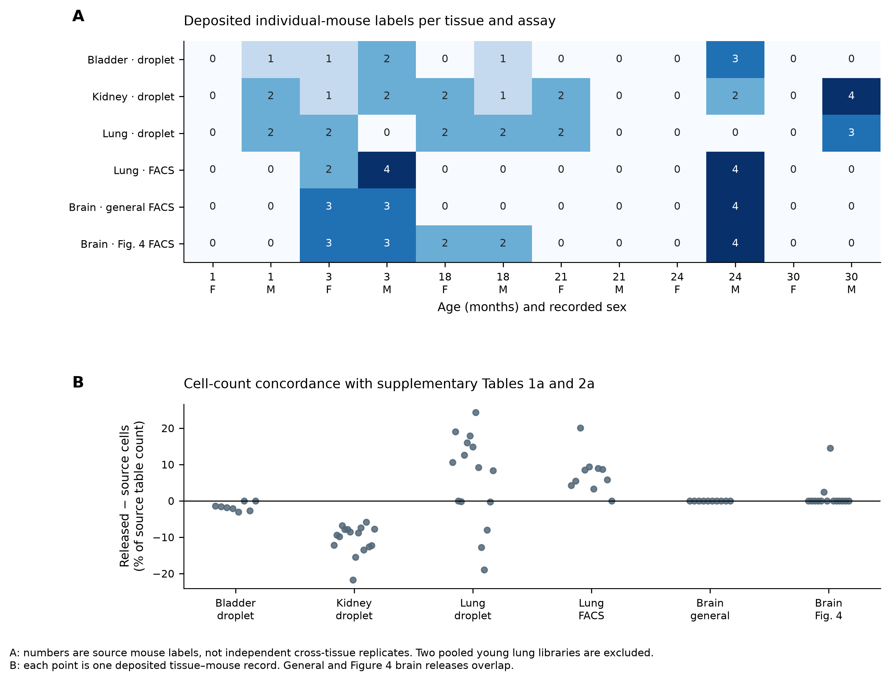
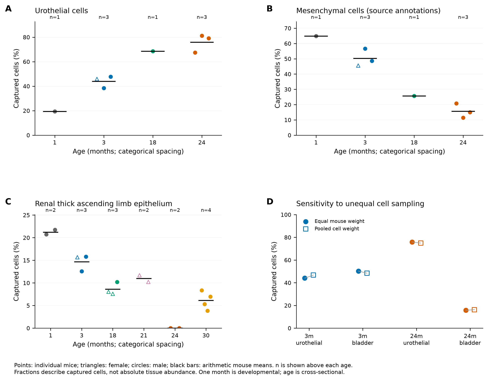
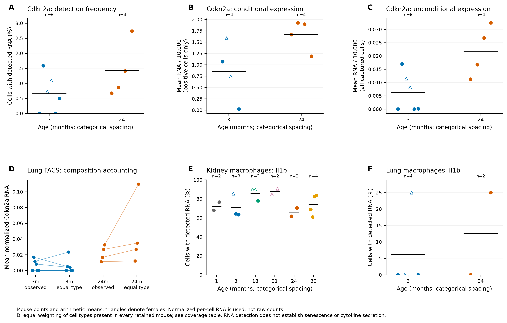
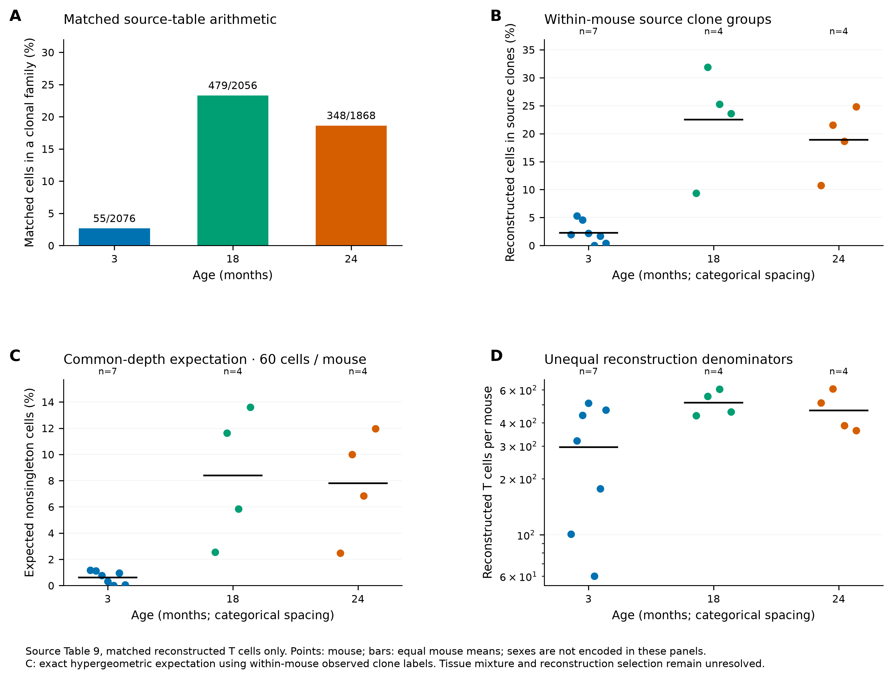
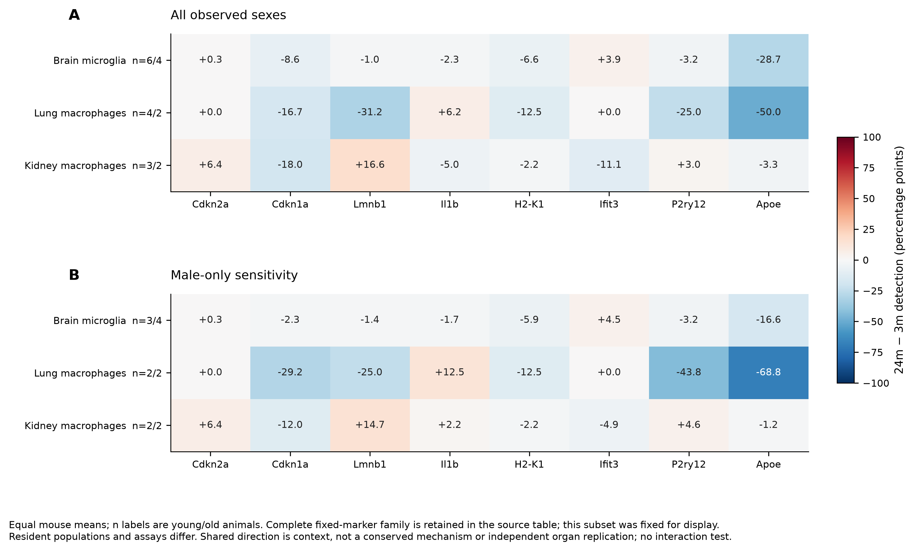

# Nb5 research figure gallery

3 October 2026. Six outcome-exposed descriptive plates, inspected individually.
White backgrounds, labeled panels, individual-mouse points and explicit units
follow the neighboring Nb4 article figures. No significance stars or cell-based
confidence intervals. Dense UMAP points are rasterized within vector exports.

[Combined six-page PDF](../../analysis/research/runs/nb5_figures_v1/nb5_figure_set.pdf) · [Results and limits](RESULTS.md) · [Rendering receipt](../../analysis/research/runs/nb5_figures_v1/receipt.json).

## Figure 1. Design and source-release qualification

A, individual deposited mouse labels by age, sex, tissue and assay. The two pooled young lung droplet labels are excluded from these counts; rows share animals. B, relative cell-count difference from supplementary source tables for each tissue–mouse record. Zero joins fail, but 47 of 73 totals differ. General and Figure 4 brain objects overlap.

[300-dpi PNG](../../analysis/research/runs/nb5_figures_v1/01_design_and_release.png) · [SVG](../../analysis/research/runs/nb5_figures_v1/01_design_and_release.svg) · [PDF](../../analysis/research/runs/nb5_figures_v1/01_design_and_release.pdf).

## Figure 2. Captured composition and sampling

A–C, per-mouse captured fractions and equal-mouse means; n is displayed at each age. Triangles indicate females and circles males. Source free annotations establish the mesenchymal mapping in B. D, equal-mouse versus pooled-cell bladder summaries. These are capture proportions, not absolute tissue counts. The zero renal label at 24 months requires annotation/capture qualification; it is not a disappearance claim.

[300-dpi PNG](../../analysis/research/runs/nb5_figures_v1/02_captured_composition.png) · [SVG](../../analysis/research/runs/nb5_figures_v1/02_captured_composition.svg) · [PDF](../../analysis/research/runs/nb5_figures_v1/02_captured_composition.pdf).

## Figure 3. Microglial deposit concordance audit

A–C, unchanged author UMAP coordinates, restricted to the deposited microglial annotation. The same numbered Leiden sets are colored across ages; final-paper cluster identity is unresolved. D–E, each mouse contributes one occupancy fraction; n=6/4/4. F, equal-mouse nonzero-expression fractions in deposited transformed X. Differing y-axis ranges in D and E are explicit. Neither clustering nor a trajectory was fitted here, and this does not test a distinct intermediate state.

[300-dpi PNG](../../analysis/research/runs/nb5_figures_v1/03_microglial_source_states.png) · [SVG](../../analysis/research/runs/nb5_figures_v1/03_microglial_source_states.svg) · [PDF](../../analysis/research/runs/nb5_figures_v1/03_microglial_source_states.pdf).

## Figure 4. Separate RNA endpoints and composition accounting

A–C, lung FACS Cdkn2a detection, positive-cell mean and all-cell mean. Conditional means omit mice with no detected cell, explaining the smaller young n in B. D, paired per-mouse observed and equal-common-type means; retained FACS types cover 91.34–99.01% of cells. E–F, macrophage Il1b detection in kidney droplet and lung FACS, with actual unit counts. Sparse captured macrophages limit precision. The endpoints do not establish senescence, cytokine secretion or repair.

[300-dpi PNG](../../analysis/research/runs/nb5_figures_v1/04_marker_endpoints.png) · [SVG](../../analysis/research/runs/nb5_figures_v1/04_marker_endpoints.svg) · [PDF](../../analysis/research/runs/nb5_figures_v1/04_marker_endpoints.pdf).

## Figure 5. T-cell repertoire sampling

A, within-mouse nonsingleton clone numerators over matched reconstructed-cell denominators from the corrected source join. Numerators match the manuscript while the 3m and 24m denominators differ. B, each mouse contributes one clonal fraction; n=7/4/4. C, exact conditional expectation after sampling 60 cells per mouse; uncertainty about unobserved receptors is not estimated. D, reconstruction denominators on a logarithmic axis. Sex is not encoded in this plate. Tissue mixture and reconstruction selection remain unresolved; no function is inferred.

[300-dpi PNG](../../analysis/research/runs/nb5_figures_v1/05_repertoire_sampling.png) · [SVG](../../analysis/research/runs/nb5_figures_v1/05_repertoire_sampling.svg) · [PDF](../../analysis/research/runs/nb5_figures_v1/05_repertoire_sampling.pdf).

## Figure 6. Fixed-marker organ context and sex sensitivity

A–B, differences between equal mouse means at 24 and 3 months for a display subset fixed before plotting. Values are percentage points of cells with nonzero RNA. All observed sexes and male-only summaries are separate; n labels give young/old mouse counts. The complete predeclared marker family is retained in the contrast table. Brain microglia, lung macrophages and kidney macrophages are distinct resident populations and assays; these panels do not identify a conserved programme or test an age-by-sex interaction.

[300-dpi PNG](../../analysis/research/runs/nb5_figures_v1/06_fixed_marker_context.png) · [SVG](../../analysis/research/runs/nb5_figures_v1/06_fixed_marker_context.svg) · [PDF](../../analysis/research/runs/nb5_figures_v1/06_fixed_marker_context.pdf).
