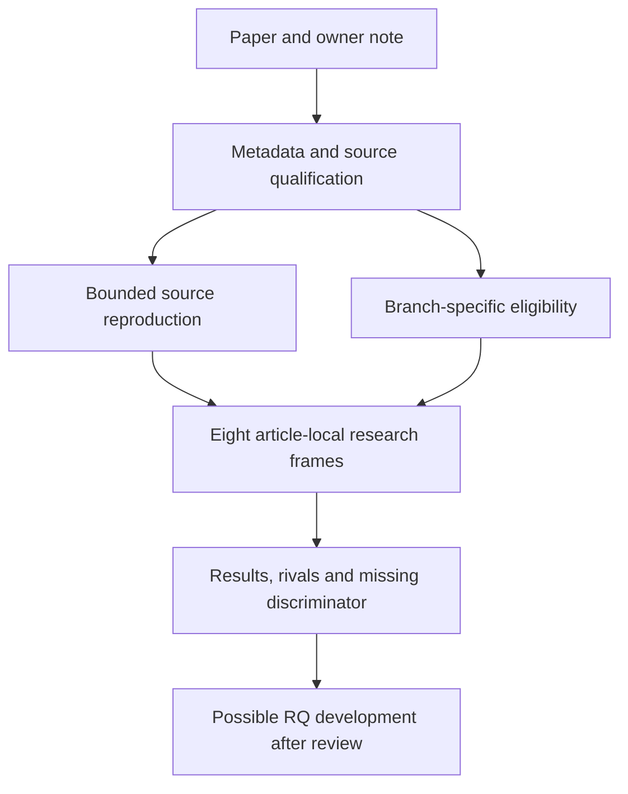

# Nb5 mouse ageing atlas analysis development

**Current status, 3 October 2026:** [bounded agent scientific review and routing](rq_review/README.md)
are complete. P01/P02/P04/P06 are registered as proposed A24/A25/A26/A27;
P03 extends A3. Other branches support qualified comparisons. Earlier draft
review language below is historical; human acceptance, exact novelty and
execution readiness remain unresolved where specified.

**Gate 2N item N4. Reading completed by the owner on 3 October 2026;
first descriptive analysis, stage-1 biological extensions, a subtype follow-up and eleven figure plates completed; scientific review pending.**

[A single-cell transcriptomic atlas characterizes ageing tissues in the mouse](https://doi.org/10.1038/s41586-020-2496-1),
The Tabula Muris Consortium, Nature 583, 590–595 (2020).
The requested folder name identifies the Nabhan reading branch; the citation
retains consortium authorship. `Nb5` distinguishes this package from the
existing `Nb4` human lung atlas. Paper IDs 1–16 and global A0–A23 remain unchanged.

This package separates bounded source reproduction from eight exploratory
frames: composition/expression, the owner's microglial idea, lung injury
context, organ specificity, marker/assay validity, immune clonality, sex
dependence and age shape. These are article-local candidates for further
analysis and RQ development, not a ranking of global questions.

| Read | Purpose |
|---|---|
| [Provisional RQ derivations](rq_derivation/README.md) | Eight derivation cards, primary precedents, evidence-access limits and pending scientific review |
| [Completion audit and latest results](EXTENSION_COMPLETION.md) | Recovered inputs, CD4/CD8 result and explicit unfinished-job routes |
| [Biological extension results](EXTENSION_RESULTS.md) | Within-type versus composition and compartment-local repertoire findings |
| [Extension figures](EXTENSION_FIGURES.md) | Figures 7–11 with compact embedded captions |
| [Extension design](EXTENSION_STAGE1.md) | Frozen biological questions, rivals, estimands and remaining holds |
| [First descriptive results](RESULTS.md) | Source discrepancies and initial branch dispositions |
| [Figure gallery](FIGURES.md) | Six plates with compact purpose/result captions; expanded gallery explanations and PNG/SVG/PDF exports |
| [Extension feasibility](EXTENSION_ASSESSMENT.md) | Supported sensitivity work and conditional steps before RQ derivation |
| [Execution validation](EXECUTION_VALIDATION.md) | Frozen contracts, amendments, verification and failures |
| [Source manifest](SOURCE_MANIFEST.md) | Exact acquired file hashes and URLs |
| [Branch register](BRANCH_REGISTER.md) | Eight separate cards and criteria for later RQ development |
| [Source reproduction](REPRODUCTION_SCOPE.md) | Bounded fidelity checks, separate from additional research |
| [Analysis plan](ANALYSIS_TRIAL_PLAN.md) | Candidates, measurements, rivals, ordered stages, decisions and holds |
| [Source and note reconciliation](NOTE_RECONCILIATION.md) | Context from the owner's Result(Body) note, corrections and source limits |
| [Data qualification](DATASETS.md) | Verified deposit pointers, release identity and missing animal-level joins |
| [Repository context](REPOSITORY_CONTEXT.md) | Repository purpose, folder ownership and existing evidence boundaries |
| [Verification](VALIDATION.md) | Documentation checks and integration base |

The first bounded analysis, P01/P06 stage-1 designs and CD4/CD8 follow-up are
complete. Read EXTENSION_COMPLETION.md before the earlier results and plan.
The microglial state/mixture comparison remains unrun, but official all-age
count-valued inputs are now recovered. Other proposed branches retain their
specific population, design or independent-evidence requirements. Published outcomes and the
owner note were exposed before execution. No claim grade or global RQ changed.

Executable contracts and source scripts live here; immutable runs and figure
exports live under `analysis/research/runs/nb5_*`, as required by the research
runner. Large inputs remain in ignored `raw_data/tabula_muris_senis_2020/`.
