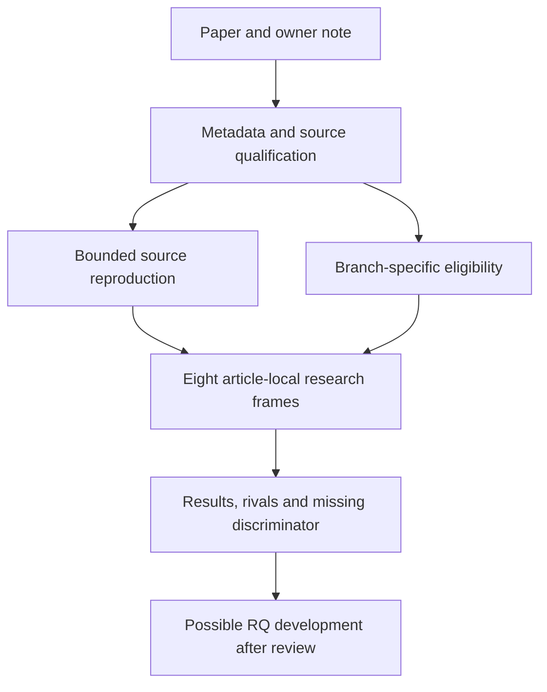

# Nb5 mouse ageing atlas analysis development

**Gate 2N item N4. Reading completed by the owner on 3 October 2026;
analysis plan drafted, scientific review pending, numerical analysis unrun.**

[A single-cell transcriptomic atlas characterizes ageing tissues in the mouse](https://doi.org/10.1038/s41586-020-2496-1),
The Tabula Muris Consortium, Nature 583, 590–595 (2020).
The requested folder name identifies the Nabhan reading branch; the citation
retains consortium authorship. `Nb5` distinguishes this package from the
existing `Nb4` human lung atlas. Paper IDs 1–16 and global A0–A23 remain unchanged.

This package separates bounded source reproduction from eight exploratory
frames: composition/expression, the owner's microglial idea, lung injury
context, organ specificity, marker/assay validity, immune clonality, sex
dependence and age shape. These are article-local candidates for further
analysis and RQ development, not a ranking of global questions.

| Read | Purpose |
|---|---|
| [Branch register](BRANCH_REGISTER.md) | Eight separate cards and criteria for later RQ development |
| [Source reproduction](REPRODUCTION_SCOPE.md) | Bounded fidelity checks, separate from additional research |
| [Analysis plan](ANALYSIS_TRIAL_PLAN.md) | Candidates, measurements, rivals, ordered stages, decisions and holds |
| [Source and note reconciliation](NOTE_RECONCILIATION.md) | Context from the owner's Result(Body) note, corrections and source limits |
| [Data qualification](DATASETS.md) | Verified deposit pointers, release identity and missing animal-level joins |
| [Repository context](REPOSITORY_CONTEXT.md) | Repository purpose, folder ownership and existing evidence boundaries |
| [Verification](VALIDATION.md) | Documentation checks and integration base |

The next executable work is metadata qualification under a committed contract.
No expression matrix, source supplement workbook or per-animal map has been
qualified here. No executable contract, run receipt, biological result or
claim grade is created by this planning package. Published outcomes and the
owner's note have already been read; future source reanalysis is exposed work.

Future `config/`, `scripts/`, `runs/`, `reports/` and `figures/` directories
should be created as their first real artifacts become available. Large source
files belong in ignored `raw_data/tabula_muris_senis_2020/`. A missing output
must not be represented by an empty results file or a success status.
