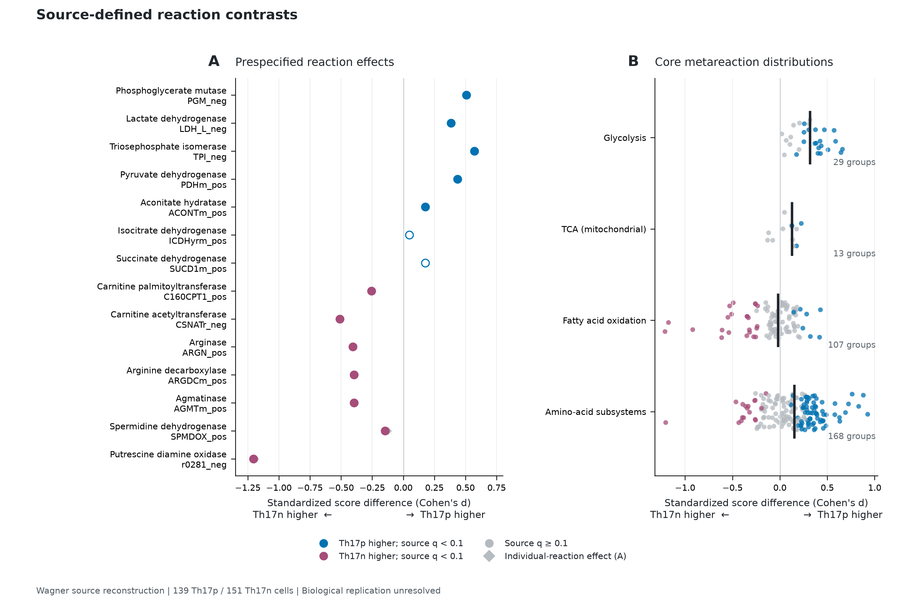
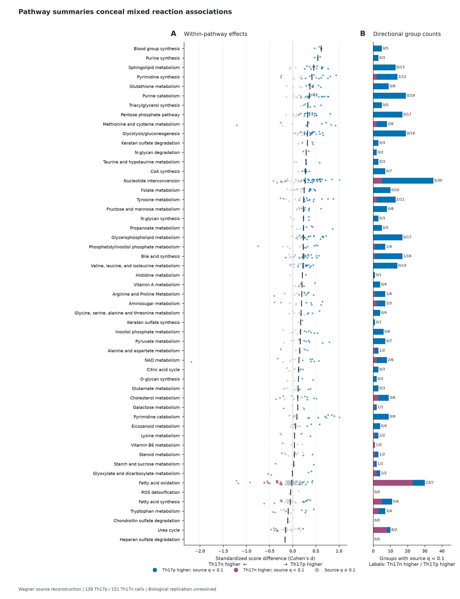
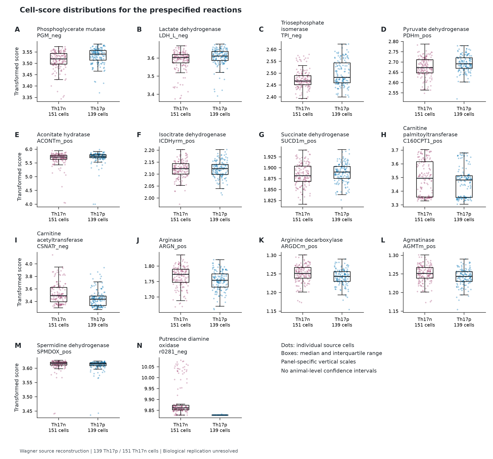
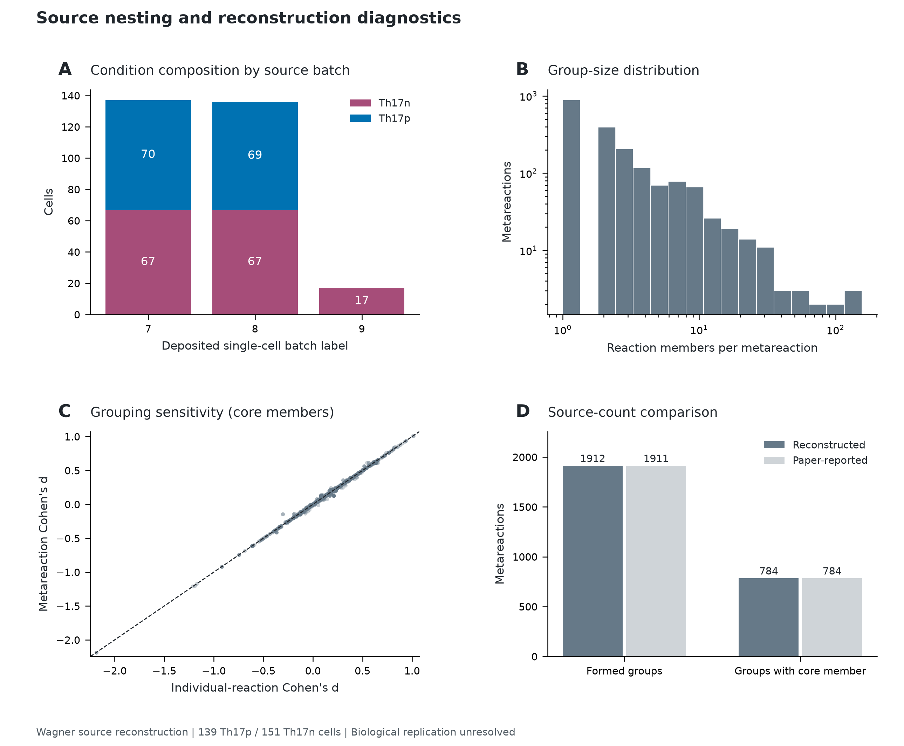
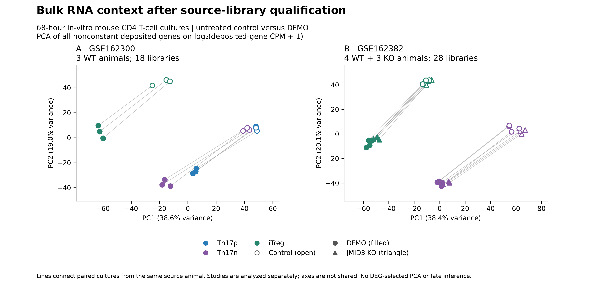
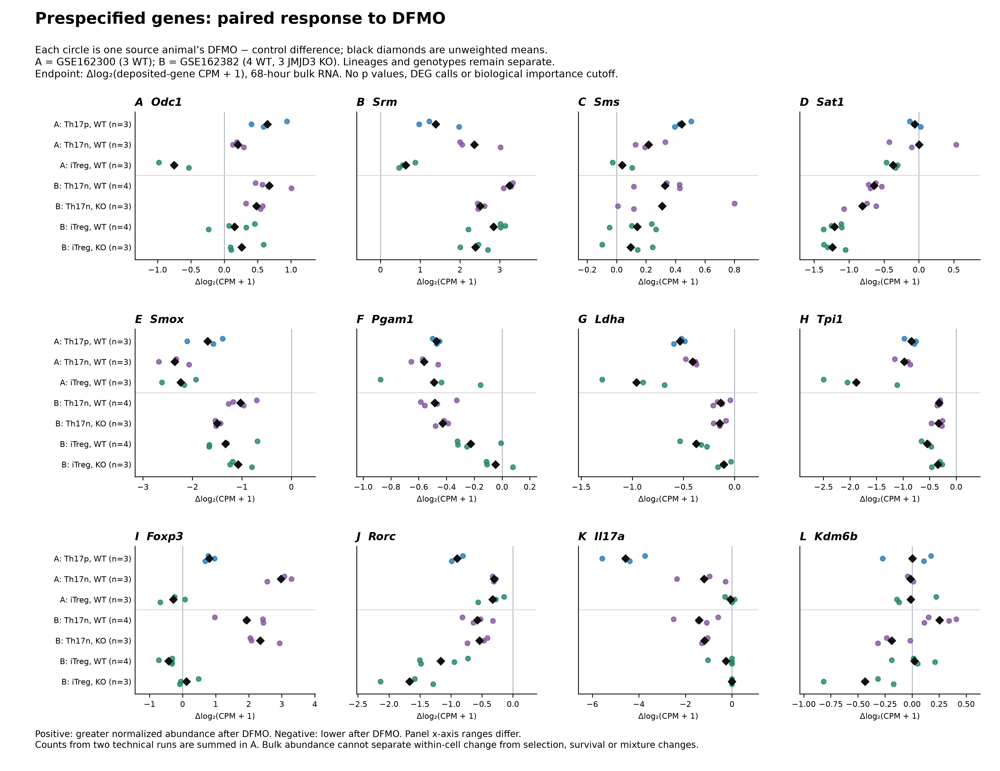

# Wagner research article figure gallery

Exposed descriptive reconstruction of author-provided Compass penalties. Read
the [numerical result and limitations](SOURCE_SCORE_RESULTS.md). All four plates
are available together as a [vector PDF](../../analysis/research/runs/wg_figures_v2/Wagner_R1_figures.pdf).
Individual vector PDF/SVG and 300-dpi PNG files follow. These are generated
scientific figures from frozen tables, not illustrative simulations.

The [initial R3 bulk RNA analysis](BULK_RESULTS.md) adds Figures 4–5 below,
with its own [two-plate PDF](../../analysis/research/runs/wg_bulk_figures_v1/Wagner_R3_initial_figures.pdf).

## Experimental context for R1 Figures 1–3 and S1

**Experimental comparison.** C57BL/6 mouse CD4 T cells from the original
IL-17A–GFP reporter dataset, differentiated in vitro and sorted as GFP-positive
cells after **48 hours**. These are the source-selected 290 cells reused by
Wagner's author example.

| Figure label | Differentiation condition | Cells shown | Deposited source |
|---|---|---:|---|
| Th17p (blue) | IL-1β + IL-6 + IL-23; pathogenic differentiation condition | 139 | [GSE75109](https://www.ncbi.nlm.nih.gov/geo/query/acc.cgi?acc=GSE75109) |
| Th17n (purple) | TGF-β1 + IL-6; non-pathogenic differentiation condition | 151 | [GSE75111](https://www.ncbi.nlm.nih.gov/geo/query/acc.cgi?acc=GSE75111) |

This is a **differentiation-condition comparison**, not a DFMO-versus-vehicle
comparison. It is also distinct from the 68-hour bulk RNA experiment analysed
for R3. The source labels do not establish pathogenicity for each individual
cell. Exact identities and conditions are recorded in the
[R0 cell join](../../analysis/research/runs/wg_source_qualification_v1/cell_join.tsv);
independent animal/preparation mapping remains unresolved.

## Figure 1: Source-defined reaction contrasts

A, Standardized Th17p-minus-Th17n score differences for all 14 source-named reactions declared before execution. Filled circles indicate source-cell BH q < 0.1; open circles indicate q >= 0.1. Grey diamonds show the individual-reaction route, while circles show the metareaction route. B, Each point is one distinct metareaction within the indicated core pathway; black lines show unweighted medians. The amino-acid panel pools the 16 source-listed subsystems and deduplicates groups. The same metareaction may occur in several pathways. Higher scores indicate lower Compass penalties, not measured flux. Cell-level q values reconstruct the source convention and do not establish animal-level evidence.

[PDF](../../analysis/research/runs/wg_figures_v2/figure_1.pdf) · [SVG](../../analysis/research/runs/wg_figures_v2/figure_1.svg) · [PNG](../../analysis/research/runs/wg_figures_v2/figure_1.png)

## Figure 2: Pathway summaries conceal mixed reaction associations

All 53 source-display pathways are shown. Left, one point per distinct metareaction per pathway, with black median marks. Blue and purple indicate positive and negative effects with source-cell BH q < 0.1; grey indicates other groups. Right, counts of groups meeting that source threshold in each direction. Rows are ordered by the unweighted median effect; this display order is descriptive. Pathways require more than five core reaction members and exclude the source transport/exchange/other categories. Shared groups across pathways are not independent tests. Medians are summaries of inferred scores, not pathway flux or activity measurements.

[PDF](../../analysis/research/runs/wg_figures_v2/figure_2.pdf) · [SVG](../../analysis/research/runs/wg_figures_v2/figure_2.svg) · [PNG](../../analysis/research/runs/wg_figures_v2/figure_2.png)

## Figure 3: Cell-score distributions for the prespecified reactions

**Conditions:** 48-hour, GFP-positive mouse CD4 T cells; Th17p = IL-1β + IL-6 +
IL-23 (blue, 139 cells), Th17n = TGF-β1 + IL-6 (purple, 151 cells). No DFMO
treatment contrast is represented in this plate.

All 14 prespecified reactions are shown without selecting for effect size. Each dot is one source cell; the deterministic horizontal jitter is visual only. Boxes show the median and interquartile range, with whiskers extending to the most extreme points within 1.5 interquartile ranges. Each panel contains 151 Th17n and 139 Th17p observations. Scores are the saved metareaction values, so reactions sharing a group have identical distributions. Vertical scales differ between panels. These cells are nested in unresolved animals or preparations; boxes and points are descriptive and no biological confidence interval is supplied.

### Figure 3: which reaction scores differ?

**Read the between-condition separation using d and q together.** Here
`d = (mean Th17p score − mean Th17n score) / pooled within-condition SD`.
Positive d means a higher predicted reaction-activity score in Th17p; negative d
means a higher score in Th17n. This is a standardized score difference, not an
enzyme-expression fold change. The `_pos`/`_neg` suffix denotes the modelled
reaction direction; it does not determine the sign of the group difference.

The table reports the existing two-sided Mann–Whitney source-cell comparison,
with BH correction across **all 1,722 tested metareactions**, before these 14
named reactions were displayed. **q < 0.1** is the source reproduction cutoff.
It does not by itself identify a biologically important enzyme or account for
unknown animal/preparation nesting. No justified biological effect-size margin
has been supplied, so “considerable” is not assigned as a biological category.

| Panel | Source-named enzyme/reaction | Reaction ID | d (Th17p − Th17n) | Source-cell BH q | At source q < 0.1 |
|---|---|---|---:|---:|---|
| A | Phosphoglycerate mutase | `PGM_neg` | +0.508 | 2.87e-05 | Th17p higher |
| B | Lactate dehydrogenase | `LDH_L_neg` | +0.383 | 0.00149 | Th17p higher |
| C | Triosephosphate isomerase | `TPI_neg` | +0.572 | 0.000286 | Th17p higher |
| D | Pyruvate dehydrogenase | `PDHm_pos` | +0.436 | 0.00175 | Th17p higher |
| E | Aconitate hydratase | `ACONTm_pos` | +0.176 | 0.0123 | Th17p higher |
| F | Isocitrate dehydrogenase | `ICDHyrm_pos` | +0.049 | 0.871 | **Threshold not met** |
| G | Succinate dehydrogenase | `SUCD1m_pos` | +0.177 | 0.18 | **Threshold not met** |
| H | Carnitine palmitoyltransferase | `C160CPT1_pos` | -0.255 | 0.0357 | Th17n higher |
| I | Carnitine acetyltransferase | `CSNATr_neg` | -0.509 | 1.17e-05 | Th17n higher |
| J | Arginase | `ARGN_pos` | -0.406 | 0.000862 | Th17n higher |
| K | Arginine decarboxylase | `ARGDCm_pos` | -0.395 | 0.00109 | Th17n higher |
| L | Agmatinase | `AGMTm_pos` | -0.395 | 0.00109 | Th17n higher |
| M | Spermidine dehydrogenase | `SPMDOX_pos` | -0.147 | 0.00378 | Th17n higher |
| N | Putrescine diamine oxidase | `r0281_neg` | -1.204 | 2.01e-46 | Th17n higher |

**Interpretation of the visible panels.** Panel **N**, putrescine diamine oxidase,
has the largest absolute standardized separation among these 14 prespecified
rows (d = −1.204; Th17n higher). Panels **A/C** show higher phosphoglycerate-mutase
and triosephosphate-isomerase scores in Th17p, while **I** shows a higher carnitine
acetyltransferase score in Th17n; their absolute d values are approximately
0.51–0.57. These are relative effect magnitudes, not validated importance cutoffs.

Panels **F/G** (isocitrate and succinate dehydrogenase) do not meet the source
q cutoff; this does not establish equivalent activity or absence of an effect.
Panel **M** illustrates why q and effect size differ: q = 0.00378 accompanies a
much smaller standardized separation (d = −0.147). **K/L share metareaction 288**,
so their identical score distributions and statistics are one grouped association,
not two independent enzyme findings.

The y-axes use different ranges. Compare d values across panels rather than the
apparent vertical gap or raw score height. The plotted quantities are
transcriptome/network-derived Compass scores, not measured enzyme abundance,
catalytic activity or metabolic flux. Exact values and model annotations are in
the [frozen selected-reaction table](../../analysis/research/runs/wg_source_scores_v3/selected_reactions.tsv).
This caption clarification supplements the preserved rendered figure and its
original run caption; it does not change the analysis or its acceptance status.

[PDF](../../analysis/research/runs/wg_figures_v2/figure_3.pdf) · [SVG](../../analysis/research/runs/wg_figures_v2/figure_3.svg) · [PNG](../../analysis/research/runs/wg_figures_v2/figure_3.png)

## Figure S1: Source nesting and reconstruction diagnostics

A, Cell counts by deposited single-cell batch label and condition. A batch label is not a verified biological replicate; batch 9 contains only Th17n cells. B, Number of reaction members in each formed metareaction, including groups later excluded by the score-range rule. C, Individual-reaction versus metareaction standardized effects for core reaction members available in both routes; multiple members can share the same group estimate. D, Declared reconstruction counts compared with counts stated in the paper. The reconstruction forms 1,912 nonconstant groups and retains 784 groups containing a core member, compared with 1,911 total and 784 core groups reported in the paper. Matching one count does not establish exact historical reproduction. The reference labels and selection conventions differ in qualification depth; no count was used to tune the clustering.

[PDF](../../analysis/research/runs/wg_figures_v2/figure_S1.pdf) · [SVG](../../analysis/research/runs/wg_figures_v2/figure_S1.svg) · [PNG](../../analysis/research/runs/wg_figures_v2/figure_S1.png)

[Frozen rendering contract](config/article_figures_v2.json) · [Run receipt](../../analysis/research/runs/wg_figures_v2/receipt.json) · [File manifest](../../analysis/research/runs/wg_figures_v2/figure_manifest.json).

## Figure 4: Bulk RNA context

**Experimental conditions for Figures 4–5:** 68-hour in-vitro mouse CD4 T-cell
cultures, control versus DFMO. Study A is GSE162300: WT Th17p, Th17n and iTreg,
three source animals and 18 libraries. Its 36 sequencing runs are technical
pairs. Study B is GSE162382: Th17n/iTreg, four WT and three JMJD3 conditional-KO
animals and 28 libraries. Study B has no Th17p group. The studies are separate;
animals with the same short identifier are not linked across studies.

Colors identify lineages, open/filled symbols identify control/DFMO, and
triangles identify KO. Grey lines connect paired cultures within each animal.
PCA uses all nonconstant deposited genes on centered log₂(deposited-gene CPM + 1),
without variance scaling or DEG selection. Each study has its own fit and axes.
This exploratory context does not reproduce the source's 3,414-gene selected
PCA or measure conversion. Read the [analysis and limits](BULK_RESULTS.md).

**Exact PCA axes.** Figure 4 is the PCA plate. The x-axis is each library's
**PC1 score**, and the y-axis is its **PC2 score**, computed from the centered
log₂(CPM + 1) gene-expression matrix. These are weighted combinations of genes,
not individual-gene expression or treatment fold changes. In study A, PC1/PC2
explain **38.6%/19.0%** of the variance; in study B they explain **38.4%/20.1%**.
The percentages describe variance captured, not the fraction of cells responding.
Each dot is a library. Axis signs are arbitrary, and the two independently fitted
studies do not share a coordinate system.

[PDF](../../analysis/research/runs/wg_bulk_figures_v1/figure_4_bulk_context.pdf) · [SVG](../../analysis/research/runs/wg_bulk_figures_v1/figure_4_bulk_context.svg) · [PNG](../../analysis/research/runs/wg_bulk_figures_v1/figure_4_bulk_context.png).

## Figure 5: Animal-paired RNA changes

### Figure 5: exact axes and symbols

**This second RNA plate is a gene-by-gene paired-response plot, not a PCA.**
There are no PC1/PC2 axes in Figure 5. Each of its twelve panels represents one
prespecified gene.

| Visible element | Exact meaning |
|---|---|
| **X-axis: Δlog₂(CPM + 1)** | For the same animal and lineage: `log₂(CPM_DFMO + 1) − log₂(CPM_control + 1) = log₂[(CPM_DFMO + 1)/(CPM_control + 1)]`. CPM is `1,000,000 × gene expected count / sum of expected counts over the deposited genes in that library`. Study A's technical-run counts are summed before normalization. |
| **X = 0** | Equal normalized abundance under DFMO and control on this offset scale. |
| **X > 0 / X < 0** | Higher / lower normalized gene abundance after DFMO. +1 means twice `(CPM + 1)`; −1 means half `(CPM + 1)`. These approximate ordinary CPM fold changes only when abundance is large relative to the +1 offset. |
| **Y-axis** | Seven **categorical experimental groups**, not a continuous biological measurement. Top to bottom: A Th17p WT; A Th17n WT; A iTreg WT; B Th17n WT; B Th17n KO; B iTreg WT; B iTreg KO. Vertical spacing and ordering do not encode effect size. |
| **Row prefixes A / B** | Study A = GSE162300; study B = GSE162382. These study codes are separate from the A–L panel letters naming the twelve gene panels. The grey horizontal divider separates the studies. |
| **Colored circle** | One source animal's paired DFMO-minus-control difference. Blue/purple/green identify Th17p/Th17n/iTreg. Small vertical offsets separate overlapping circles and carry no quantitative meaning. |
| **Black diamond** | Arithmetic mean of the animal differences in that row. It is not a confidence interval or a separate animal. |
| **n = 3 / n = 4** | Number of source animal labels contributing paired responses; technical sequencing runs are excluded from this denominator. |

**Panel scales differ.** Read the numeric x-axis ticks when comparing genes;
the same physical distance on two panels can represent different changes.
Positions farther from zero indicate larger observed changes on the stated
scale, without establishing statistical significance or biological importance.

The conditions are those of Figure 4, repeated inside this plate with actual
group counts. Each colored circle is one animal's DFMO-minus-control change;
black diamonds are unweighted means. Positive values indicate greater normalized
transcript abundance after DFMO. X-axis ranges differ: compare labeled values,
not apparent horizontal distance. No significance or biological-importance
category is assigned.

Panels A–E show polyamine-context transcripts, F–H glycolytic transcripts,
I–K lineage-associated transcripts, and L Kdm6b. The twelve genes were named
before computation; none was chosen or removed based on the result. Exact
uppercase deposit symbols and mouse-style display names are bound in the
[identity map](../../analysis/research/runs/wg_bulk_paired_descriptive_v2/gene_identity_map.tsv).

Foxp3 increases while Rorc and Il17a decrease in all three animals in each
GSE162300 Th17 condition on this scale. This remains a bulk RNA observation:
selection, survival, proliferation and mixture changes can produce aggregate
shifts. Enzyme transcripts do not measure catalytic activity; Kdm6b abundance
does not establish functional-exon deletion. These are separate endpoints from
the Compass scores in Figure 3.

[Individual-animal values](../../analysis/research/runs/wg_bulk_paired_descriptive_v2/prespecified_gene_animal_changes.tsv) · [Group summaries](../../analysis/research/runs/wg_bulk_paired_descriptive_v2/prespecified_gene_summaries.tsv) · [Direct genotype response differences](../../analysis/research/runs/wg_bulk_paired_descriptive_v2/prespecified_genotype_response_differences.tsv).

[PDF](../../analysis/research/runs/wg_bulk_figures_v1/figure_5_bulk_paired_genes.pdf) · [SVG](../../analysis/research/runs/wg_bulk_figures_v1/figure_5_bulk_paired_genes.svg) · [PNG](../../analysis/research/runs/wg_bulk_figures_v1/figure_5_bulk_paired_genes.png) · [Full frozen captions](../../analysis/research/runs/wg_bulk_figures_v1/CAPTIONS.md).

The current R3 rendering fixes the Figure 4 legend overlap. Earlier generated
plates remain preserved, and no numerical analysis was repeated for this edit.
[Rendering contract](config/bulk_figures_v1.json) · [Receipt](../../analysis/research/runs/wg_bulk_figures_v1/receipt.json).
