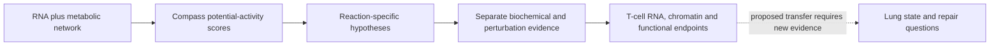

# Wagner 2021: Th17 metabolism and autoimmunity

**4 October 2026: owner reading completed; source review and reproduction plan
prepared. No numerical reproduction, Compass run or biological extension has run.**

[Wagner et al., Cell 184, 4168-4185.e21 (2021)](https://doi.org/10.1016/j.cell.2021.05.045),
*Metabolic modeling of single Th17 cells reveals regulators of autoimmunity*.
This is stable reading-order paper **15**, Gate **2W**, in the owner-requested
folder `gate2_W1_wagner_th17_autoimmunity`. Analysis identifiers use **Wg**:
the existing Niethamer **W1** macrophage pseudobulk analysis is separate.

The paper connects transcriptome-constrained metabolic predictions to biochemical
measurements, polyamine perturbations, chromatin accessibility and autoimmune
phenotypes. The owner's Discussion and Result notes supply the starting argument,
especially the possible metabolism/chromatin/cell-identity connection. The
source supports that argument in its T-cell systems; applying it to lung
epithelial transitions requires a separately qualified comparison.

## Read the package

| Document | Purpose |
|---|---|
| [Evidence map](EVIDENCE_MAP.md) | What each main figure measures and what can be reproduced |
| [Note reconciliation](NOTE_RECONCILIATION.md) | Check source distinctions without replacing the owner's notes |
| [Source manifest](SOURCE_MANIFEST.md) | PDF, public sources, versions and access limits |
| [Datasets](DATASETS.md) | GEO families, intended subsets, units and unresolved joins |
| [Reproduction scope](REPRODUCTION_SCOPE.md) | Wg-R01: stages and completion criteria |
| [Execution plan](ANALYSIS_TRIAL_PLAN.md) | Dependencies, planned outputs and contract/runner handoff |
| [Branch register](BRANCH_REGISTER.md) | Six article-local hypotheses and enabling evidence |
| [Neighboring papers](REPOSITORY_CONTEXT.md) | Current evidence and context-transfer limits |
| [Literature context](LITERATURE_CONTEXT.md) | Precedents, contrary evidence and bounded search log |
| [Validation](VALIDATION.md) | Actual checks and outstanding limits |

## Evidence logic

The proposed bridge is that a metabolic feature might distinguish regulatory
competence within a supported cell state. Its strongest rival is that RNA scores
track activation, growth, current exposure or population selection. A score
alone does not choose between these explanations. Independent functional and
history-linked measurements are missing for the lung bridge.

## Current decision

Begin with source/metadata qualification, then the author's precomputed-score
reproduction of Figures 2C/2E. A full expression-to-Compass rerun and the bulk
RNA/ATAC analyses are separate stages. All six branches remain available;
their sequence is a dependency map, not a ranking or scientific acceptance.

Published figures, notes and tutorial outputs have already been viewed. Future
reanalysis is outcome-exposed. No frozen executable contract exists yet:
input/code hashes, biological identities and environment qualification must
precede one. [Governance](../../docs/RESEARCH_GOVERNANCE.md) and the
[literature workflow](../../docs/LITERATURE_WORKFLOW.md) govern execution.
No global A identifier, claim grade, laboratory protocol or owner retain/reject
decision is created here. Private PI/placement planning remains outside Git.
