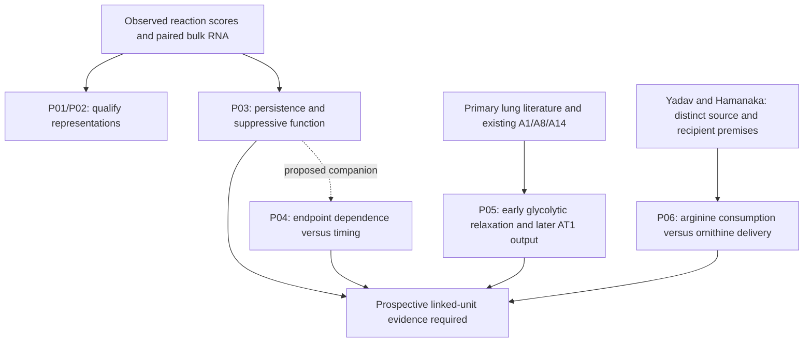

# Wagner: provisional RQ derivation

4 October 2026. Derived from the evidence and review at `1c099f0`; refreshed
main is `a5d41834395cac0b82b488d48759ceb6fab8f2d5`. The owner requested the
start of RQ derivation after the [pre-derivation review](../pre_rq_review/README.md).
These are exposed, agent-proposed questions for scientific review. They are not
human acceptance, novelty clearance, frozen experiments or new canonical A IDs.

**The first derivation pass is complete for all six branches.** Four cards
develop biological comparisons; two develop their measurement prerequisites.
P05 proposes a specific feature within existing A1, with A8/A14 companions.
P03/P04 and P06 remain article-local pending review of their distinctness and
feasibility. All prior RQs and branch evidence remain available without ranking.

## Derived questions and proposed routing

| Card | Explicit question | Proposed role / remaining distinction |
|---|---|---|
| [P01](P01.md) | Which Th17 reaction-score associations retain information beyond matched enzyme RNA, technical variation and source smoothing? | Measurement qualification, not a new metabolic mechanism. No independent preparation split is currently qualified |
| [P02](P02.md) | Which pathway summaries conceal directionally different, correctly mapped reaction responses? | Reaction/compartment measurement prerequisite. An enzyme's RNA or reaction-score q value is not target efficacy |
| [P03](P03.md) | Does the DFMO-associated regulatory RNA response during Th17 polarization persist as drug-independent suppressive function, or resolve into a transient response or selected population? | Context and persistence question. Beyond an already published proliferation-independent phenotype or generic polyamine–Treg effect |
| [P04](P04.md) | Is the apparent JMJD3 dependence of DFMO responses endpoint-specific, or explained by delayed response kinetics? | Mechanistic companion to P03. Measure RNA, protein and secretion at common times on linked units; source RNA alone cannot decide |
| [P05](P05.md) | Does early epithelial glycolytic relaxation after IL-1β withdrawal predict later lineage-derived mature AT1 output beyond starting RNA state, survival and residual input? | Proposed A1 feature extension, with A8's fixed RNA comparator and A14's history/reception alternatives. A19 is a separate future transport setting |
| [P06](P06.md) | Does recipient arginine sufficiency change the net collagen response to myeloid ARG1 activity, by balancing arginine consumption against ornithine delivery? | Human neutrophil–lung fibroblast context/model comparison. Source supply and recipient use are already published; the proposed increment is their joint, independently manipulated balance |

No table row is a retain/reject decision. The P05/P06 choices are **new proposed
specifications**, not features or mechanisms discovered in the local T-cell data.
P06's compensation prediction is an inference joining published premises, not
an established finding. Its detailed card explicitly allows no compensation.

## How the proposals follow from evidence

The numerical [R1](../SOURCE_SCORE_RESULTS.md) and [R3](../MODEL_RESULTS.md)
results are unchanged. R1 exposes representation differences; R3 establishes
relative bulk RNA responses with substantial program-definition sensitivity.
Neither measures tracked conversion, drug-free suppressive function, linked
RNA/protein kinetics, epithelial repair or intercellular substrate transfer.

The [source and grounding ledger](SOURCES_AND_GROUNDING.md) records the exact
comparison searches, targeted primary readings, additional Carriche and Lee
precedents, access limits and why more RNA fitting would not answer the proposed
functional questions. E1/E2/E3 from the prior review remain optional, separately
contracted analytical groundwork; they are not presented as new biological RQs.

This is a qualitative derivation map, not a measured figure or causal result.
Arrows show reasoning dependencies; no branch inherits evidence from another
tissue simply because it shares a metabolite or gene.

## What is complete and what remains

- Complete: six derivation cards with question, biological unit, endpoint,
  strongest rival, informative favorable/unfavorable outcomes, precedent and
  explicit contribution; a concrete P05 feature and P06 source/recipient model;
  overlap routing and a source-grounded review packet.
- Required before canonical registration or adoption: scientific review of the
  exact proposed scope and contribution, including whether P03/P04 should be a
  question plus companion rather than separate global questions. No authority
  or human decision has been fabricated. See [review decisions](REVIEW.md).
- Required before execution: specimen/model access, assay qualification,
  independent-unit identities, endpoint timing, variance and a justified useful
  effect or precision target; then a new hash-bound exposed contract and freeze.
  The available RNA data cannot supply these missing functional measurements.
- Still unresolved: source R2/R4/R5 holds, PGAM signature orientation and relevant
  newly discovered restricted full texts. Exact novelty remains provisional.

This derivation does not rerun biology, alter canonical hypotheses or their
registered schematic hashes, or change a claim grade. The existing eight
article-style plates remain in the [gallery](../FIGURES.md). No additional
measured figure is generated from unobserved proposed outcomes.
