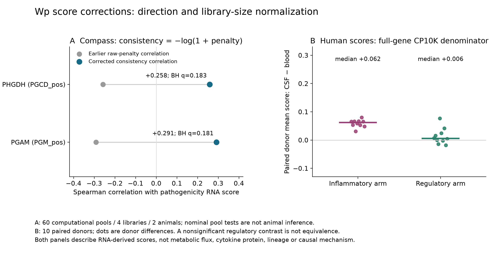

# Wp current evidence: score corrections, 7 October 2026

This report owns the corrected interpretation of Wp-R2, Wp-R4 and the human
component of Wp-M. The original scripts, contracts, tables and receipts remain
immutable. These are exposed corrective analyses, not independent replication
or human scientific acceptance. Other stages retain their own current reports.

## What supersedes what

| Earlier artifact | Current artifact | Change |
|---|---|---|
| `wp_compass_sensitivity_v1_rerun` and `v2_rerun` sign interpretation | [Compass orientation v3](../../analysis/research/runs/wp_compass_orientation_v3/receipt.json) | Transform raw penalty to consistency; do not call the raw penalty a consistency score |
| `wp_human_signature_transfer_v1/v2` score values | [Human transfer v3](../../analysis/research/runs/wp_human_signature_transfer_v3/receipt.json) | Full-gene library-size denominator; unchanged gates and comparisons; barcode/QC provenance added |
| Human M3 in `wp_metadata_phenotypes_v1` | [Metadata phenotypes v2](../../analysis/research/runs/wp_metadata_phenotypes_v2/receipt.json) | Propagate corrected human input; bulk M1/M2 outputs verified unchanged |
| Human and Compass plates in `wp_figures_v2` | [Corrected panels v4](../../analysis/research/runs/wp_correction_figures_v4/receipt.json) | Replace affected panels; v3 render retained with a footer-overlap defect found in visual QA |

[SVG](../../analysis/research/runs/wp_correction_figures_v4/corrected_scores.svg) ·
[PDF](../../analysis/research/runs/wp_correction_figures_v4/corrected_scores.pdf) ·
[independent verification](../../docs/audits/2026-10-07-repository-readiness/correction_verification.json)

## Compass: the sign changes

The official [Compass tutorial](https://yoseflab.github.io/Compass/notebooks/Demo.html)
applies `-log(1 + penalty)` to the raw output. The previous scripts read
`reactions.tsv` directly but labelled it as already transformed. Higher raw
penalty means lower expression consistency; it is not higher metabolic flux.

A recovered **v1** raw cache, SHA-256
`8112f133b2abf814931cab518a98b4b4e7f6ae031b6a2fe943ef62eea1dc7e8d`,
reproduces every numeric v2 reaction-summary column: 83 nonconstant reactions ×
16 columns = 1,328 values, using v2's 60 pool identities. The cache contains 103
reactions; the same 20 constant rows are excluded. The original v2 solver file
was not recovered, and the solver was not rerun. This is verified postprocessing
of the recovered cache, not proof about undocumented intermediate files.

| Reaction | Earlier raw-penalty rho | Corrected consistency rho | Nominal BH q | Ascending signed-rho rank |
|---|---:|---:|---:|---:|
| PGAM, `PGM_pos` | −0.291248 | +0.291248 | 0.180810 | 73/83 |
| PHGDH, `PGCD_pos` | −0.258183 | +0.258183 | 0.183400 | 70/83 |

All six correlation endpoints reverse sign; nominal p values and the
pathogenicity BH family are unchanged. These pool-level statistics describe
four libraries nested in **two animals**, not 60 independent animals. The
positive corrected association does **not reproduce** the paper's negative
PGAM association under the substituted inputs. It does not refute the paper's
genetic, chemical, protein or animal experiments. Missing published scVI inputs,
restricted reaction scope and different software still prevent Figure 1 reproduction.

The old claim that the repository's serine reaction corroborates the paper's
negative direction must also be withdrawn. A comparison of serine flux under
perturbation remains a proposal; RNA-derived consistency cannot supply that assay.

## Human transfer: correct the denominator, preserve the comparison

R4 v2 retained a subset of scoring genes and then divided each cell by that
subset's total. It used full-gene totals for QC, so cell selection was unaffected,
but its score normalization was not full-library CP10K. R4 v3 carries the
all-gene total into scoring. All previous per-library QC selections match:
**73,646 QC-passing cells; 35,928 retained CD4-lineage/non-CD8 cells; 22 libraries;
12 donors; 10 donors paired across compartments.** The label is operational and
does not prove CD4 identity or absence of doublets.

The new [cell identity/QC table](../../analysis/research/runs/wp_human_signature_transfer_v3/cell_identity_qc.csv.gz)
records library, original barcode, one-based matrix column, full-gene total,
selected-gene total, detected genes and mitochondrial fraction. A lineage-dominance
gate was used; no dedicated doublet detector was run. Tissue-dependent capture,
ambient RNA and cell-state representation remain plausible sources of bias.

From [R4 paired scores](../../analysis/research/runs/wp_human_signature_transfer_v3/paired_tissue.csv):

| Authors' score | Median CSF minus blood | Positive donors | Nominal paired Wilcoxon p |
|---|---:|---:|---:|
| Inflammatory | +0.061825 | 10/10 | 0.001953 |
| Regulatory | +0.006024 | 6/10 | 0.232422 |
| Pathogenicity difference | +0.044328 | 9/10 | 0.003906 |

These paired tests are descriptive and unadjusted across scores. No disease
contrast survives the within-CSF BH family (minimum q=0.220779); some blood
contrasts do (minimum q=0.029982). That does not demonstrate disease-specific
module biology. The authors' inflammatory and regulatory blood effects have
size-only null tail fractions 0.506 and 0.175, respectively; N1 is 0.094.
Read [all disease contrasts](../../analysis/research/runs/wp_human_signature_transfer_v3/disease_contrasts.csv)
and [all null results](../../analysis/research/runs/wp_human_signature_transfer_v3/random_set_null.csv).
The signed S3 signature is compared with unsigned random sets in this preserved
null implementation, so its tail fraction is not a calibrated test of signature
specificity. The null is also restricted to loaded scoring genes, not genome-wide
or expression/detection matched. A zero tail fraction means **0/1,000 draws**, not
an exactly zero probability.

## M3 and relation to A28–A30

[M3 v2](../../analysis/research/runs/wp_metadata_phenotypes_v2/tissue_specificity_null.csv)
recalculates compartment context from corrected donor gene means. Its
inflammatory authors' set is +0.060759, 10/10 donors positive, and 3/1,000 null
draws as extreme. The authors' regulatory set is +0.005783, 6/10 positive, tail
fraction 0.292; the all-gene regulatory set is +0.020502, 10/10 positive, tail
fraction 0.884. Thus “the regulatory arm does not move” is not a valid general
summary. There is no regulatory equivalence or preserved-function result.

M3 includes finite constant genes, whereas R4 excludes zero-variance genes from
each score. Its authors' set sizes are 58/25 rather than R4's 57/24; their slightly
different medians are not interchangeable. Both implementations retain a limited,
size-only null. This correction does not silently redesign that null.

- **A28:** an RNA-arm asymmetry remains an observation motivating a protein-level
  competence question, not proof that two functions are independently regulated.
- **A29:** the corrected Compass sign supplies no support for the prior negative
  reaction interpretation. Expression-decile matching in E3 addresses one aspect
  of null calibration; it does not identify absolute abundance or solve TPM
  compositional ambiguity. Isotope enrichment and an absolute metabolite pool
  are different endpoints. Lack of a detected change is not equivalence.
- **A30:** its existing v3 analysis already uses full-gene normalization and is
  not rerun or replaced here. Its corrected pooled inflammatory difference agrees
  with R4 v3. Activation stratification does not exclude activation-related biology;
  size-only null calibration and unsupported cross-compartment states still limit
  interpretation. Use the [A30 extension baseline](../../RQ_Specified/A30_csf_compartment_effector_state/EXTENSION_BASELINE_V2.md).

## Verification and next work

Contracts and code were committed before each run, with exposed status retained.
The independent checker passed **91 checks covering 4,999 values**, including
all donor score means, paired statistics, disease differences/BH, Compass sign
and p-value identities, M1/M2 equality, and M3 module arithmetic. It independently
reconstructed raw denominators, detected genes and mitochondrial fractions for
one small library per compartment (`GSM4104130`, `GSM4104143`) using vectorized
raw-matrix aggregation. It did not independently reconstruct all 22 matrices.

The numerical correction is complete. Stronger biological conclusions require
separate designs: a calibrated null universe, barcode-level QC sensitivity and
common-state support for A30; appropriate functional readouts for A28/A29. These
are explicit future questions, not unfinished attempts to obtain a positive result.
The [repository audit](../../docs/audits/2026-10-07-repository-readiness/REPORT.md)
and [return checklist](../../docs/audits/2026-10-07-repository-readiness/RETURN_CHECKLIST.md)
define the operational handoff.
