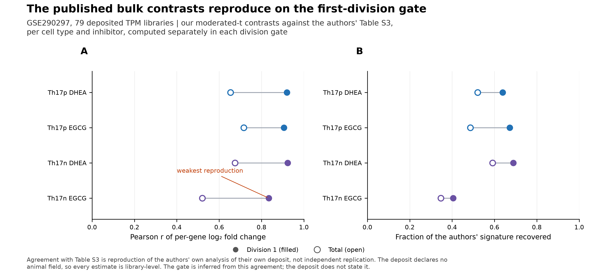
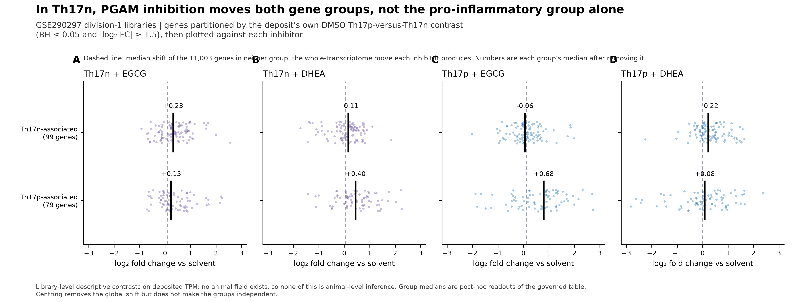
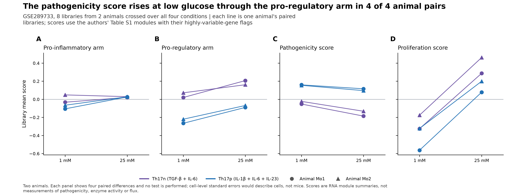
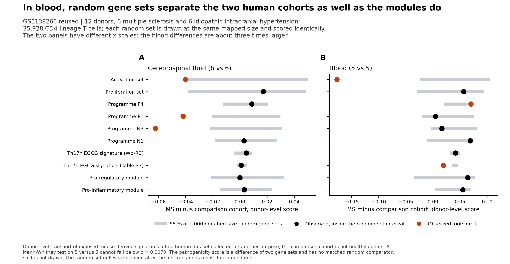
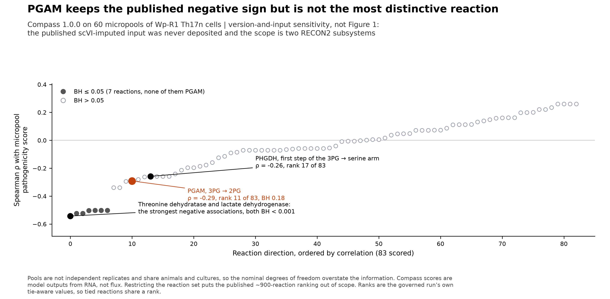
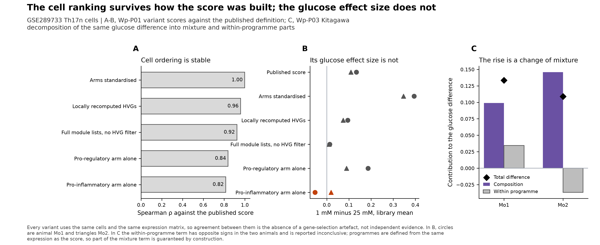

# Wang 2025 PGAM figure gallery

Six plates, one per executed stage plus one for the branch pair. Every value
drawn comes from a committed table of a governed run with a verified receipt;
the rendering step performs no biological calculation. These are generated
scientific figures from frozen tables, **not** reproductions of the published
figures and not illustrative simulations.

All six are available together as a
[vector PDF](../../analysis/research/runs/wp_figures_v1/Wang_PGAM_figures.pdf).
Each plate also has individual PDF, SVG and 300-dpi PNG files, and the
[figure manifest](../../analysis/research/runs/wp_figures_v1/figure_manifest.json)
records the sha256 of every input table.

Read the plates against the stage reports: [Wp-R1](R1_RESULTS.md),
[Wp-R2](R2_RESULTS.md), [Wp-R3](R3_RESULTS.md), [Wp-R4](R4_RESULTS.md),
[Wp-P01](P01_RESULTS.md) and [Wp-P03](P03_RESULTS.md). The
[claim-by-claim outcome table](REPRODUCTION_SCOPE.md#claim-by-claim-outcome-4-october-2026)
states what each stage did and did not establish.

## Experimental context

| Label | Differentiation condition | Deposit |
|---|---|---|
| Th17n (purple) | TGF-β + IL-6; non-pathogenic condition | [GSE289733](https://www.ncbi.nlm.nih.gov/geo/query/acc.cgi?acc=GSE289733) single cell, [GSE290297](https://www.ncbi.nlm.nih.gov/geo/query/acc.cgi?acc=GSE290297) bulk |
| Th17p (blue) | IL-1β + IL-6 + IL-23; pathogenic condition | the same two deposits |
| Human reuse | MS and idiopathic intracranial hypertension donors, CSF and blood | [GSE138266](https://www.ncbi.nlm.nih.gov/geo/query/acc.cgi?acc=GSE138266) |

Colour is bound once across the gallery: Th17n purple, Th17p blue, with a single
alarm hue reserved for marks that fall outside a null or that the text flags.

## Figure 1: The published bulk contrasts reproduce on the first-division gate

A, Pearson correlation between our per-gene log₂ fold change and the authors'
Table S3 value, for each cell type and inhibitor, computed separately in the
division-1 and Total gates. B, the fraction of the authors' signature our
contrast recovers, same pairing. Filled marks are division 1, open marks Total.
Every division-1 contrast agrees better than its Total counterpart, which is how
the published gate is inferred — the deposit does not state it. Th17n EGCG is
the weakest reproduction in both panels. Agreement with Table S3 is reproduction
of the authors' own analysis of their own deposit, not independent replication.

[PDF](../../analysis/research/runs/wp_figures_v1/figure_1_gate_concordance.pdf) ·
[SVG](../../analysis/research/runs/wp_figures_v1/figure_1_gate_concordance.svg) ·
[PNG](../../analysis/research/runs/wp_figures_v1/figure_1_gate_concordance.png)

## Figure 2: In Th17n, PGAM inhibition moves both gene groups

Each point is one gene's log₂ fold change against its solvent in the division-1
libraries; black bars are group medians. Genes are partitioned by the deposit's
own DMSO Th17p-versus-Th17n contrast, so the grouping is independent of the
Gaublomme modules. The dashed line is the median shift of the 11,003 genes in
neither group — the whole-transcriptome move each inhibitor produces — and the
printed numbers are each group's median after removing it. In Th17n with EGCG
(A) both groups rise by a similar amount; selectivity appears instead with DHEA
in Th17n (B) and with EGCG in Th17p (C). Library-level descriptive contrasts on
deposited TPM; no animal field exists.

[PDF](../../analysis/research/runs/wp_figures_v1/figure_2_module_selectivity.pdf) ·
[SVG](../../analysis/research/runs/wp_figures_v1/figure_2_module_selectivity.svg) ·
[PNG](../../analysis/research/runs/wp_figures_v1/figure_2_module_selectivity.png)

## Figure 3: The pathogenicity score rises at low glucose through the pro-regulatory arm

Each line joins one animal's paired libraries at 1 mM and 25 mM glucose, within
a cell type; circles are animal Mo1 and triangles Mo2. The pro-regulatory arm
(B) falls at low glucose in all four animal × cell-type pairs while the
pro-inflammatory arm (A) does not rise, which is what moves the pathogenicity
score (C). Proliferation (D) runs the other way, higher at 25 mM in all four
pairs, so the score shift is not tracking growth. Two animals: each panel shows
four paired differences and no test is performed.

[PDF](../../analysis/research/runs/wp_figures_v1/figure_3_glucose_arms.pdf) ·
[SVG](../../analysis/research/runs/wp_figures_v1/figure_3_glucose_arms.svg) ·
[PNG](../../analysis/research/runs/wp_figures_v1/figure_3_glucose_arms.png)

## Figure 4: In blood, random gene sets separate the two human cohorts as well as the modules do

Each row is one donor-level score; the grey bar spans 95 % of 1,000 random gene
sets drawn at the same mapped size and scored identically, and the dot is the
observed MS-minus-comparison difference, coloured when it falls outside its own
null. In CSF (A) nothing reaches BH ≤ 0.05 at all. In blood (B) the modules and
programmes separate the cohorts, but so do matched random sets — only the
activation set and programme P4 exceed their null, and the Table S3 EGCG
signature performs worse than random. Note the different x scales. The
pathogenicity score is a difference of two gene sets and has no matched random
comparator, so it is not drawn.

[PDF](../../analysis/research/runs/wp_figures_v1/figure_4_human_random_null.pdf) ·
[SVG](../../analysis/research/runs/wp_figures_v1/figure_4_human_random_null.svg) ·
[PNG](../../analysis/research/runs/wp_figures_v1/figure_4_human_random_null.png)

## Figure 5: PGAM keeps the published negative sign but is not the most distinctive reaction

All 83 scored reaction directions, ordered by their Spearman correlation with
the micropool pathogenicity score; filled marks pass BH ≤ 0.05. The forward PGAM
reaction keeps the published negative sign and so does the first step of the
3PG-to-serine arm, but PGAM ranks 11th of 83, does not pass BH, and is well
short of threonine dehydratase and lactate dehydrogenase. Ranks are the run's
own tie-aware values, so tied reactions share a rank. **This plate is a
version-and-input sensitivity, not a reproduction of the paper's Figure 1:** the
published scVI-imputed input was never deposited, and the reaction scope is two
RECON2 subsystems rather than the full model.

[PDF](../../analysis/research/runs/wp_figures_v1/figure_5_compass_reactions.pdf) ·
[SVG](../../analysis/research/runs/wp_figures_v1/figure_5_compass_reactions.svg) ·
[PNG](../../analysis/research/runs/wp_figures_v1/figure_5_compass_reactions.png)

## Figure 6: The cell ranking survives how the score was built; the glucose effect size does not

A, rank agreement between each pre-specified score variant and the published
definition, across 8,711 Th17n cells. B, the animal-paired glucose difference
recomputed under each variant; dropping the highly-variable-gene filter keeps
the sign but shrinks the effect about tenfold, and the pro-inflammatory arm
alone is sign-inconsistent between the two animals. C, the Kitagawa
decomposition of the same difference: the mixture term is positive in both
animals while the within-programme term changes sign, so it is reported
inconclusive. Every variant uses the same cells and the same expression matrix,
so agreement between them is the absence of a gene-selection artefact, not
independent evidence.

[PDF](../../analysis/research/runs/wp_figures_v1/figure_6_branch_sensitivity.pdf) ·
[SVG](../../analysis/research/runs/wp_figures_v1/figure_6_branch_sensitivity.svg) ·
[PNG](../../analysis/research/runs/wp_figures_v1/figure_6_branch_sensitivity.png)

## What this gallery does not contain

No plate shows a UMAP or any embedding: the analysed 5,192-cell object and its
scVI model were never deposited, so a re-derived embedding would differ from the
published one by construction and would invite exactly the distance reading that
[the repository's embedding guidance](../../docs/UMAP_AND_FIGURES.md) warns
against. No plate shows protein, metabolite or disease data, because none is
deposited — that is [Wp-P04](branches/P04_endpoint_class_dependence.md)'s
permanent block, and substituting an RNA panel for it is the specific error that
card exists to prevent.
