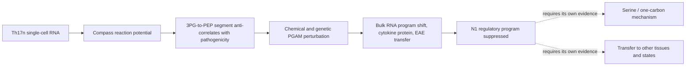

# Wang, Wagner et al. 2025: PGAM restrains Th17 pathogenicity

**Subsequent 7 October A30 extension:** [observed common-state and activation support](../../docs/portfolio_extensions/2026-10-07/g3_immune/A30_RESULTS.md) is now qualified. The restricted association loses donors and cell coverage; floor-five uncertainty crosses zero. Corrected pooled Wp/R4/M3 evidence remains a different estimand, and no function or new PGAM mechanism is inferred.

**Current status — 7 October 2026:** R0–R4 and selected extensions have executed; R5 is closed without numerical execution. A28–A30 are registered proposals. The [current correction report](CORRECTIONS_2026-10-07.md) supersedes the affected Compass and human-score summaries. A30 v3 remains a bounded RNA association, not activation exclusion, residency or preserved regulatory function.

[Wang, Wagner, Fessler et al., *Cell Reports* 44, 115799 (2025)](https://doi.org/10.1016/j.celrep.2025.115799),
*The glycolytic reaction PGAM restrains Th17 pathogenicity and Th17-dependent
autoimmunity* (PMID 40482033). Stable reading-order paper **17**, Gate **2W**
item **W2**, in the owner-requested folder `gate2_W2_wagner_Th17_PGAM`.

Analysis identifiers use **Wp**. They are distinct from **Wg** (the 2021 Compass
paper in [gate2_W1_wagner_th17_autoimmunity](../gate2_W1_wagner_th17_autoimmunity/README.md))
and from the separate Niethamer **W1** macrophage pseudobulk analysis.

## What the paper claims, in one paragraph

Compass scores ~900 metabolic reactions per cell from Th17n single-cell RNA and
ranks them by correlation with a transcriptional pathogenicity score. The segment
between 3-phosphoglycerate and phosphoenolpyruvate — and the serine shunt leaving
3PG — correlate *negatively* with pathogenicity, while LDH, PDH and PCK correlate
positively. Chemical inhibition of PGAM (EGCG) raises IL-17 and IL-2, genetic
perturbation raises IL-17A/IL-17F/IL-2/TNF secretion, bulk RNA shifts Th17n toward
the pathogenic program, and EGCG-treated Th17n cells induce EAE on adoptive
transfer (10 of 12 recipients versus 0 of 12). An extended single-cell dataset at
25 mM and 1 mM glucose yields seven programs, and EGCG specifically suppresses the
FOXP3/SGK1-high, least pathogenic Th17n program N1.

## Read the package

| Document | Purpose |
|---|---|
| [Wp-R0 result](R0_RESULTS.md) | What the deposits contain, the stage eligibility it decided and its independent check |
| [Note reconciliation](NOTE_RECONCILIATION.md) | The owner's two Notion notes against the source: where each marked question is specified, and what the notes' shorthand should not be read as |
| [Evidence map](EVIDENCE_MAP.md) | What each figure measures, what can be reproduced and the interpretation limit |
| [Datasets](DATASETS.md) | Verified deposit inventory, units, joins and the unresolved aggregation order |
| [Source manifest](SOURCE_MANIFEST.md) | Exact files, URLs, bytes, SHA-256 and what is missing |
| [Reproduction scope](REPRODUCTION_SCOPE.md) | Wp-R01: the Wp-R0 to Wp-R5 ladder and completion criteria |
| [Execution plan](ANALYSIS_TRIAL_PLAN.md) | Dependencies, contract/runner handoff and the exact next action |
| [Branch register](BRANCH_REGISTER.md) | Six article-local candidates Wp-P01 to Wp-P06 |
| [Repository context](REPOSITORY_CONTEXT.md) | Neighbouring packages, existing questions and transfer limits |
| [Literature context](LITERATURE_CONTEXT.md) | Precedents, the directional conflict with Godfrey 2025, and the bounded search log |
| [Validation](VALIDATION.md) | What was actually checked in this pass and what was not |

## Published paper’s evidence logic

The inference the paper rests on is that a reaction-level RNA-derived score
identifies a perturbation whose functional consequence is then measured
independently. The strongest rival is that the score ranks cells by activation,
growth or current nutrient exposure, and that EGCG — a promiscuous polyphenol —
moves the phenotype through targets other than PGAM. The paper answers part of
this with 13C labelling restricted to 2PG and with an sgRNA perturbation; neither
addresses whether the *ranking* was informative or whether the direction of the
serine arm is correct.

## Current decision and extension baseline

Read [the correction report](CORRECTIONS_2026-10-07.md) first, then the
[stage map](REPRODUCTION_SCOPE.md), [figure gallery](FIGURES.md) and
[repository readiness audit](../../docs/audits/2026-10-07-repository-readiness/REPORT.md).

- **R1 / P01 / P03:** deposited mouse RNA supports descriptive score and
  composition comparisons, with two animals. The HVG definition matters and the
  [floor sensitivity](R1_RESULTS.md) changes the tested universe and BH family,
  while per-gene effects and raw p values remain invariant.
- **R2:** corrected expression-consistency scores reverse the prior sign
  interpretation. The modern, restricted, micropooled analysis does not reproduce
  the paper's PGAM negative association; it does not refute the perturbation data.
- **R3 / M1 / M2 / E3:** bulk contrasts remain library-level TPM descriptions.
  Missing animal identity, compositional ambiguity and distinct drug vehicles
  restrict inference. Expression-matched gene sets do not remove those limits.
- **R4 / M3:** full-library normalization now replaces subset-denominator scores.
  Use the new donor summaries, not the old human figure or empirical null values.
  The loaded-gene, size-only null cannot establish genome-wide specificity.
- **A28–A30:** available for development without selecting a preferred question.
  RNA arms are not measured protein competence; A29 requires a metabolite/functional
  discriminator; A30 requires overlap, QC and null qualification before stronger
  interpretation. Use each current dossier and A30's versioned extension baseline.

Reading and design development can continue. New numerical work requires an
eligible comparison and a new frozen contract. Source reuse is not independent
replication, and no owner retain/reject or claim-grade decision is inferred.
