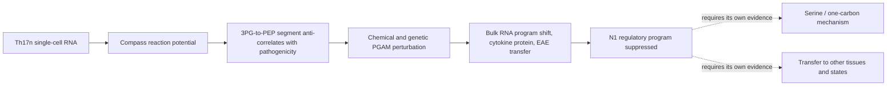

# Wang, Wagner et al. 2025: PGAM restrains Th17 pathogenicity

**4 October 2026: package opened at the owner's request after reading the paper.
The source deposits are inventoried and hash-recorded, [Wp-R0 has executed under
the governed runner](R0_RESULTS.md) and decided stage eligibility, the ladder
Wp-R0 to Wp-R5 is specified, and six article-local development branches are
registered. No expression value has been analysed, and no claim grade, research
question identifier or scientific acceptance is created here.**

[Wang, Wagner, Fessler et al., *Cell Reports* 44, 115799 (2025)](https://doi.org/10.1016/j.celrep.2025.115799),
*The glycolytic reaction PGAM restrains Th17 pathogenicity and Th17-dependent
autoimmunity* (PMID 40482033). Stable reading-order paper **17**, Gate **2W**
item **W2**, in the owner-requested folder `gate2_W2_wagner_Th17_PGAM`.

Analysis identifiers use **Wp**. They are distinct from **Wg** (the 2021 Compass
paper in [gate2_W1_wagner_th17_autoimmunity](../gate2_W1_wagner_th17_autoimmunity/README.md))
and from the separate Niethamer **W1** macrophage pseudobulk analysis.

## What the paper claims, in one paragraph

Compass scores ~900 metabolic reactions per cell from Th17n single-cell RNA and
ranks them by correlation with a transcriptional pathogenicity score. The segment
between 3-phosphoglycerate and phosphoenolpyruvate — and the serine shunt leaving
3PG — correlate *negatively* with pathogenicity, while LDH, PDH and PCK correlate
positively. Chemical inhibition of PGAM (EGCG) raises IL-17 and IL-2, genetic
perturbation raises IL-17A/IL-17F/IL-2/TNF secretion, bulk RNA shifts Th17n toward
the pathogenic program, and EGCG-treated Th17n cells induce EAE on adoptive
transfer (10 of 12 recipients versus 0 of 12). An extended single-cell dataset at
25 mM and 1 mM glucose yields seven programs, and EGCG specifically suppresses the
FOXP3/SGK1-high, least pathogenic Th17n program N1.

## Read the package

| Document | Purpose |
|---|---|
| [Wp-R0 result](R0_RESULTS.md) | What the deposits contain, the stage eligibility it decided and its independent check |
| [Note reconciliation](NOTE_RECONCILIATION.md) | The owner's two Notion notes against the source: where each marked question is specified, and what the notes' shorthand should not be read as |
| [Evidence map](EVIDENCE_MAP.md) | What each figure measures, what can be reproduced and the interpretation limit |
| [Datasets](DATASETS.md) | Verified deposit inventory, units, joins and the unresolved aggregation order |
| [Source manifest](SOURCE_MANIFEST.md) | Exact files, URLs, bytes, SHA-256 and what is missing |
| [Reproduction scope](REPRODUCTION_SCOPE.md) | Wp-R01: the Wp-R0 to Wp-R5 ladder and completion criteria |
| [Execution plan](ANALYSIS_TRIAL_PLAN.md) | Dependencies, contract/runner handoff and the exact next action |
| [Branch register](BRANCH_REGISTER.md) | Six article-local candidates Wp-P01 to Wp-P06 |
| [Repository context](REPOSITORY_CONTEXT.md) | Neighbouring packages, existing questions and transfer limits |
| [Literature context](LITERATURE_CONTEXT.md) | Precedents, the directional conflict with Godfrey 2025, and the bounded search log |
| [Validation](VALIDATION.md) | What was actually checked in this pass and what was not |

## Evidence logic

The inference the paper rests on is that a reaction-level RNA-derived score
identifies a perturbation whose functional consequence is then measured
independently. The strongest rival is that the score ranks cells by activation,
growth or current nutrient exposure, and that EGCG — a promiscuous polyphenol —
moves the phenotype through targets other than PGAM. The paper answers part of
this with 13C labelling restricted to 2PG and with an sgRNA perturbation; neither
addresses whether the *ranking* was informative or whether the direction of the
serine arm is correct.

## Current decision

[Four stages have run](REPRODUCTION_SCOPE.md#claim-by-claim-outcome-4-october-2026):
Wp-R0, [Wp-R3](R3_RESULTS.md), [Wp-R1](R1_RESULTS.md) and [Wp-R4](R4_RESULTS.md).
Wp-R1 recovers the undeclared library order from markers (8/8) and reproduces the
low-glucose pathogenicity rise through the pro-regulatory arm in 4/4 animal-paired
comparisons. Wp-R4 closes [Wp-P05](branches/P05_human_signature_activation.md) in
the negative: a matched-size random gene set separates the human blood cohorts as
well as the modules do, and nothing separates the CSF cohorts. Wp-R3
reproduces the authors' deposited bulk statistics on the first-division gate
(log2FC *r* 0.83-0.92) but recovers only 0.405 of their Th17n EGCG signature, and
finds the Th17n EGCG module shift **not** selective for the pro-inflammatory
group once the global shift is centred out. Wp-R2 runs only as a declared
version-and-input sensitivity, because the published scVI-imputed input was never
deposited; Wp-R5 is closed, the owner having declined author contact and figure
digitisation. The five supplementary tables were
recovered on 4 October 2026 from the NIH PMC Cloud open-data package, so the
module and signature definitions are the authors' own rather than substitutions. The single-cell deposit is the pre-QC
aggregated matrix of 19,203 barcodes, not the 5,192-cell analysed set, and its
library order is not stated. Compass itself now runs - licence obtained, authors' own fork installed - but on
an input that was never deposited: the published run used scVI-imputed expression
whose model and matrix are not in GEO, so Figure 1 cannot be reproduced as
published and Wp-R2 is labelled a sensitivity throughout.

The next intellectual step is **not** more scores: it is deciding between the
paper's serine-shunt direction and the opposite direction reported for Tregs by
[Godfrey et al. 2025](LITERATURE_CONTEXT.md#directional-conflict-on-the-serine-arm).
That contrast is the reason this package is worth executing, and it is specified
as [Wp-P02](branches/P02_serine_one_carbon_direction.md), whose second arm —
cellular stress and TGF-β — comes from the owner's own Discussion note and from
the source's closing sentence, with the TGF-β leg flagged as an unverified
premise in the [note reconciliation](NOTE_RECONCILIATION.md).

[Governance](../../docs/RESEARCH_GOVERNANCE.md) and the
[literature workflow](../../docs/LITERATURE_WORKFLOW.md) govern execution. No
global A identifier, claim promotion, laboratory protocol or owner retain/reject
decision is created by this package.
