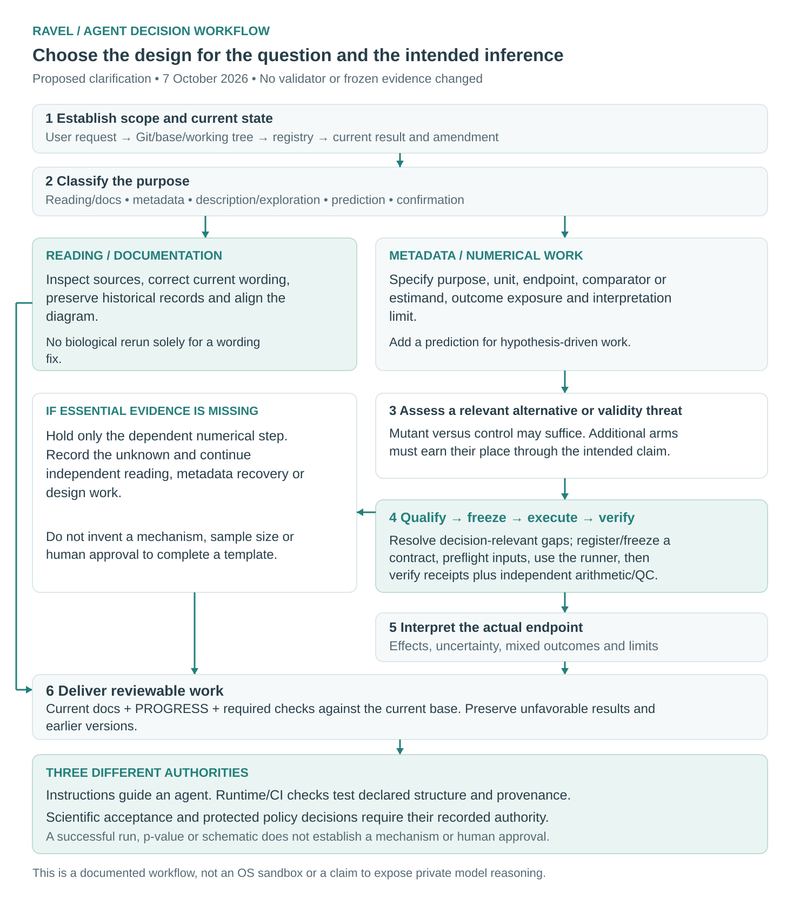
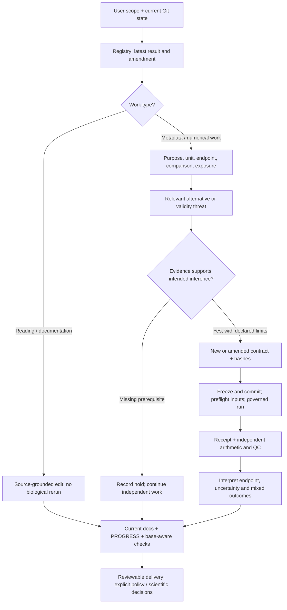

# Agent decisions: proportional design and evidence-preserving execution

7 October 2026. Requested review of hypothesis/rival framing and instructions
that could obstruct further development. This describes the repository's declared
workflow and observable checks, not a claim to expose a model's private reasoning
or guarantee that arbitrary tools obey Markdown. Changes are proposed for explicit
policy review; no human scientific acceptance is inferred.

## What the instruction audit found

Tracked instruction inventory: root [AGENTS.md](../AGENTS.md) and
[CLAUDE.md](../CLAUDE.md). No nested AGENT/AGENTS file is tracked; CLAUDE.md points
to the same policy. The user-supplied session instructions also govern this task;
this change does not edit personal/global agent settings.

| Rule/source reviewed | Assessment and correction |
|---|---|
| AGENTS: every substantive analysis identifies its strongest rival | Sound intent, overly uniform wording. Now distinguishes purpose/estimand from a mechanistic hypothesis; alternatives may be validity threats and do not imply extra arms. |
| RESEARCH_QUESTIONS: every RQ must propose a process and causal/directional prediction | Overrestrictive for description, faithful replication, prediction and effect estimation. Replaced with fit-for-purpose framing while retaining biological purpose and limits. Earlier 29 September wording remains in Git history. |
| AGENTS: do not select a preferred RQ or expand a failed analysis | Could obstruct a requested single-question task or justified negative-result follow-up. Clarified preservation of the portfolio, owner-directed scope and prohibition of significance-seeking expansion. |
| Literature workflow/template: hypothesis/rival → outcomes | Retained headings for compatibility; non-mechanistic work records its estimand/target and validity threat. Mixed explanations are allowed. Refresh remains triggered by material changes, not every routine edit. |
| Governance examples: population selection, persistence after withdrawal | Useful examples, now explicitly optional. No requirement that every experiment distinguish these routes. |
| Contract schema: required `strongest_rival` and `discriminator` strings | No validator requires two mechanisms, more than two groups, a rescue, lung or Th17. Clarified field meaning without changing the schema or relaxing execution checks. |
| Dossier/guide validator: common headings and hypothesis/SVG hashes | A documentation synchronization requirement, not proof of biological merit. Existing headings can hold a question/estimand and limits; no validator edit was necessary. |
| Evidence, exposure, units, immutable outputs and claim authority | Retained. These protect traceability and interpretation; they are not question-specific assay mandates. |
| Mandatory repository checks and integration review | Retained. Policy edits are visible review material; CI does not substitute for human scientific judgment. Server-side review/protection settings were not changed or certified. |

No tissue, pathway, Th17, lung or A30 assay requirement was found in AGENTS.md or
CLAUDE.md. Actual question-specific choices belong in local plans. A30's inherited
activation-only, regulatory-function and TCR-residency assumptions were corrected
locally rather than generalized into global policy. The Wp joint-experiment note
also receives a clarification: shared preparations are optional and its listed
arms do not form a complete three-factor experiment.

## Mutant versus control is a valid starting design

Example question: does a specified mutation change endpoint Y in population P at
time T? The primary estimand can be the mutant-minus-control difference at the
biological-unit level. The proposed biological role motivates that comparison;
it need not already identify every intermediate mechanism.

The relevant alternative could be background differences, allocation/batch,
off-target perturbation, differential viability or an endpoint artifact. Those
threats may be handled through an appropriate matched control, blocking, design,
measurement or interpretation limit. They are **explanations, not a required
third group**. Whether they need additional measurements depends on the claim.
For animal experiments, this objective-dependent comparator choice is consistent
with [ARRIVE item 1a](https://arriveguidelines.org/arrive-guidelines/study-design/1a/explanation).

| Intended inference | Appropriate planning question |
|---|---|
| Estimate a perturbation effect | Are mutant and control meaningfully comparable; are perturbation, endpoint, unit and precision credible? |
| Establish a specific mechanism or on-target rescue | Which additional control/perturbation or orthogonal assay would discriminate the asserted route? A rescue is an option, not automatic proof. |
| Describe a public dataset | What is being estimated, from which selected population and denominator, with what uncertainty? |
| Reproduce a published contrast | Which author choices and inputs are available; what deviations prevent an exact replay? |
| Predict in a new setting | What is the target, baseline, independent split unit and intended transport domain? |

An imprecise null does not establish equivalence. Cells, wells or repeated
measurements do not become independent animals/donors. An effect on an RNA score
does not establish secretion or function. These limits remain regardless of the
number of groups.

## The workflow an agent should actually follow

1. **Establish scope and current state.** Read user instructions and entrypoints;
   inspect HEAD/upstream/dirty state, fetch the base, preserve unrelated work and
   use a scoped branch. Read the registry's current evidence/amendment before plans.
2. **Classify the work.** Reading/docs, metadata, descriptive/exploratory analysis,
   prediction or confirmation have different requirements. Routine documentation
   does not trigger biological reruns or a full literature search.
3. **Specify only what the purpose needs.** Question, unit, comparator/estimand,
   endpoint, exposure, major validity threat and interpretation limit. For a
   hypothesis-driven contrast add its prediction. Record unknowns explicitly.
4. **Resolve decision-relevant uncertainty.** Reuse valid evidence; inspect the
   source or run a targeted check only if it can change the decision. A missing
   prerequisite holds dependent numerical work, not independent reading/design.
5. **Route numerical work through its contract.** Register source/code hashes,
   choices, units, exclusions, multiplicity and exposure; freeze/commit, preflight
   inputs and use the runner. Confirmation additionally needs unexposed outcomes
   and justified precision. Amend exposed designs honestly; never overwrite a run.
6. **Verify and interpret.** Verify receipts plus independent arithmetic/QC.
   Report effects, uncertainty and negative/mixed outcomes within the actual
   endpoint. A successful run or a small p-value does not grant scientific acceptance.
7. **Deliver reviewable work.** Update current summaries and PROGRESS, preserve
   history, run required checks against the current base and present concrete
   limitations. Policy/interpretation changes remain explicit review items.
   Ask for missing essential information or a genuinely required decision only.

## What is enforced, and what is not

- **Instructions:** AGENTS, governance, literature workflow and plans guide a
  compliant agent. They cannot sandbox arbitrary commands.
- **Runtime/CI checks:** schema/registry validation, raw input/code hashing at
  execution, refusing reused run directories, receipts, output hashes and change
  checks detect specified structural/provenance failures.
- **Scientific judgment:** source fidelity, adequate controls, causal identification,
  meaningful precision and claim acceptance require review. Neither CI nor an AI
  reviewer proves them. CODEOWNERS names ownership; enforcement depends on GitHub
  settings and credentials, which were not audited here.

This session followed the reading/documentation and saved-artifact verification
routes. It did not perform a new biological fit, weaken a validator or certify
that the remaining Compass/A30 numerical corrections have been executed.
