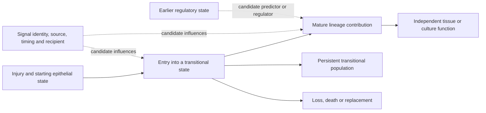

# Research roadmap: closing the biological and logical gaps

**Computational continuation:** [small-task pipeline](COMPUTATIONAL_RESEARCH_PIPELINE.md) and [next-session handoff](handoffs/2026-09-27-computational-research.md). Intake has started; new biological scoring is pending.

**Latest execution:** [follow-through](roadmap_runs/2026-09-27-followthrough/README.md) adds completed A12/A13 exploratory pilots, expanded candidate checks and experimental precision scenarios. The [remaining-work ledger](roadmap_runs/2026-09-27-followthrough/remaining_work.json) identifies actual data requirements; prospective designs below are not completed experiments.

**Date:** 27 September 2026. **Status:** the first bounded execution is complete; see the [P0–P5 reports](roadmap_runs/2026-09-27/README.md) for completed source checks, calculations and failed gates. The designs below remain prospective wherever compatible data are missing.

This roadmap follows the [repository rationale audit](audits/2026-09-27-rq-rationale/REPORT.md) and [shared architecture](RESEARCH_ARCHITECTURE.md). It preserves existing stop decisions and frozen instruments. It structures future work without changing claim grades or treating A15 registration as accepted. A dataset mentioned in an older analysis is not automatically eligible for a new question.

## 1. Organizing question and biological context

**Which epithelial properties and immune–stromal signals allow an injured lung to complete repair, and which conditions leave it in persistent remodelling?**

The proposed organizing hypothesis is that entering a transitional epithelial state and successfully leaving it are different biological events. Shared RNA may identify a response to injury; it need not identify the capacity to make functional mature cells. This is a synthesis to test, not a mechanism established by the repository.

| Biological observation from primary research | Consequence for this research programme |
|---|---|
| Krt8-positive transitional cells occur during mouse alveolar regeneration and persist in human fibrosis. These observations do not by themselves establish that their persistence causes fibrosis. [Strunz et al., 2020](https://www.nature.com/articles/s41467-020-17358-3) | Measure entry, persistence, exit and mature contribution separately. Do not assign a beneficial or harmful role from one expression snapshot. |
| IL-1β can promote AT2 entry into a regenerative intermediate, while sustained IL-1β signalling can impede mature AT1 differentiation in the studied models. [Choi et al., 2020](https://pmc.ncbi.nlm.nih.gov/articles/PMC7487779/) | Timing and withdrawal can be more discriminating than a cross-sectional ligand score. A14 should distinguish induction from completion. |
| In the studied mouse niche, Wnt supports AT2 stem-cell maintenance, whereas leaving that signalling context permits differentiation; injury also changes the source of Wnt. [Nabhan et al., 2018](https://pmc.ncbi.nlm.nih.gov/articles/PMC5997265/) | Current pathway activity, signalling history and cell fate are different variables. A4 requires a temporal design, not Axin2/Il1r1 co-detection alone. |
| Macrophage-derived AREG can activate a pericyte integrin/TGF-beta route contributing to vascular barrier restoration in acute injury models. [Minutti et al., 2019](https://pubmed.ncbi.nlm.nih.gov/30770250/) | Ligand abundance, recipient competence and latent-ligand activation must be separated. This precedent does not establish the same route for epithelial ITGB6 in the repo's organoid screen. |

The specific public-data tests and experimental contrasts below are proposed deductions from those precedents and the repository audit. The literature check is targeted biological context, not a comprehensive novelty review or a declaration that suitable datasets exist.

This is a design map. A population remaining transitional need not contain the same cells over time. The arrows are not a fitted causal graph, and RNA trajectories do not verify them.

## 2. Priority and dependencies

Scientific importance and immediate executability differ. The outcome-linked work is central to the biological goal; A5 replication is the most bounded next computational test.

| Order | Work package | Gap addressed | First deliverable | Decision that opens the next step |
|---|---|---|---|---|
| Start together | P0: define outcomes and maintain evidence status | No shared repair endpoint; incomplete question-level ledger | Outcome contract and RQ outcome index | One primary endpoint, population, unit and interpretation are explicit for each selected study |
| Start together | P1: recover screen design | A2/A10/A15 replication, position and imaging ambiguity | Sample/preparation/plate/guide map with source evidence | Replication and contrasts are identifiable, or a documented ceiling closes further model work |
| First computational extension | P2: independent recruitment and specificity | A5 independent generality; A11 lesion specificity; A0 conservation boundary | Metadata-only eligibility report for one primary candidate and a stated fallback | Unchanged instrument and genuinely independent, comparable units can be tested with useful precision |
| Central biological branch | P3: link regulation to fate and function | A1/A8 linkage; A7 genotype interpretation | Linked-design feasibility table and one frozen feature/outcome specification | Early features can be linked to later outcomes at a defensible unit of replication |
| Conditional mechanism branch | P4: identify source-to-recipient signalling | A2/A9/A12/A13/A15 and A12-S1 | Recipient/source/readout design matrix | Direct engagement/activation and selective perturbations exist for the claimed mechanism |
| Longer-term causal branch | P5: test exposure history and recovery | A14 duration and fibroblast reception; A3/A4/A6 context | Timing and lineage design with separately identifiable contrasts | Exposure, withdrawal, viability and later outcomes can all be measured |

P1 and P2 can proceed independently. P3 and P5 require P0's outcome definition. P4 requires its own eligible design; failure to recover the old screen's metadata does not prevent testing the mechanism in a different well-designed study. A positive A5 replication is not a prerequisite for A14, nor evidence that A14's mechanism is true.

## 3. P0 — Define what counts as repair

**Biological rationale.** A lower transitional score can mean maturation, reversion, death, or dilution by another population. Larger organoids can mean proliferation, altered shape or survival. These outcomes must not be collapsed into one repair score.

**Work.** Create a study-specific outcome contract before choosing a predictor or scoring a new cohort. Use these distinct levels:

| Level | Candidate measurement | Claim it can support |
|---|---|---|
| State | Frozen RNA or protein phenotype | Presence or change of the measured phenotype |
| Lineage contribution | Number and fraction of traced descendants acquiring independently defined mature identity, with survival and lineage-label denominators | Contribution to a mature population; a fraction alone can change through selective death |
| Function | A model-appropriate, independently measured barrier, transport or physiological endpoint, with viability controls | Recovery of that measured function; culture barrier performance is not whole-lung gas exchange |

For an alveolar maturation study, select a primary mature-cell contribution endpoint with independent protein/morphology criteria, plus a prespecified functional endpoint when available. The particular endpoint depends on the model. If function is unavailable, label the conclusion as differentiation or lineage contribution. Tissue physiology also needs an attribution design before it can be assigned to one epithelial mechanism.

**Deliverables.** Record the starting population, injury/exposure, early and late sampling times, independent unit, numerator/denominator, missingness, primary contrast, and biological interpretation. Maintain an outcome index for A0–A15 and A12-S1 linking estimates, uncertainty, failed gates and current interpretations. Proposed claim rows remain separate from owner-graded claims.

**Completion criterion.** Every selected new run has one primary estimand and a decision it can change. The ledger may correctly say completed/inconclusive, stopped, or awaiting data. None of these is a new evidence grade.

## 4. P1 — Recover the experimental design before extending screen models

**Questions:** A2, A10 and the motivation for A15. **Feasible now:** bounded inspection of existing primary records and deposited metadata.

**Biological rationale.** A target-associated decrease in fibroblast RNA could arise from altered signalling, epithelial survival, culture composition, guide effects or plate position. Organoid area is likewise sensitive to both biology and measurement scale.

**Work sequence.**

1. Join each library and imaged well to its animal/donor, independent culture preparation, lot, plate, position, guide pool, collection time and condition. Record medium/matrix and image scale/segmentation definitions where available. Distinguish unknown from explicitly shared.
2. Attach a precise source location to each recovered fact. Inspect the named deposits, supplements and existing lab metadata files once; close the search with a missing-fields table. Author contact is a separate action requiring authorization.
3. Test identifiability: tabulate target-by-position, target-by-preparation and target-by-plate overlap. Document complete confounding, rather than adding covariates that cannot separate it.
4. For A10, define whether the estimand is concurrent association or prediction before an outcome occurs. Require train-only transformations and new-preparation validation for transport claims; report absolute error/calibration as well as relative improvement.

**Decision.** Recovering independent preparations may permit uncertainty estimation, but it cannot repair a target permanently tied to one guide/position. Such effects remain screen-specific leads until a crossed or independently randomized design exists. If the map cannot be recovered, stop further mechanism/transport modelling on this screen and retain its descriptive estimates. This is useful closure, not failed research.

## 5. P2 — Test generality and specificity without redefining the instrument

### P2a: A5 independent adult-injury replication — first computational priority

**Biological rationale.** Recruitment of a perinatal gene set may represent reusable differentiation machinery, alveolar identity, birth-associated stress or generic injury. The current result supports partial RNA recruitment, leaving these explanations incompletely separated.

**Starting evidence.** The [completed A5 test](../RQ_Specified/A5_developmental_programme_reuse/README.md) found positive within-mouse contrasts in 24 Strunz mice. Its primary external module has 99 genes, with fixed 57-gene identity and 53-gene identity/control exclusion sensitivities. These definitions remain frozen.

**Next test.**

1. Inspect metadata for an independent adult-injury cohort, preferably mouse first to avoid adding ortholog/species differences to the initial replication. Require raw integer counts, verified animal IDs, supported transitional and activated-AT2 comparators, compatible sampling times and adequate gene/cell coverage.
2. Establish state correspondence without using the module being tested. If the author labels do not map credibly, report a transport limitation; do not select labels that maximize the score. Track previous exposure to the candidate data.
3. Preserve the [existing instrument and contrast](../RQ_Specified/A5_developmental_programme_reuse/PLAN.md): expected detection at 500 UMI and a transitional-minus-activated-AT2 contrast within each animal, with equal-animal aggregation. Retain existing gene coverage, cell eligibility and secondary-family rules. A necessary assay adaptation becomes a separately named amended transport test, not an unchanged replication.
4. Before scores are inspected, justify the target population/time window and evaluate anticipated precision using independent information. The historical three-mouse floor is not a sample-size justification. Do not use the original positive estimate as the only planning assumption.
5. Report every eligible animal, uncertainty, time heterogeneity and fixed secondary results. Keep the original and replication estimates separate before considering any cross-study synthesis; two studies give little information about between-study heterogeneity.

**Decision.** A consistent positive primary contrast supports external recruitment. Positive fixed exclusions weaken only those specified membership rivals. A precise contradictory result limits generality; a wide interval remains inconclusive. Neither outcome establishes developmental lineage reuse or repair benefit. Do not tune the module on the replication cohort.

### P2b: A11 specificity and A0 conservation — separate conditional branches

For A11, first seek comparable epithelial states in non-neoplastic injury, tumour and appropriate normal tissue with verified patient structure. Freeze the 91-gene lesion instrument. Distinguish association, disease specificity and incremental prediction. If claiming added predictive information, use a fixed nested comparison with held-out patients and identical training/evaluation rules; subtracting scores does not test that claim. Tumour-versus-normal-AT2 alone cannot distinguish lesion programme from epithelial identity.

A0 remains stopped after its frozen intestinal transfer failure. Resume only for a new, biologically justified branch with independent evidence of start/intermediate/destination identities and an exposure history distinct from the reused sources. Changing the same intestinal labels or genes until transfer passes is not a new conservation test. A5 positivity would not overturn A0's result.

## 6. P3 — Link an earlier regulatory state to later fate

**Questions:** A1/A8, with A7 genotype as a design-specific modifier. **Current gate:** no compatible replicated feature-to-outcome link established.

**Biological rationale.** Similar RNA states could have different future capabilities. Regulatory information is useful only if it distinguishes those outcomes beyond what is already available from RNA and the experimental design.

**Minimum design.** Select one earlier regulatory feature and one later endpoint from P0. Accessibility, direct histone marks and methylation are distinct measurements; choose the modality required by the hypothesis. Link them through traced clones, sister populations, or independently replicated biological units. A destructive chromatin assay cannot measure the later fate of the same assayed cell; any surrogate linkage and its inferential level must be explicit. Different papers cannot be treated as paired observations.

**Two separate tests.**

- Predictive test: compare a fixed early-RNA/design model with the same model plus the regulatory feature. Split at the donor/preparation level before feature selection; evaluate future outcomes in held-out units without using their outcome means for centring. Prespecify an improvement/precision criterion appropriate to the endpoint.
- Mechanistic test: perturb the candidate regulator with engagement and viability checks, then measure later lineage contribution/function. A predictive mark alone is not a causal regulator; changing a regulator can also affect survival and proliferation.

For A7, independently define states and use replicated genotype-by-state or genotype-by-time contrasts. Treatment-induced state membership is itself an outcome; conditioning on it changes the estimand and can bias a total genotype effect. Report population-level and within-defined-state questions separately.

**Decision.** Replicated added predictive value supports information about fate; the intervention addresses a different causal claim. No compatible linkage means a feasibility report and an experimental requirement, not another integrated embedding.

## 7. P4 — Identify the source, recipient and active signalling step

**Questions:** A2/A9/A12/A13/A15 and A12-S1. **Biological rationale.** Ligand RNA, secreted protein, receptor competence, ligand activation and recipient response occupy different steps. Both ligand supply and integrin activation may contribute, including through interactions.

### P4a: observation and source attribution

For A12-S1, audit the IL1B-rich unassigned cells using independent identity evidence, annotation confidence, ambient-RNA/doublet diagnostics and sensitivity to abstention. RNA attribution does not establish mature secreted IL-1β. For A12/A13, require matched source/receiver compartments at the biological-unit level, comparable states, non-overlapping predictor/outcome definitions and enough complete units for the prespecified model.

Compare a source-only model with a small recipient/fibroblast extension using identical held-out units. Keep A13's existing failed gate closed for the inspected datasets; count another cohort before fitting. Largest available fibroblast labels cannot silently substitute for the same fibroblast state across patients. A positive extension establishes conditional information, not transmission, mediation or feedback.

### P4b: route-discriminating evidence

| Proposed contrast or measurement | What it distinguishes | Essential rival/control |
|---|---|---|
| Source ligand perturbation with measured protein change; controlled presentation/proximity at defined dose | Contribution of source supply and presentation | Alternative ligands, recipient production, partial perturbation; nominal concentration is not necessarily local effective dose |
| Epithelial integrin perturbation plus active-versus-total TGF-beta and recipient response | Whether the candidate activation step changes alongside the response | Target engagement, matrix/latent-ligand availability, epithelial viability and source specificity |
| Ligand and integrin arms under the same recipient-ligand condition, with a factorial recipient condition where feasible | Joint contributions and compensation | Removing recipient ligand changes the system; do not compare different recipient conditions as one route contrast |
| Recipient receptor perturbation and appropriate active-ligand bypass/rescue | Whether the downstream response can depend on the nominated route | Outcome floors, saturation and toxicity; rescue can bypass several upstream defects and is not uniquely diagnostic |

Select a primary contrast and statistical scale before interpreting an interaction. A full factorial is justified only when it can be replicated adequately; otherwise narrow the hypothesis rather than proliferating underpowered arms. Read the [A2](../RQ_Specified/A2_areg_source_delivery/reports/INTERPRETATION_AUDIT_2026-09-27.md) and [A15](../RQ_Specified/A15_epithelial_integrin_tgfb_activation/reports/INTERPRETATION_AUDIT_2026-09-27.md) corrections before drafting a new specification.

**Decision.** Concordant perturbation, engagement, activation and recipient-response evidence can distinguish proposed routes under the tested conditions. Failed engagement is inconclusive. A precise lack of a prespecified effect weakens that route in that context; a nonsignificant RNA score does not. The A15 parent remains proposed and blocked until its own gate is met.

## 8. P5 — Test whether exposure history changes the ability to recover

**Central question:** A14, linked to A3/A4/A6. **Biological rationale.** A signal may help initiate regeneration yet impede its completion when sustained. A population that looks persistent may instead be continuously replenished.

**Primary A14 design.** Compare explicitly defined transient and sustained exposure schedules with verified withdrawal and later lineage/function measurements. Track starting labelled cells, mature descendants, total surviving descendants and death/replacement. Keep exposure measurements and biological engagement separate from RNA-state measurements.

Duration, cumulative dose, age at exposure and time since withdrawal are coupled. Define the primary effect as the effect of the specified schedules. To investigate duration beyond dose or recency, add justified intensity/duration combinations and sampling times, with matched controls; do not call a two-schedule contrast a pure duration effect. Choose which variables are held fixed and which change before the experiment.

Test the fibroblast-recipient hypothesis separately with fibroblast-specific versus epithelial-specific IL1R1 perturbation, verified specificity/engagement, and baseline viability controls. A schedule effect alone does not establish fibroblast mediation; the two A14 hypotheses can differ in outcome.

| Linked RQ | Additional biological distinction | Required design before interpretation |
|---|---|---|
| A3 | Injury memory versus ordinary aging; same-cell persistence versus replacement | Injury and sham controls at comparable ages/harvests, with replication; tracing if the claim concerns the same cells |
| A4 | Prior Wnt activity versus current Wnt activity and later IL-1 responsiveness | Validated reporter pulse/chase and washout plus temporally ordered response/lineage measurements |
| A6 | Changed macrophage mixture versus changed state within a comparable population | Programme-independent harmonization and defined target population; report composition and within-state estimands separately. Equivalence needs a margin and precision |

**Decision.** A reproducible schedule-dependent difference in later mature contribution/function, with documented exposure and survival, supports an exposure-history effect. Recovery after withdrawal supports reversibility under those conditions. Loss of the transitional label alone does neither. Continued failure after verified withdrawal still needs death, replacement and residual-damage explanations considered.

## 9. Concrete next work and stopping rules

These are the original planned tasks. The [execution record](roadmap_runs/2026-09-27/README.md) now distinguishes delivered outputs from gated analyses. Metadata inspection and specification come before large downloads or new fits.

| Task | Output to create | Done when | If the gate fails |
|---|---|---|---|
| T0 / P0 | RQ outcome index and one selected study's outcome contract | Every RQ has current status/evidence; the chosen endpoint has a defined unit and interpretation | Keep unsupported outcome claims out of new specifications |
| T1 / P1 | Screen provenance and confounding report | Each critical field has a source or an explicit unknown; estimability is stated | Close further causal/transport modelling on this screen |
| T2 / P2a | Independent A5 cohort eligibility report | Independence, state correspondence, raw counts and anticipated precision have been checked before scores | Examine the stated fallback once; then record data need |
| T3 / P2a | Frozen replication specification, then a separate replication report after the gate passes | The pre-score contract is recorded; eligible-unit estimates, uncertainty and the decision are reported without retuning | No scoring with an improvised comparator |
| T4 / P3 | Regulatory-to-outcome linkage feasibility report | One eligible linked design is identified, or missing elements are named | Keep RNA/regulatory descriptions separate from fate claims |
| T5 / P4 | Source/receiver identity and matched-unit coverage report | Source identity and matched data are adequate for the claimed descriptive extension | No forced triad model or novel-cell claim |
| T6 / P4–P5 | One focused mechanism or withdrawal design | Independent units, engagement, timing, outcome and principal rival can be tested together | Narrow the hypothesis or seek new experimental data |
| T7 / P2b | Lesion-specificity or conservation specification, only if its eligibility changes | Required comparator or distinct branch exists | Preserve current uncertainty and A0 stop |

For each task, save: the question; existing evidence; principal rival; data exposure history; unit and target population; predictor/intervention and independent endpoint; estimand; precision or meaningful-effect criterion; eligibility/stop rule; and the decision under positive, contradictory and inconclusive results. Set any new margin before the relevant outcomes are inspected. Existing frozen specifications are amended transparently, never overwritten.

The first execution batch should be T0–T2. T4 can be a small metadata-only feasibility task alongside them. Run T3's analysis only after eligibility and specification are complete. Choose the next mechanism branch from the resulting evidence; there is no reason to activate every RQ simultaneously.

**Success for the next phase:** a trustworthy screen-design ceiling, one eligible independently specified replication or a documented data gap, and one explicit path from early state to a later independent outcome. Negative or inconclusive findings can meet that goal when they resolve which claims and next tests are justified.

Document consistency and RQ coverage are recorded in [roadmap validation](audits/2026-09-27-rq-rationale/roadmap_validation.json). That record covers the planning document; the [execution validation](roadmap_runs/2026-09-27/execution_validation.json) covers subsequent source audits and calculations. No unperformed experiment is reported as a result.
