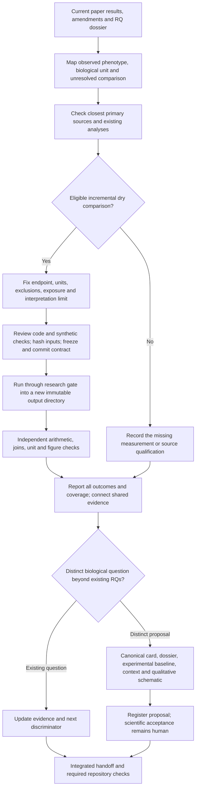

# Portfolio scan and governed extensions

**Date:** 7 October 2026. **Status:** six governed runs executed; proposed A31 registered; scientific review pending.

The owner requested a scan of every paper package and RQ, grouped by biological
logic, followed by eligible dry analyses and evidence-based question development.
This pass starts from merged PR #146, main revision
`55e7cdeb679a103c570421279959b33be922331b`, on
`codex/portfolio-extensions-20261007`. The [coverage manifest](COVERAGE.md)
accounts for all 15 analysis-bearing article packages, the source-only Primary
archive, 31 canonical RQs, 31 article candidates and the unexecuted reading queue.

[Integrated results and question decisions](SYNTHESIS.md) · [Selected evidence checkpoint](EVIDENCE_CHECKPOINT.md) · [Return checklist](RETURN_CHECKLIST.md) · [Validation](VALIDATION.md)

## Groups and decisions

| Group | Biological logic | Audit scope | Executed extension |
|---|---|---|---|
| G1 | Epithelial identity, lineage, chromatin and plasticity | 7 packages; 12 RQs | A11 paired patient-held-out discrimination and separate capacity diagnostic; A17 founder versus retained-clone/cell contribution under source-parameter size laws |
| G2 | Niche communication, stromal/vascular response and repair | 5 packages; 12 RQs; Nb4 candidates; A3 age bridge | Nb4-P09 sensory-gene expression specificity and external transport, with separate genes and joint detection |
| G3 | Immune states, metabolism, ageing and compartment | 3 packages; 7 RQs; Nb5/Wg/Wp candidates | A30 observed common-state and activation-support sensitivity; A25 source-qualified region/sex occupancy stage |

Assignments prevent overlapping runs, not scientific connections. Niethamer,
human fibrosis/lesion atlases and other reused deposits remain shared sources.
The [source-only review](SOURCE_ONLY_REVIEW.md) separates publications and data
leads from executed analyses. No Th17 or lung branch defines the project mission.

## Execution pipeline

This is an exposed exploratory programme. Freezing choices prevents silent
post-result changes; it does not erase historical outcome exposure. Sparse
coverage, unfavorable effects and failed qualification remain in the report.
An experimental baseline may be mutant versus matched control when that
comparison answers the question. Extra arms require a reason tied to the claim.

## Preservation and practical scope

Existing outputs and contracts remain unchanged. Needed ignored raw inputs are
hard-linked from the X-drive primary cache into this worktree; they must never be
edited in place. No whole-dataset redownload, C-drive relocation, worktree deletion,
automatic claim-grade promotion or human retain/reject decision is part of this
pass. Numerical reruns are limited to a concrete unresolved comparison rather
than replaying every historical pipeline.

The main agent owns shared registries, integration and delivery. Three explicitly
authorized subagents own nonoverlapping group directories. All reports and receipts are available in the [G1](g1_epithelial/README.md),
[G2](g2_niche/README.md) and [G3](g3_immune/README.md) reports. Five initial
extensions and one A11 qualification ran; existing questions retain their owners.
The baseline 31 RQs are now joined by proposed [A31](../../../RQ_Specified/A31_gria1_fibroblast_response/README.md),
with a canonical card, dossier, conventional experiment baseline and registered
qualitative schematic. No functional experiment was run.
