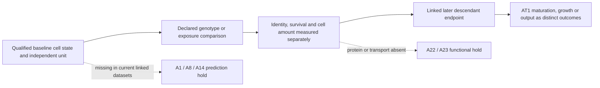

# Epithelial identity, lineage, chromatin and plasticity audit

7 October 2026; integration base `55e7cdeb679a103c570421279959b33be922331b`.
The registry, current dossiers, amendments and reports control this assessment.
Historical stage completion does not imply scientific acceptance. Existing
source cohorts are shared evidence lineages. No RQ is ranked or retired.

## Paper execution coverage

| Paper / package | Executed stages and current result authority | Unresolved comparison and bounded disposition |
|---|---|---|
| Choi 2020 | D0 intake; D1 QC; D2/D2b annotation; D3 ordering; D4 composition; D5/D5b organoids; D6 programmes and corrected scale/units; D7 attacks. `Research Article/gate1_02_choi_2020/ANALYSIS_TRIAL_PLAN.md`, `trials/README.md`, `trials/d6_programmes/revision_20260929/README.md`. Chromatin M0–M4 includes successive annotation/depth/null/corroboration corrections; current `datp_epigenetics/trials/m4_the_corroboration_the_register_claimed/m4_summary.md`. Axin2 branch has A1/A1b/A1c co-accessibility and A2 deletion/Wnt/context checks, `axin2_il1r1/ROUTE_B_OUTCOME.md`. | One pooled RNA library per condition; four of five states recovered, primed AT2 not separated. Ordering and marker programmes do not establish lineage. Coverage-only original ATAC and unlinked substitute assays cannot answer regulatory-to-later-fate or Wnt-history questions. Additional score fitting cannot restore missing linkage. |
| Cardoso 2026 | C0–C3/C1b–d/C2b, C5–C14; E1/E1b, E2/E2b, E4–E6. Source/state purity, AREG deletion, ligand specificity, gradient/cluster and resource dependence, human injury/tumour descriptions. `Research Article/gate2_05_cardoso_2026/ANALYSIS_TRIAL_PLAN.md`; current `analysis/corrections/ligand/README.md` and `trials/revision_20260929/README.md` override old ligand rankings/annotations. | Pooled genotype libraries; no surface-EpCAM measurement; AREG transcript is neither secreted ligand nor recipient function. C13 Epcam transcript/depth check is already done. Repeating resource rankings is not a new biological contrast. G2 owns niche/ligand functional continuation. |
| England 2025 | Batch1, EN0–EN7, FU blocks; A16 Stage1 and corrected C1; A17 source accounting and synthetic kernel. `Research Article/gate2_C2_england_2025/EVIDENCE_REVIEW.md`, `ANALYSIS_OPPORTUNITIES.md`, `RESULTS_FOLLOWUP.md`; `RQ_Specified/A16_cd177_state_attribution/correction_20260928/reports/CORRECTED_C1_REPORT.md`; `docs/research_dossiers/continuation_2026-10-03/A17_MODEL_SPEC.md`. | 20 pooled RNA libraries; nonspatial mouse/lobe identifiers recoverable but spatial rows pooled without mouse/clone IDs. Corrected CD177 matching leaves imbalance. A17 ascertainment extension now specified; full switching-versus-founder fit remains ineligible without qualified solver/fair domains/observation model. E-N2 burden/WT response is G2/A18; E-N1 common-size decomposition needs raw identity/count linkage. |
| Yu/Lee/Choi/Min 2026 | U0–U3 design/source/count/access/QC and lineage annotation; U4 mouse niche; U5 IPF and human source/pathway/LR/target/full-panel/spatial analyses; U6 specificity, ISR, IPF/human contrasts and completion. `Research Article/gate2_C3_yu_lee_choi_min_2026/EVIDENCE_REVIEW.md`, `WORK_PACKAGES.md`, `trials/u6_completion/evidence_matrix.csv`. | Source KAC classifier absent; RNA states are reference-compatible rather than author KAC. 23 patient labels reused across contrasts; no primary pathway family discoveries; whole sections lack independent pathology regions. Reduced HPCS increased in repair contexts, limiting specificity. A11 paired conditional increment is distinct from these source-program contrasts. G2 owns niche arms. |
| Nabhan 2026 / Nb3 | Intake; R1 imaging; R2 species/DE/panels; R3 components; R4 paired panels; source S5 concordance audit; eight initial extensions and marker/depth/control/Hallmark follow-up; external E5 receptor/context pilot. `Research Article/gate2_N2_nabhan_2026/reports/REPRODUCTION_REVIEW.md`, `CONCORDANCE_AUDIT.md`, `FOLLOWUP_RESULTS.md`, `E5_EXTERNAL_FEASIBILITY.md`. | 771 retained paired technical wells, preparation identifiers unknown; human S5 numeric/sign inconsistencies unresolved. A22 broad predictor already failed transport; A23 external compensation/marker support unfavorable. More RNA composites cannot replace chemokine protein or phosphate transport/entry-exit measurements. |
| ES1 epithelial specificity | Fixed 2,000-UMI panels, label-gene exclusions, stage-specific genotype descriptions, second-seed and external unit-floor checks. `Research Article/epithelial_state_specificity/results/SUMMARY.md`, `within_unit_effects.csv`, `between_well_contrasts.csv`, `retention.csv`. | Six CEBPA and four separate AP-1 condition wells; broad identity loss may coexist with state interaction, but post-treatment labels and pooled units cannot identify baseline-state dependence. No new state/score should be fitted to make an interaction appear. |
| Murthy 2022 / GSE178360 | Stage0 atlas/QC, epithelial subanalysis, later HLCA label-transfer/uncertainty checks on same three healthy donors. `Research Article/ungated_murthy_2022/GSE178360/README.md`, `tables/cell_metadata.csv`, `epithelial_subanalysis/tables/epithelial_cell_metadata.csv`; linked HLCA S2. | Three healthy donors, no injury time course or linked progenitor fate. Healthy keratin overlap is construct context, not an independent epithelial repair test. Avoid another atlas description without a qualified biological contrast. Owner roadmap reading status is unchanged. |

## All assigned RQs

Every row uses `docs/research_dossiers/A<n>.md` plus the exact authority below.

| RQ | Current evidence / authority | Phenotype, metadata or comparison needed; next disposition |
|---|---|---|
| A0 | `RQ_Specified/A0_conserved_epithelial_transition_program/reports/PILOT_V1_RESULTS.md`; `SOURCE_RECOVERY.md`. Frozen lung-to-intestine transfer failed. | Independent biological source/target correspondence and a distinct rationale before reopening. No signature replacement; no further outcome analysis eligible now. |
| A1 | `RQ_Specified/A1_transitional_epithelial_state_distinction/COMPARISON_MATRIX.md`, `reports/A1_BRANCH_INVENTORY.md`, `reports/A1_A8_A14_OUTCOME_INVENTORY.md`. 27 branches and 29 outcome records reviewed through current matrix. | A named early regulatory feature, early RNA and later independent lineage-linked mature output in the same units. Separate histone/lineage/intervention cohorts cannot be joined. Hold prediction; biochemical withdrawal candidate remains a proposed companion. |
| A7 | ES1 `results/SUMMARY.md`; source closeout M03/M04. | Independent pre-intervention state and preparation/animal IDs for genotype-by-starting-state identity/survival contrast. Post-genotype RNA labels are not a baseline interaction; descriptive boundary retained. |
| A8 | `RQ_Specified/A8_maturation_component_at1_contribution/README.md`; `docs/research_dossiers/continuation_2026-10-03/SOURCE_LINKAGE.md`; source closeout and shared A1 outcome inventory. | Early RNA score linked to later lineage-derived AT1 endpoint in independent units, train/test separated by those units. Published early and late endpoints in different animals cannot instantiate prediction. |
| A10 | `RQ_Specified/A10_organoid_growth_outcome/reports/FOLLOWUP_RESULTS.md`; `FOLLOWUP_DESIGN_REPORT.md`. Growth-block additions evaluated, including four whole-plate holdouts; poor absolute transport remains. | Independent preparations and genuinely earlier RNA/later viable growth. Plate-target confounding and same-day RNA/image measurement already audited. Further resampling existing wells does not resolve the missing biological contrast. |
| A11 | `RQ_Specified/A5_A11_shared_component_contract/reports/REVISED_TEST_RESULTS.md`; A11 `reports/ACUTE_INJURY_RESULTS.md`. Positive lesion shift; beyond-shared q=0.0547 retained. | New governed internal paired incremental prediction against fixed shared/stress baseline; same eight patients and exposed data. This differs from signed-rank score subtraction. Retain unknown specificity and epithelial-population confounding. |
| A13 | `RQ_Specified/A13_fibroblast_beyond_macrophage_il1b/reports/COVERAGE_RESULTS.md`; current dossier retains failed held-out TGFB/HPCS proxy. | Fixed primary triad impossible in Kim tumour annotation; wider definition only three eligible paired patients. Missing fibroblast capture, mediator and functional feedback endpoints. No threshold relaxation or relabelled positive proxy. |
| A14 | `RQ_Specified/A14_withdrawal_recovery_and_reception/README.md`; shared outcome inventory; `docs/research_dossiers/followup_2026-10-03/OUTCOMES.md`. | Linked withdrawal timing, input/activity and viable mature descendant endpoint. Published withdrawal premise does not link unrelated RNA and outcome cohorts. Keep epithelial direction separate from unresolved fibroblast direction; coordination with G2. |
| A16 | Corrected C1 report above, before original `reports/STAGE1_RESULTS.md`. | Source-validated epithelial CD177 protein, baseline state and one linked later response. Residual matching imbalance and ambient/specificity limits remain; another RNA match cannot prove priming or CD177 causality. |
| A17 | Current model specification and source parameter trace above. | New exact source-parameter ascertainment calculation and independent ODE check. Full fitted model comparison still needs parameter domains, informative observation process and probability/tail qualification; latent class is not molecular cell type. |
| A22 | `RQ_Specified/A22_epithelial_identity_niche_response/reports/identity_amount_v2/RESULTS.md`: small internal gain, loss without NKX2-1 and whole-plate failure. | Nominate actual chemokine protein output plus viable epithelial amount and fibroblast state/survival. No general-identity predictor rerun; transcript relation is already published and source-amount/selection distinction remains. |
| A23 | `RQ_Specified/A23_slc34a2_transition_homeostasis/reports/external_pilot_v2/RESULTS.md`, `reports/transporter_context_v1/RESULTS.md`. External marker/coordinated compensation failed. | Transport and compartment phosphate plus lineage-linked entry, persistence, division, loss and exit. Fixed endpoint counts cannot separate entry from residence; no ad hoc compensation score. |

## Eligible work and overlap

Two bounded extensions are implemented under new contracts: A11 paired
discrimination and A17 ascertainment. The [literature record](LITERATURE.md)
states their actual increment, alternatives and access limits. Neither needs a
new A identifier. All twelve questions remain preserved.

England E-N6 (second-hit p53 dependence of durable epithelial plasticity) is
biologically distinct from merely attributing a CD177 marker, but is **already
an article-local candidate**, not a newly discovered RQ. Existing GSE253461 and
GSE227719 metadata do not establish a matched Kras-only versus Kras/p53 causal
comparison. Its baseline would require genotype/background-matched independent
preparations, early state assignment independent of outcomes, and separate
later clone growth, survival and maturation observations. No automatic rescue
arm is required for a genotype-effect question. Assay calibration, effect
margin, variance and sample size remain unknown; no global ID is allocated.

Potential Wg biochemical companions belong to A1/A8/A14; Nb3 protein/transport
questions belong to A22/A23; epithelial maturity under inflammation belongs to
A8/A14. Rebranding those would duplicate the portfolio. An additional global
question should be reserved for a genuinely different contrast after source
qualification, not used to bypass an unfavorable result.

## Experimental baseline and interpretation map

The shared baseline is unit and time linkage, not a universal extra-arm design.
Identity/survival can be estimated from a qualified mutant/control experiment.
Prediction requires an earlier feature and later independently measured
endpoint; mechanism requires a perturbation/identification design appropriate
to the actual claim. Host capability and sample-size assumptions remain
unverified. These are conditional experiment requirements, not bench protocols.

Qualitative schematic only. Arrows indicate proposed measurement order,
not an established causal pathway. No numerical or biological effect is shown.
