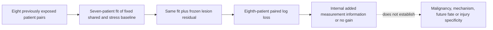
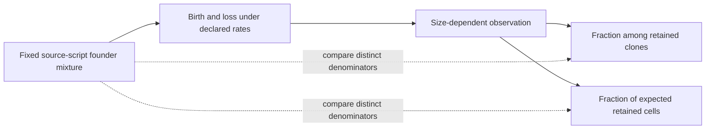

# G1 epithelial portfolio extensions

This group covers A0, A1, A7, A8, A10, A11, A13, A14, A16, A17, A22 and A23.
The [audit](AUDIT.md) records seven paper packages, prior stages and exact
current evidence. The [literature refresh](LITERATURE.md) explains the two
eligible new comparisons and why the remaining endpoint holds persist.

## Execution pipeline

| Stage | Input and action | Decision / output |
|---|---|---|
| Existing-evidence audit | Registry → current dossier/amendment → result table/report → source/units | Distinguish completed tests from unmet biological measurements; preserve negative findings |
| A11 input recovery | Immutable primary-cache hard links; original patient/cell rules and human module membership | Reconstruct original 16 pseudobulks; exact cell-count and whole-library-total checks |
| A11 measurement/model | Per-library log2(CPM+1); fixed shared/stress baseline ± frozen lesion component; eight patient holdouts | Internal paired log-loss increment, all patient/penalty results; no cancer-specific or future-fate interpretation |
| A17 source model | Archived code parameter trace; exact no-switching birth-death law | Starting mixture versus size-selected clone and expected-cell contribution; source alternatives remain named sensitivities |
| Independent checks | A11 Newton versus BFGS and library identity checks; A17 backward PGF ODE versus exact tail law | Numerical agreement supports arithmetic only; it does not replicate biology |
| Remaining biological pipeline | Linked early/late units for A1/A8/A14; baseline states for A7; independent preparations/timing for A10; protein attribution for A16; chemokine output for A22; phosphate/transition timing for A23 | Reopen the named comparison only when those measurements or identities exist; no automatic signature or RQ replacement |

Six synthetic tests passed before outcome execution, covering patient holdout
isolation, pair reversal, no-contrast coefficients, complete size probability,
piecewise probability integration and initial-condition handling. Input
preflight passed for both frozen contracts. Actual executions require the
main agent's committed-freeze confirmation; their receipts and results will be
linked in [RESULTS.md](RESULTS.md) when complete.

## What the contrasts mean

These qualitative diagrams show the comparison and its limits, not measured
results. A17 cell shares are ratios of expected contributions under the model;
they are not the expectation of a noisy finite-cohort ratio or observed tissue
fractions. Model state labels have no assigned molecular identity.

## Review disposition

Both extensions belong to existing A11/A17. Existing E-N6 is a possible
second-hit genotype question with unresolved source eligibility, not a newly
allocated global question. No human scientific acceptance, claim promotion,
portfolio retirement or experimental readiness is inferred.
