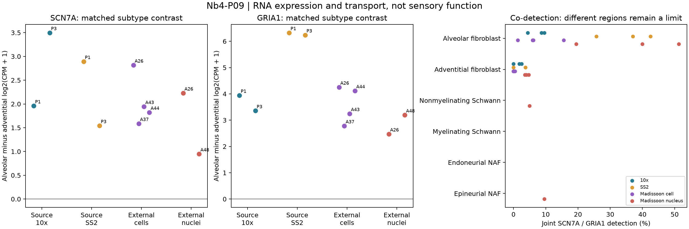

# Nb4-P09: separate genes transport; a sensory function remains untested

7 October 2026. The first fixed expression/specificity stage executed successfully
after the contract/code freeze at `0761ba8`; the runner records execution HEAD
`95b0118f8374950baca6f74e9a459bebe312002b`. All prior source outcomes remain
exposed. [Contract](../../../../analysis/portfolio_extensions/2026-10-07/g2_niche/contract_v1.json),
[receipt](../../../../analysis/research/runs/nb4_p09_expression_specificity_v1_20261007/receipt.json),
[machine summary](../../../../analysis/research/runs/nb4_p09_expression_specificity_v1_20261007/summary.json).

SCN7A and GRIA1 each favor labelled alveolar over adventitial fibroblasts in
every primary-eligible donor/assay comparison. The study-level transport is
descriptive and does not establish independent cell identity, membrane protein,
sensory response, sodium sensing or repair. Same-cell co-detection occurs,
but its frequency is strongly dependent on the assay and count threshold.

## Unit, normalization and complete primary comparison

83,255 retained records cover source lung and external normal, non-mixed
anatomy. All seven fixed candidate/diagnostic genes map exactly once in each
raw universe. Full measured-gene library totals precede filtering and scoring.
No new cell labels, marker fitting or pathway scoring were used.

For matched subtype contrasts, source distal lung and external explicit left
lobes are compared within donor, assay, region and protocol. Each arm needs
20 cells; eligible stratum differences receive equal weight within a donor.
Values below are alveolar minus adventitial **log2(CPM+1) differences**, not
unregularized log-fold changes. No biological p-values or population intervals
were calculated.

| Assay / primary donor IDs | SCN7A mean [range] | GRIA1 mean [range] | Direction |
|---|---:|---:|---|
| Source 10x, P1/P3 | +2.729 [1.959, 3.498] | +3.650 [3.357, 3.943] | Both positive 2/2 |
| Source SS2, P1/P3 | +2.217 [1.543, 2.892] | +6.282 [6.238, 6.325] | Both positive 2/2; same donors |
| Madissoon cells, A26/A37/A43/A44 | +2.043 [1.588, 2.816] | +3.600 [2.783, 4.254] | Both positive 4/4 |
| Madissoon nuclei, A26/A48 | +1.589 [0.948, 2.229] | +2.834 [2.474, 3.195] | Both positive 2/2; A26 overlaps cells |

[Every stratum and eligibility](../../../../analysis/research/runs/nb4_p09_expression_specificity_v1_20261007/pair_effects.tsv)
and [donor estimates](../../../../analysis/research/runs/nb4_p09_expression_specificity_v1_20261007/donor_effects.tsv)
include unfavorable/sparse contexts. At the inherited 10-cell sensitivity,
source 10x P2 joins and both directions remain positive. Other assay donor
counts do not increase. The three source donors are never counted twice
because SS2 and 10x are repeated assays.

## Same-cell intersection and the specificity rival

The following co-detection percentages describe all individually eligible
alveolar-fibroblast specificity strata, averaged equally within donor. They
are **not the paired-subtype estimand**: donor coverage and anatomical regions
differ. Therefore the percentages do not estimate an assay effect or a common
tissue prevalence.

| Assay | Donors with eligible alveolar strata | Both genes >=1 count: donor range | Both genes >=2 counts: donor range |
|---|---:|---:|---:|
| Source 10x | 3 | 4.44–9.52% | 0–0.97% |
| Source SS2 | 3 | 25.72–42.50% | 19.49–41.25% |
| External cells | 4 | 1.35–15.58% | 0–4.00% |
| External nuclei | 3 | 19.45–51.29% | 10.22–30.32% |

SS2 read counts are not UMI molecules. The >=2 rule is a count-threshold
diagnostic, not a common molecular sensitivity or validated contamination test.
Frozen low/high library-half strata retain visible detection dependence;
the complete [joint table](../../../../analysis/research/runs/nb4_p09_expression_specificity_v1_20261007/joint_detection.tsv)
shows every split, threshold, neural exclusion and marker co-detection count.

The fixed SOX10-and-(S100B-or-PLP1) flag marks zero records among the
13,924 source/external alveolar or adventitial fibroblast-labelled records.
Thus its exclusion leaves paired estimates unchanged. This is an insensitive
RNA diagnostic under dropout; it does not exclude neural admixture or ambient
RNA. Among joint-positive alveolar records in >=20-cell strata, COL1A1 or
PDGFRA is detected in 82/110 source 10x, 110/121 SS2, 187/224 external cells
and 129/326 external nuclei. These are technical co-detection counts, not
independently validated fibroblast identities or biological replicates.

The available neural comparisons actively limit specificity. Only external
nuclear donor A42 has >=20-cell strata for nonmyelinating Schwann and
epineurial nerve-associated fibroblasts (NAF). SCN7A is detected in 19/20
Schwann nuclei; GRIA1 and the intersection in 1/20. Epineurial NAF strata
have joint detection averaging 9.55%. Other plotted neural rows have no
eligible points; blank rows mean insufficient coverage, not zero expression.
Regions differ from the lobe comparison, so no neural-versus-alveolar
specificity effect is inferred. The entire source population table remains
available in [stratum gene measurements](../../../../analysis/research/runs/nb4_p09_expression_specificity_v1_20261007/stratum_gene.tsv).

## Figure and independent verification

Left/middle: individual donor subtype contrasts; no donor pooling across
assays. Right: donor averages across eligible specificity strata, with
anatomical mismatch stated. Neither panel shows a functional measurement.
The PNG was visually inspected: axes/units/donor IDs are legible and the
null line remains visible. [Vector export](../../../../analysis/research/runs/nb4_p09_expression_specificity_v1_20261007/sensory_v1.svg).

The governed run passed 13,902 checks: independent pandas aggregation from
the cell evidence, full-library arithmetic, joint-detection bounds, fixed
eligibility and equal-stratum donor summaries. A separate post-run verifier
did not import the execution script: for 21 evenly spaced retained cells per
raw object, it directly read CSR pointers/data/indices and summed full rows
and each of seven exact feature offsets using Python dictionaries. All
504 raw-value checks passed. This is arithmetic verification of the same
data, not biological replication. Receipt output hashes also verified.

The first verification attempt stopped on categorical HDF5 metadata; an
inefficient feature lookup was then interrupted and replaced by a cached
lookup. Neither attempt modified scientific inputs or outputs. The frozen
analysis ran once. Two synthetic unit tests passed before freezing.

## Biological decision

The measured result supports a narrower expression premise for an adult
alveolar-fibroblast GRIA1 response experiment. It does not justify a stable
dual-positive sensory-cell class or a combined SCN7A/GRIA1 score. Older
primary literature already describes GRIA1-high lung fibroblasts; broad
nerve–fibroblast biology is also established. The proposed increment is a
qualified **GRIA1 perturbation/control acute-response comparison**, not
rediscovery of expression or a claim of a new sensory mechanism.

[Candidate derivation and wet baseline](NEW_QUESTION_CANDIDATE.md) explains
the nonredundant endpoint, alternatives and unresolved laboratory inputs.
Existing A20/A9 mechanisms remain unchanged. A proposed registration and
successful execution do not supply human scientific acceptance.
