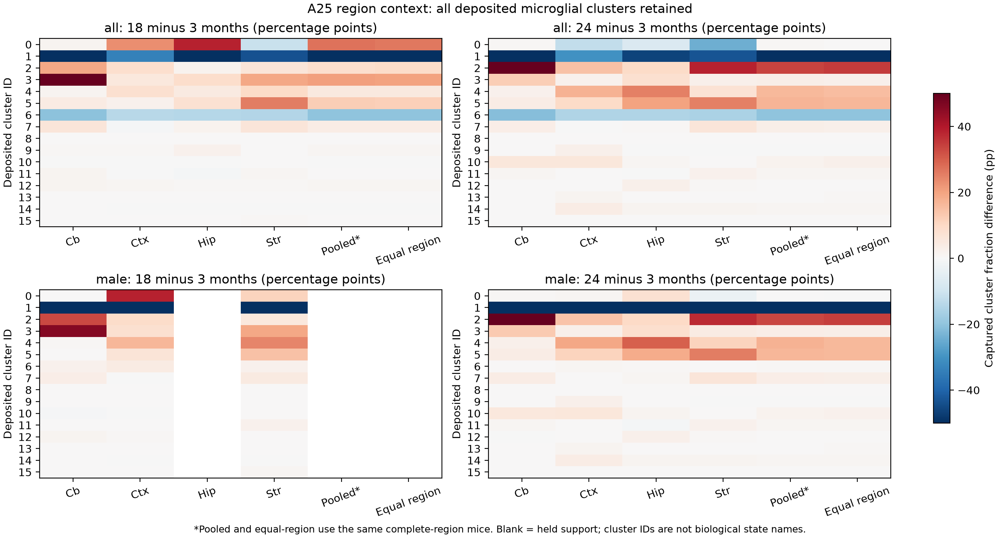

# A25 regional and sex context of source-cluster occupancy

Executed 7 October 2026 after review/freeze at `ec16e2b`. [Contract](../../../../analysis/portfolio_extensions/2026-10-07/g3_immune/a25_region_occupancy_v1.json), [receipt](../../../../analysis/research/runs/a25_region_occupancy_v1/receipt.json), [context/search](A25_CONTEXT.md), [all contrasts](../../../../analysis/research/runs/a25_region_occupancy_v1/age_contrasts.csv). Outcomes and source cluster definitions are exposed. Scientific acceptance is not assessed.

Regional capture alone does not account for the large aggregate source-cluster age differences among complete-region mice. However, the same cluster can have opposite age associations across regions, and sex/cohort support materially changes some interpretations. This is a descriptive supplement; **A25's distinct-state versus continuum/endpoint-mixture model remains unrun**.

The exact source bridge retains 13,130 source-labelled microglia from 14 mice and all 16 deposited Leiden IDs. Cells/regions are nested observations. The ≥20-cell region rule gives complete four-region data in **4/3/3 mice** at 3/18/24 months, rather than the entire source 6/4/4. Missing hippocampus in `18_53_M`, only 11 striatal cells in `24_61_M`, and missing regions in two young females are retained as exclusions. [Support](../../../../analysis/research/runs/a25_region_occupancy_v1/region_support.csv) and [mouse fractions](../../../../analysis/research/runs/a25_region_occupancy_v1/mouse_cluster_fractions.csv) identify every unit.

The table retains all cluster IDs. Numbers are older-minus-3-month percentage-point changes in equal-mouse means, all-sex complete-region subset; pooled and equal-region columns use exactly the same mice. Cluster numbers are source labels, **not** validated final-paper state names.

| Source ID | 18m pooled | 18m equal-region | 24m pooled | 24m equal-region |
|---|---:|---:|---:|---:|
| 0 | +27.08 | +26.52 | +0.57 | +0.03 |
| 1 | −58.76 | −58.00 | −57.28 | −56.85 |
| 2 | +8.36 | +9.04 | +33.79 | +34.84 |
| 3 | +20.49 | +20.29 | +2.78 | +2.69 |
| 4 | +4.85 | +4.78 | +16.13 | +15.25 |
| 5 | +12.27 | +11.81 | +17.05 | +16.51 |
| 6 | −20.27 | −20.22 | −20.24 | −20.19 |
| 7 | +3.85 | +3.84 | +2.80 | +2.70 |
| 8 | +0.05 | +0.05 | 0.00 | 0.00 |
| 9 | +1.03 | +1.04 | −0.10 | −0.08 |
| 10 | −0.11 | −0.13 | +1.68 | +2.35 |
| 11 | +0.34 | +0.19 | +1.11 | +0.93 |
| 12 | +0.85 | +0.84 | +0.31 | +0.30 |
| 13 | 0.00 | 0.00 | +0.26 | +0.44 |
| 14 | −0.13 | −0.15 | +1.14 | +1.07 |
| 15 | +0.08 | +0.08 | 0.00 | 0.00 |

This aggregate similarity does not imply uniform regional biology. Source cluster 0's 18-minus-3-month within-region contrast is **+1.29 pp cerebellum, +23.19 pp cortex, +38.56 pp hippocampus and −10.94 pp striatum** (respective young/middle mouse counts 4/4, 5/4, 5/3, 6/4). Its single-mouse-deletion ranges remain positive in the first three regions and negative in striatum. These ranges describe sensitivity, not population confidence or trajectories. The pooled middle-age enrichment cannot nominate a universal intermediate state.

Sex qualification is consequential. Source cluster 6's equal-region 24-month all-sex difference is −20.19 pp, with deletion range spanning −27.08 to +0.50 pp; the male-only difference is **+0.50 pp** (3 versus 3 complete-region mice), because no retained young male cell belongs to that source cluster. This is a sex/cohort/processing sensitivity, not proof of a sex-specific biological mechanism. Source cluster 1 remains reduced in males (−78.27 pp), while cluster 2 rises (+34.65 pp). Every other cluster and sex scope remains in the linked table.

Only **one** 18-month male has all four qualified regions, so the male middle-age equal-region and pooled-complete comparison is held. Female complete-region young support is one mouse, and there are no old females. The design cannot estimate a full lifespan sex interaction or repair these missing populations statistically.

Figure visually inspected: all sixteen IDs, labels and footnote are legible; blank columns indicate held support. Colors saturate at ±50 pp, so exact larger changes must be read in the table. [SVG](../../../../analysis/research/runs/a25_region_occupancy_v1/region_occupancy.svg). Region abbreviations: Cb cerebellum, Ctx cortex, Hip hippocampus, Str striatum. Region columns can use more mice than the two complete-region columns and therefore do not supply paired organ effects by themselves.

Receipt verification passes. [1,344 independent arithmetic checks](../../../../analysis/research/runs/a25_region_occupancy_v1/verification.json) reconstructed each fraction from cell counters, confirmed all per-mouse/basis fractions sum to one, and agreed to 1.11×10⁻¹⁶. A separate read-only CSV/`math.fsum` check recomputed age means, differences and exhaustive mouse-deletion minima/maxima from those fractions: **2,320 values** agreed to 1.11×10⁻¹⁶ and **208 held cluster-contrasts** correctly lacked two mice in at least one age. This post-run check is recorded here, not added to the immutable receipt. Synthetic pure-region-mixture and missing-sex checks passed before freeze. Source cell IDs and official age/mouse/sex/region/microglial labels were asserted concordant. No biological analysis or raw data was overwritten.

The next A25 decision is still the explicit held-out model comparison on qualified unintegrated expression and a prospectively defined regional/sex scope. These clusters were derived from the same exposed atlas, may encode processing, and have not been mapped to all final-paper state names. Captured fractions are not absolute abundance, transitions, beneficial function, Alzheimer mechanisms or independent replication. No new global question or claim grade is warranted merely by these regional/sex sensitivities.
