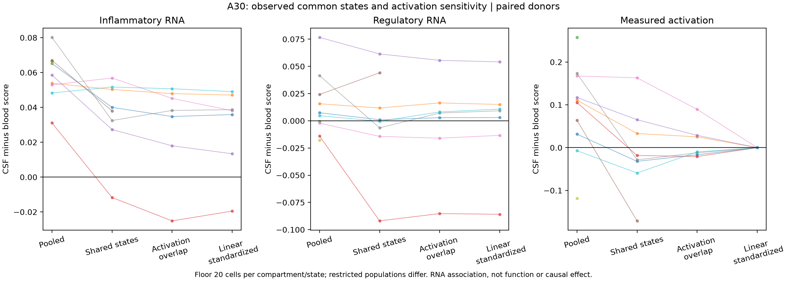

# A30 common-state support and activation sensitivity

Executed 7 October 2026 after review and freeze at `0761ba8`. [Contract](../../../../analysis/portfolio_extensions/2026-10-07/g3_immune/a30_common_support_v1.json), [receipt](../../../../analysis/research/runs/a30_common_support_v1/receipt.json), [all estimates](../../../../analysis/research/runs/a30_common_support_v1/summary.csv), [literature/context](LITERATURE_CONTEXT.md). Every input and motivating outcome was exposed. Scientific acceptance is not assessed.

The inflammatory RNA association remains positive on the supported subset, while the intended comparison loses donors and considerable cell coverage. This qualifies the population to which the association can be applied. It does not replace the original pooled estimate.

| Estimand, primary floor 20 per state/compartment | Donors | Inflammatory median CSF−blood | Positive donors | Regulatory median | Median CSF / blood coverage |
|---|---:|---:|---:|---:|---:|
| Original pooled retained cells | 10 | +0.06182 | 10/10 | +0.00602 | 100% / 100% |
| Observed shared states, overlap weights | 8 | +0.03900 | 7/8 | +0.00026 | 77.6% / 37.1% |
| Shared states plus continuous activation overlap | 7 | +0.03825 | 6/7 | +0.00711 | 67.7% / 33.0% |
| Same trimmed support, linear activation standardization | 7 | +0.03810 | 6/7 | +0.00922 | 67.7% / 33.0% |

State weights are proportional to the smaller compartment's count, identically applied to both compartments. No opposite-compartment state mean is filled. Trimming to intersecting activation 5th–95th percentile bounds is followed by an explicit common prediction-target check against each retained observed range. Separate slopes standardize RNA to the common activation value. Zero activation contrast after fitting is an algebraic property, **not independent evidence that biological activation is controlled**.

MS60249 and PTC41540 have no primary common-state support; PST83775 additionally fails primary activation support. Among included donors, minimum CSF coverage is **4.6%** for common states and **3.9%** after activation trimming. Thus a positive restricted result cannot supply evidence about PTC41540's largely unsupported CSF cells or all cells of the included donors. The original all-cell association remains a different target population and weighting scheme. [Every support decision](../../../../analysis/research/runs/a30_common_support_v1/state_support.csv) and [donor values](../../../../analysis/research/runs/a30_common_support_v1/donor_estimates.csv) are retained.

At the fixed floor-five sensitivity, activation standardization retains all ten donors: median +0.03681, 8/10 positive, pointwise donor-bootstrap 95% interval **−0.00308 to +0.04420**. At floor 50 it retains five donors, +0.03588, 5/5 positive. The primary floor-20 interval is +0.01338 to +0.04706, but no floor is a power calculation and these intervals are exploratory, pointwise and based on few donors. Floor-five uncertainty crossing zero is retained; the favorable primary interval cannot erase it. Regulatory primary intervals span negative/positive values and do not show equivalence or preserved function. No significance claims are assigned.

The measured activation gap changes from +0.1082 pooled to −0.0234 common-state and −0.00989 trimmed medians, so the restricted population differs materially in activation as well as cell composition. Similar unadjusted/standardized RNA differences within trimmed support suggest limited sensitivity to this particular local linear adjustment, not exclusion of activation biology, unmeasured subtypes or selective trafficking.

Figure visually inspected: all titles, axes, points and restriction caption are legible; each line is one donor and stops when support fails. [SVG](../../../../analysis/research/runs/a30_common_support_v1/common_support.svg). The zero standardized activation panel is a model identity as explained above.

Verification: receipt passes; [852 arithmetic checks](../../../../analysis/research/runs/a30_common_support_v1/verification.json) independently reconstruct state means with raw-row sums, linear predictions using least-squares matrices and donor weighted sums (maximum error 1.67×10⁻¹⁶). Synthetic known-offset, missing-state and gapped-activation-support checks passed before freeze. This verifies calculations on saved v3 cells, not raw-matrix denominators anew or biological replication.

Remaining limits: inherited operational CD4/non-CD8 gate, no dedicated doublet detector, saved state table lacks barcode linkage, loaded-gene size-only null uncalibrated, exposed de novo labels, shared GSE138266 lineage, ten donors and incomplete clinical covariates. No protein, secretion, regulatory function, residency, local induction or causal compartment effect is measured. A30 remains an association question; the extension warrants a narrower supported-population statement, not a new RQ identifier.
