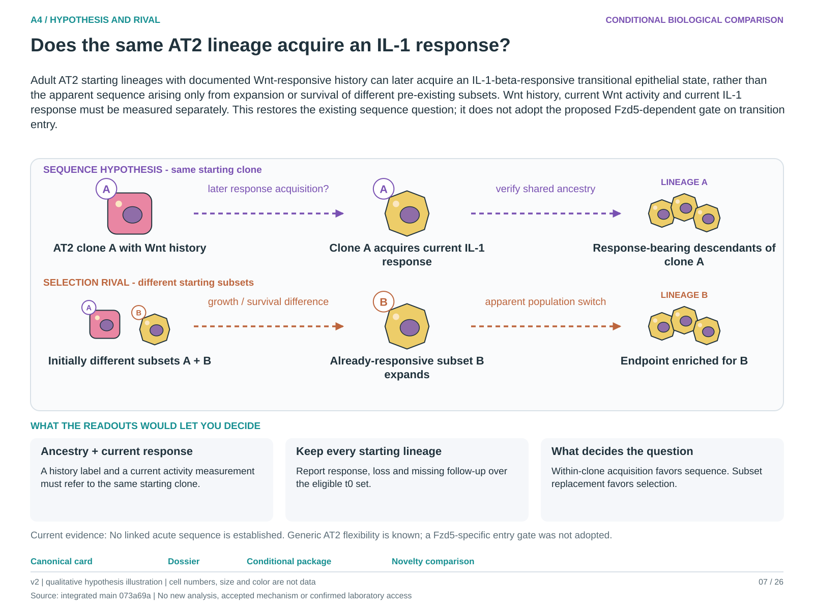

# A4: research development dossier

**Current entrypoints:** [existing source-analysis context](../../Research%20Article/gate1_03_nabhan_2018/README.md) ·
[conditional hypothesis package](packages_2026-10-03/A4.md).
The package draft exists. The requested specificity/novelty revision is applied;
scientific acceptance and experiment-specific qualification remain pending. Use [current work disposition](REMAINING_WORK.md), not an older
package-pending checkpoint, to decide what is active.
Source recovery is closed at its documented evidence limit: [M08](source_mapping_closeout_2026-10-03/README.md). Missing biological links remain held.
Review the [t0-denominator and missing-lineage refinement](continuation_2026-10-03/PACKAGE_REVIEW.md) with the package; survivor-conditioned fractions are not the proposed primary denominator.

Can Wnt-supported maintenance precede an IL-1-responsive transition in the same AT2 lineage?

Status: proposed refinement, 3 October 2026. This is a development aid, not scientific acceptance or an experimental protocol.

## Biological problem

Can tracked adult AT2 starting lineages with documented Wnt-responsive history later acquire an IL-1-beta response, rather than merely select a different subset?

## Established knowledge

Wnt-responsive lineage history, current pathway activity and transcript abundance are distinct. The Nb1 source establishes relevant lineage biology but not every acute response transition.

## Repository evidence

Nb1 lacks sufficient acute sampling for the proposed switch. AF1 Wnt2 and AF2 Wnt4 expression nominate source contexts but do not demonstrate switching by the same cells.

Evidence locators (source citations and numerical details remain in these records):

- [Research Article/gate1_03_nabhan_2018/README.md](../../Research%20Article/gate1_03_nabhan_2018/README.md)

## Unresolved gap

Within-lineage response flexibility has not been distinguished from replacement or selective survival of pre-existing subsets.

## Working hypothesis

Adult AT2 starting lineages with documented Wnt-responsive history can later acquire an IL-1-beta-responsive transitional epithelial state, rather than the apparent sequence arising only from expansion or survival of different pre-existing subsets. Wnt history, current Wnt activity and current IL-1 response must be measured separately. This restores the existing sequence question; it does not adopt the proposed Fzd5-dependent gate on transition entry.

**Specificity/novelty disposition:** Restored conditional lineage question; novelty provisional. Dynamic Wnt responsiveness and inflammatory AT2 transitions are established. The possible increment is the linked adult Wnt-history-to-IL-1 sequence versus within-population selection. The Fzd5 entry-gating proposal remains unsupported as current scope. See the [source comparison](NOVELTY_SPECIFICITY_APPLICATION_2026-10-03.md#a4). This is a proposed research scope, not a claim-grade or retain/reject decision.

## Competing explanations

Fixed subsets respond differently; selective expansion, death or reporter history creates an apparent switch.

## Discriminating outcomes

Acquisition of the qualified response within tracked starting clones favors the sequential model; stable subset responses with differential growth or death favor selection. Count response, loss and unresolved follow-up over the eligible t0 lineage set. A survivor-only fraction or endpoint KRT8 fraction cannot identify switching or entry.

## Next investigation

Identify a dataset or model with lineage history, current state and temporal coverage. Do not substitute RNA-derived ordering for lineage transitions.

## Experimental bridge

Independently distinguish Wnt history from current Wnt activity, then link current IL-1 response and qualified transitional identity to the same starting clones. Reporter/activity measurements address input history and engagement; lineage-resolved absolute counts address selection, division and loss. Preserve the eligible t0 denominator and missing-response bounds. This does not require or establish the unadopted Fzd5 entry-gating mechanism.

## Interpretation boundary

Ligand-source RNA and reporter positivity cannot establish a reversible cellular switch.

## Decision and maturity

Biological question remains open; temporal and lineage measurement feasibility must be established before narrowing a molecular mechanism.

Novelty remains provisional: review primary literature around the actual discriminator before calling this a new contribution. Assay validity, meaningful effect size, biological-unit variance and model feasibility must be established before a confirmatory experiment.

## Primary-source and feasibility review

A Wnt-responsive stem-cell niche is established. Switching within the same tracked population remains distinct from selection of different subsets.

See the [3 October review](review_2026-10-03/FEASIBILITY.md#a4) for primary-source locators, the next evidence decision and required capabilities. This bounded review does not establish exhaustive novelty or lab readiness.

## Source and capability qualification

The qualification portfolio records the current source hold and exact enabling evidence; no new dataset eligibility is inferred from this entry. See the [qualification report](qualification_2026-10-03/README.md) and [portfolio disposition](qualification_2026-10-03/PORTFOLIO.md). Actual laboratory capability remains unspecified.

## Targeted follow-up

See the [current novelty ledger](followup_2026-10-03/NOVELTY.md) for the precise contribution boundary and source access. The [outcome-linkage qualification](followup_2026-10-03/OUTCOMES.md) separates published endpoints from the required unit-level join. Frank 2016 already reports dynamic developmental Wnt responsiveness; the narrower response-sequence versus selection comparison remains unresolved. No scientific acceptance or laboratory readiness is inferred.

## Published model review and package status

The [downloaded-paper methods review](capabilities_2026-10-03/METHODS.md) records published models and assay limits. Actual host access is unconfirmed. The [conditional package draft](packages_2026-10-03/A4.md) is complete. Scientific review, assay validity, meaningful effects, precision and actual resource confirmation remain deferred or unqualified. The [current ledger](REMAINING_WORK.md) supersedes the [historical completion audit](capabilities_2026-10-03/NEXT_STEPS.md) as a task list; the recorded result and eligibility are unchanged.

## Conditional package continuation — 3 October 2026

The newer [A4 package](packages_2026-10-03/A4.md) now develops the proposed
comparison or next evidence decision, units, endpoints, timing, controls,
precision inputs and stop conditions. This updates the earlier package-pending
status above; its scientific results and interpretation are preserved.
Owner scientific review, actual access and unresolved assay/precision
qualification remain pending. See the [ledger](packages_2026-10-03/LEDGER.md).

## 3 October continued qualification

The [current evidence/refinement](continuation_2026-10-03/PACKAGE_REVIEW.md) records the new bounded qualification. It preserves prior stop decisions and distinguishes proposed design changes, numerical verification and source metadata from biological inference or owner scientific acceptance.

<!-- literature-visual-context:start -->
## Literature context and visual hypothesis

[What previous findings contribute, what remains, and what the readouts would decide](literature_context_2026-10-03/A4.md).

*Explanatory proposal, not measured results. Read the linked context and caption; arrows do not certify a mechanism or novelty.*
<!-- literature-visual-context:end -->
