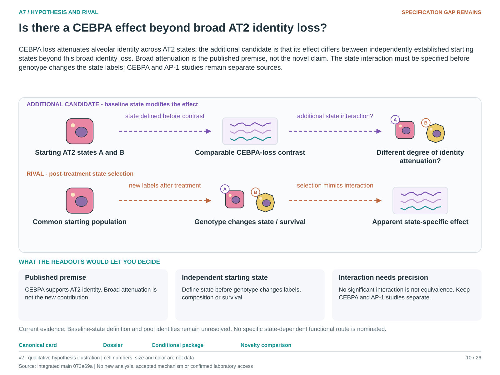

# A7: research development dossier

**Current entrypoints:** [existing source-analysis context](../../Research%20Article/epithelial_state_specificity/README.md) ·
[conditional hypothesis package](packages_2026-10-03/A7.md).
The package draft exists. The requested specificity/novelty revision is applied;
scientific acceptance and experiment-specific qualification remain pending. Use [current work disposition](REMAINING_WORK.md), not an older
package-pending checkpoint, to decide what is active.
Source recovery is closed at its documented evidence limit: [M03/M04](source_mapping_closeout_2026-10-03/README.md). Missing biological links remain held.

Does Cebpa loss attenuate AT2 identity across states or preferentially within a transitional state?

Status: proposed refinement, 3 October 2026. This is a development aid, not scientific acceptance or an experimental protocol.

## Biological problem

How broadly does Cebpa loss attenuate AT2 identity, and is there an additional effect associated with independently defined states?

## Established knowledge

Hassan and Chen (2024) establish CEBPA-dependent AT2 identity; Sawhney et al. (2025) further distinguish defensive and reparative programmes. The broad role of CEBPA is therefore established background, not this dossier's novelty claim.

## Repository evidence

The relevant record is ES1 epithelial-state specificity using the CEBPA source, not the England mutant-clone paper. The shared ES1 resource has six CEBPA-source and four separate AP-1-source condition wells. These support conditional, label-sensitive descriptions; cells and pooled wells do not supply a replicated genotype-by-state interaction at animal level.

Evidence locators:

- [Research Article/epithelial_state_specificity/README.md](../../Research%20Article/epithelial_state_specificity/README.md)
- [Research Article/epithelial_state_specificity/results/SUMMARY.md](../../Research%20Article/epithelial_state_specificity/results/SUMMARY.md)

## Unresolved gap

How much of the apparent reference-versus-transition compression survives independent state definitions and valid biological replication is unresolved. Broad identity change and an additional state interaction can coexist.

## Working hypothesis

CEBPA loss attenuates alveolar identity across AT2 states; the additional candidate is that its effect differs between independently established starting states beyond this broad identity loss. Broad attenuation is the published premise, not the novel claim. The state interaction must be specified before genotype changes the state labels; CEBPA and AP-1 studies remain separate sources.

**Specificity/novelty disposition:** Published premise; baseline-state extension unresolved. CEBPA-dependent AT2 identity is established. Only a qualified baseline-state interaction and its consequence could extend that result; post-treatment state stratification does not isolate it. See the [source comparison](NOVELTY_SPECIFICITY_APPLICATION_2026-10-03.md#a7). This is a proposed research scope, not a claim-grade or retain/reject decision.

## Competing explanations

The apparent breadth or interaction arises from post-genotype state selection, reference enrichment, differential survival or depth-sensitive measurement rather than a difference between starting states.

## Discriminating outcomes

Estimate broad attenuation and the additional baseline-state interaction separately. A consistent interaction supports state dependence; precise similarity would weaken it. A nonsignificant interaction is not equivalence, and differential survival can mimic selective loss.

## Next investigation

Audit state definitions, pooled-source identities and animal-level replication in ES1. Use the existing results descriptively unless the source can support the intended interaction; do not manufacture replication from cells.

## Experimental bridge

A future genotype-by-starting-state comparison needs independent preparations, a justified pre-intervention state definition, separate identity and survival outcomes, and later descendant output if a fate claim is intended.

## Interpretation boundary

More cells in one well cannot establish genotype replication; a reduced transitional fraction does not establish altered fate.

## Decision and maturity

Descriptive evidence only. A replicated interaction design is the next meaningful discriminator.

Novelty remains provisional: review primary literature around the actual discriminator before calling this a new contribution. Assay validity, meaningful effect size, biological-unit variance and model feasibility must be established before a confirmatory experiment.

## Primary-source and feasibility review

The source locator is corrected to ES1/CEBPA. A broad effect and state interaction can coexist; post-genotype state labels do not supply a causal starting-state contrast.

See the [3 October review](review_2026-10-03/FEASIBILITY.md#a7) for primary-source locators, the next evidence decision and required capabilities. This bounded review does not establish exhaustive novelty or lab readiness.

## Source and capability qualification

Fresh deposited-metadata findings and their inference limits are recorded in the qualification results. See the [qualification report](qualification_2026-10-03/README.md) and [portfolio disposition](qualification_2026-10-03/PORTFOLIO.md). Actual laboratory capability remains unspecified.

## Targeted follow-up

See the [current novelty ledger](followup_2026-10-03/NOVELTY.md) for the precise contribution boundary and source access. The [BioSample follow-up](followup_2026-10-03/METADATA.md) adds library identities without promoting biological replication. No scientific acceptance or laboratory readiness is inferred.

## Published model review and package status

The [downloaded-paper methods review](capabilities_2026-10-03/METHODS.md) records published models and assay limits. Actual host access is unconfirmed. The [conditional package draft](packages_2026-10-03/A7.md) is complete. Scientific review, assay validity, meaningful effects, precision and actual resource confirmation remain deferred or unqualified. The [current ledger](REMAINING_WORK.md) supersedes the [historical completion audit](capabilities_2026-10-03/NEXT_STEPS.md) as a task list; the recorded result and eligibility are unchanged.

## Conditional package continuation — 3 October 2026

The newer [A7 package](packages_2026-10-03/A7.md) now develops the proposed
comparison or next evidence decision, units, endpoints, timing, controls,
precision inputs and stop conditions. This updates the earlier package-pending
status above; its scientific results and interpretation are preserved.
Owner scientific review, actual access and unresolved assay/precision
qualification remain pending. See the [ledger](packages_2026-10-03/LEDGER.md).

<!-- literature-visual-context:start -->
## Literature context and visual hypothesis

[What previous findings contribute, what remains, and what the readouts would decide](literature_context_2026-10-03/A7.md).

*Explanatory proposal, not measured results. Read the linked context and caption; arrows do not certify a mechanism or novelty.*
<!-- literature-visual-context:end -->
