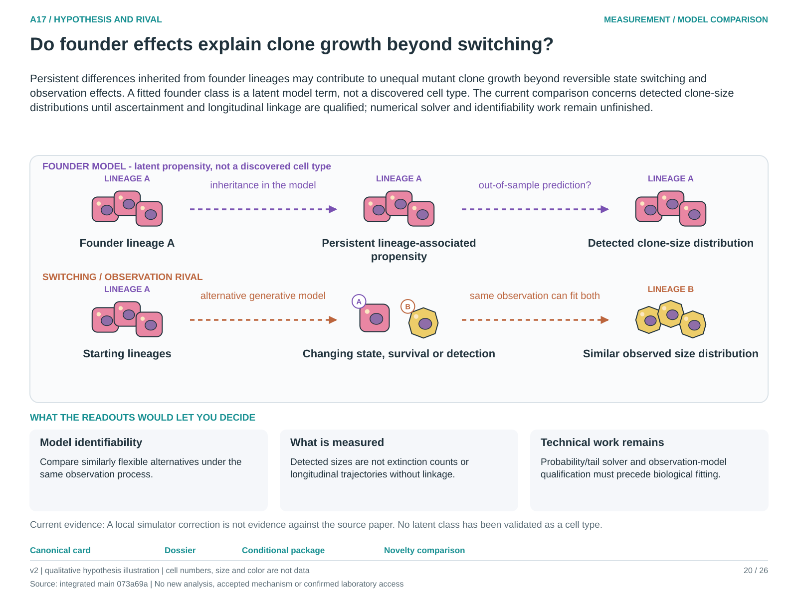

# A17: literature context and hypothesis schematic

Reviewed 3 October 2026. This note connects published findings to the current proposed question. It is a bounded synthesis, not novelty clearance or scientific acceptance.

## Published starting point

The source clonal experiments motivate models of growth heterogeneity and state change. A latent founder class is a model component, not an independently identified cell type.

| Primary source | Inspected locator and access record |
|---|---|
| [England 2025](https://doi.org/10.1016/j.stem.2025.01.011) | Clonal evidence and mutant-state plasticity; abstract/source audit. [Access / prior review](../review_2026-10-03/SOURCES.md#s08) |

Sources above reuse the named review unless the update ledger explicitly records a fresh inspection. Published-source evidence and reanalysis of the same material are not independent replication.

## Repository observation

Source accounting covers 58 rows and 11 source mice. The deposited slow-loss branch is unreachable in its current simulator implementation; the corrected stochastic model comparison remains unrun.

Exact current result locators:

- [Research Article/gate2_C2_england_2025/README.md](../../../Research%20Article/gate2_C2_england_2025/README.md)
- [docs/research_dossiers/followup_2026-10-03/NOVELTY.md](../followup_2026-10-03/NOVELTY.md)
- [docs/research_dossiers/continuation_2026-10-03/A17_MODEL_SPEC.md](../continuation_2026-10-03/A17_MODEL_SPEC.md)

## What this question could add

Compare persistent founder propensity against similarly flexible switching and observation models. Technical identifiability and solver qualification must come first; a local implementation correction is not a refutation of the paper.

## Current hypothesis and rival

Persistent differences inherited from founder lineages may contribute to unequal mutant clone growth beyond reversible state switching and observation effects. A fitted founder class is a latent model term, not a discovered cell type. The current comparison concerns detected clone-size distributions until ascertainment and longitudinal linkage are qualified; numerical solver and identifiability work remain unfinished.

**Strongest rival:** State switching, differential survival, clone merger or observation error accounts for apparent founder persistence.

## What the comparison would teach

A founder component that improves held-out prediction under comparably flexible switching/observation models supports that explanation only where identifiable. Equal adequacy or non-identifiability leaves the question unresolved. Unlinked size snapshots must not be called measured clone trajectories.

## Hypothesis schematic

[Editable hypothesis schematic](../schematics/A17_v2.svg). Original explanatory artwork. Dashed arrows denote the labelled proposal or rival; shapes, colours and cell counts are qualitative, not observations. The three readout cards explain which uncertainty a measurement could resolve. Missing features/endpoints remain marked.

A0–A23 artwork is preserved from the checked v2 atlas at source revision `073a69a758f25f988ecc18402477efa268c00927`. Its full hypothesis was compared with the current dossier. Later literature and scope context are supplied by this note.

## Next literature check

Planned query (not reported as newly executed): `alveolar mutant clone size founder heterogeneity switching observation model identifiability`. Expand to synonyms, nearest source references/citations and conflicting results using the [literature workflow](../../LITERATURE_WORKFLOW.md). Recheck the exact population, comparison, timing, unit and endpoint before making a stronger contribution claim.

**Current unresolved specification:** Competing model families have not been compared under common observations, biological units and held-out predictive criteria.

**Interpretation limit:** A fitted latent founder class is not a distinct biological cell type or a demonstrated molecular mechanism.

[Current dossier](../A17.md) · [All-question context index](README.md)
