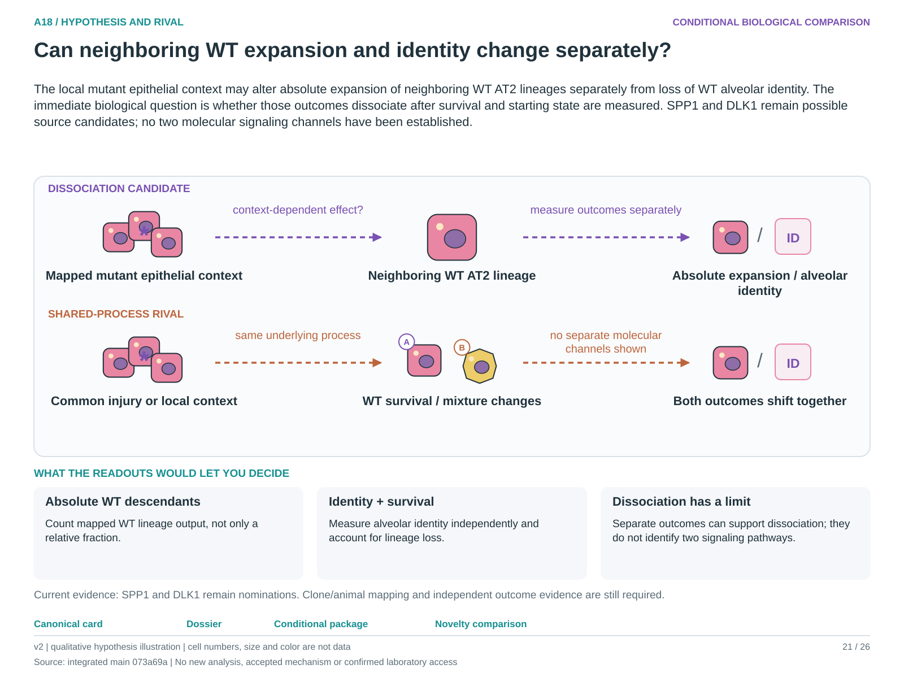

# A18: literature context and hypothesis schematic

Reviewed 3 October 2026. This note connects published findings to the current proposed question. It is a bounded synthesis, not novelty clearance or scientific acceptance.

## Published starting point

Mutant epithelial context can affect neighbouring wild-type cells. That motivates asking which wild-type consequences travel together and which can separate.

| Primary source | Inspected locator and access record |
|---|---|
| [England 2025](https://doi.org/10.1016/j.stem.2025.01.011) | Clonal evidence and mutant-state plasticity; abstract/source audit. [Access / prior review](../review_2026-10-03/SOURCES.md#s08) |

Sources above reuse the named review unless the update ledger explicitly records a fresh inspection. Published-source evidence and reanalysis of the same material are not independent replication.

## Repository observation

Source Figures 5–6 motivate both outcomes, but available pooled spatial data lack the mouse/clone identities required for the proposed independent-unit comparison. SPP1/DLK1 remain nominated interactions.

Exact current result locators:

- [Research Article/gate2_C2_england_2025/README.md](../../../Research%20Article/gate2_C2_england_2025/README.md)
- [docs/research_dossiers/followup_2026-10-03/NOVELTY.md](../followup_2026-10-03/NOVELTY.md)

## What this question could add

Measure absolute WT lineage expansion separately from qualified alveolar identity and loss. Dissociation could sharpen the biological question, while two measured outcomes alone do not identify two signalling mechanisms.

## Current hypothesis and rival

The local mutant epithelial context may alter absolute expansion of neighboring WT AT2 lineages separately from loss of WT alveolar identity. The immediate biological question is whether those outcomes dissociate after survival and starting state are measured. SPP1 and DLK1 remain possible source candidates; no two molecular signaling channels have been established.

**Strongest rival:** A single shared stress or compositional process changes both, or pooled sampling creates an apparent separation.

## What the comparison would teach

A context-dependent change in absolute WT descendants without corresponding identity loss, or the reverse, would support outcome dissociation. Coupled changes explained by survival or pooled lineage mixture would not. Measure lineage identity, absolute yield and survival separately within mapped animals.

## Hypothesis schematic

[Editable hypothesis schematic](../schematics/A18_v2.svg). Original explanatory artwork. Dashed arrows denote the labelled proposal or rival; shapes, colours and cell counts are qualitative, not observations. The three readout cards explain which uncertainty a measurement could resolve. Missing features/endpoints remain marked.

A0–A23 artwork is preserved from the checked v2 atlas at source revision `073a69a758f25f988ecc18402477efa268c00927`. Its full hypothesis was compared with the current dossier. Later literature and scope context are supplied by this note.

## Next literature check

Planned query (not reported as newly executed): `mutant alveolar neighbouring wild type expansion identity loss dissociation lineage`. Expand to synonyms, nearest source references/citations and conflicting results using the [literature workflow](../../LITERATURE_WORKFLOW.md). Recheck the exact population, comparison, timing, unit and endpoint before making a stronger contribution claim.

**Current unresolved specification:** The two WT outcomes have not been separated with identifiable biological units and compartment-specific causal evidence.

**Interpretation limit:** Co-localization and nominated SPP1/DLK1 interactions are not evidence of distinct causal pathways.

[Current dossier](../A18.md) · [All-question context index](README.md)
