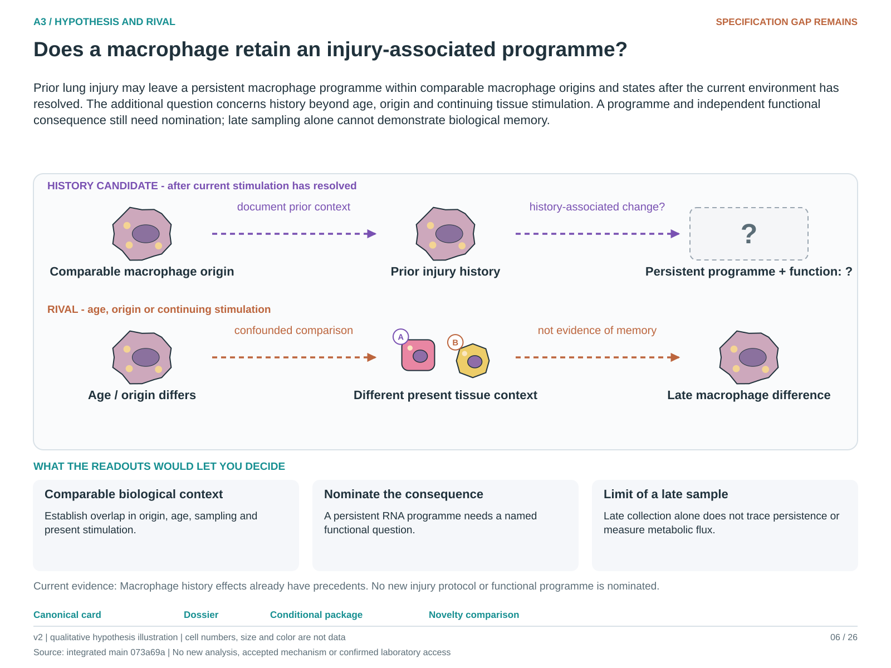

# A3: literature context and hypothesis schematic

Reviewed 3 October 2026. This note connects published findings to the current proposed question. It is a bounded synthesis, not novelty clearance or scientific acceptance.

## Published starting point

Origin and past tissue history already help explain macrophage behaviour. Normal ageing also supplies a reference alternative to an injury-specific interpretation.

| Primary source | Inspected locator and access record |
|---|---|
| [Aegerter 2020](https://www.nature.com/articles/s41590-019-0568-x) | Abstract and Figs. 5–7 headings; subscription limits. [Access / prior review](../review_2026-10-03/SOURCES.md#s11) |

Sources above reuse the named review unless the update ledger explicitly records a fresh inspection. Published-source evidence and reanalysis of the same material are not independent replication.

## Repository observation

W1 is a pseudobulk analysis, not a completed Compass flux analysis. Age and processing are confounded; the reference CAMERA analysis found no significant sets and the seven-gene ornithine set was ineligible.

Exact current result locators:

- [Research Article/gate1_01_niethamer_2025/README.md](../../../Research%20Article/gate1_01_niethamer_2025/README.md)
- [docs/research_dossiers/followup_2026-10-03/NOVELTY.md](../followup_2026-10-03/NOVELTY.md)
- [docs/research_dossiers/extensions_2026-10-03/A3_Nb5_age_reference.md](../extensions_2026-10-03/A3_Nb5_age_reference.md)

## What this question could add

A3 would ask whether a nominated programme and consequence remain associated with injury history at comparable origin, age and present context. The Nb5 normal-age extension informs the rival; it does not establish injury memory.

## Current hypothesis and rival

Prior lung injury may leave a persistent macrophage programme within comparable macrophage origins and states after the current environment has resolved. The additional question concerns history beyond age, origin and continuing tissue stimulation. A programme and independent functional consequence still need nomination; late sampling alone cannot demonstrate biological memory.

**Strongest rival:** The signal is normal aging, processing variation, altered macrophage mixture or continuing tissue stimulation.

## What the comparison would teach

A history-associated difference within supported age/origin/context comparisons could support persistence. Disappearance under those comparisons favors age, mixture or ongoing stimulation. Missing overlap cannot be repaired by covariate adjustment, and RNA does not measure metabolic flux.

## Hypothesis schematic

[Editable hypothesis schematic](../schematics/A3_v2.svg). Original explanatory artwork. Dashed arrows denote the labelled proposal or rival; shapes, colours and cell counts are qualitative, not observations. The three readout cards explain which uncertainty a measurement could resolve. Missing features/endpoints remain marked.

A0–A23 artwork is preserved from the checked v2 atlas at source revision `073a69a758f25f988ecc18402477efa268c00927`. Its full hypothesis was compared with the current dossier. Later literature and scope context are supplied by this note.

The newer [Nb5 normal-age reference](../extensions_2026-10-03/A3_Nb5_age_reference.md) develops the age rival already shown in the illustration; it is not an injury experiment.

## Next literature check

Planned query (not reported as newly executed): `alveolar macrophage injury history persistent function origin ageing matched context 2025 2026`. Expand to synonyms, nearest source references/citations and conflicting results using the [literature workflow](../../LITERATURE_WORKFLOW.md). Recheck the exact population, comparison, timing, unit and endpoint before making a stronger contribution claim.

**Current unresolved specification:** An age-matched, independently replicated comparison separating within-state changes from abundance and current environment is missing.

**Interpretation limit:** Neither a pathway score nor an ineligible metabolic gene set demonstrates flux or trained immunity.

[Current dossier](../A3.md) · [All-question context index](README.md)
