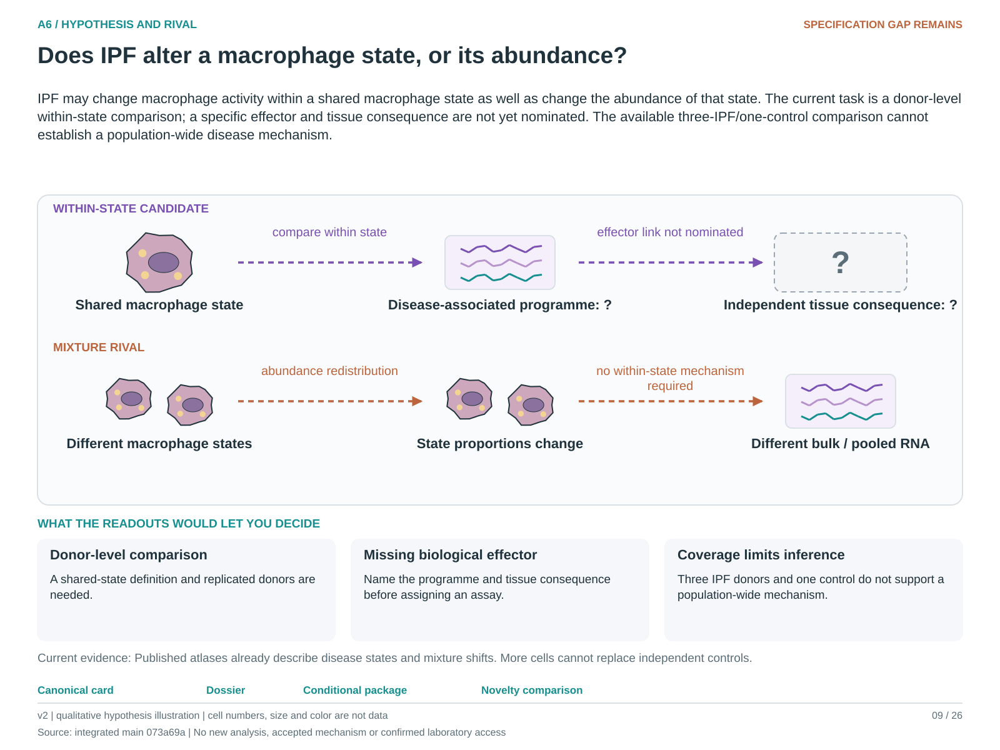

# A6: literature context and hypothesis schematic

Reviewed 3 October 2026. This note connects published findings to the current proposed question. It is a bounded synthesis, not novelty clearance or scientific acceptance.

## Published starting point

Human lung atlases already report disease-associated macrophage states and population redistribution. They make mixture a substantive biological rival, not merely a nuisance covariate.

| Primary source | Inspected locator and access record |
|---|---|
| [Sikkema 2023](https://www.nature.com/articles/s41591-023-02327-2) | Integrated healthy/disease cell-state comparison. [Access / prior review](../followup_2026-10-03/NOVELTY.md) |

Sources above reuse the named review unless the update ledger explicitly records a fresh inspection. Published-source evidence and reanalysis of the same material are not independent replication.

## Repository observation

The proliferating-state comparison has only three IPF donors and one control at its gate. Earlier owner reservations about this direction remain recorded; registration does not reverse them.

Exact current result locators:

- [Research Article/gate1_04_sikkema_2023_hlca/README.md](../../../Research%20Article/gate1_04_sikkema_2023_hlca/README.md)
- [docs/research_dossiers/followup_2026-10-03/NOVELTY.md](../followup_2026-10-03/NOVELTY.md)

## What this question could add

A reproducible change within a comparable state could narrow the effector question. An independent tissue consequence and nominated programme remain necessary before treating the comparison as a mechanism.

## Current hypothesis and rival

IPF may change macrophage activity within a shared macrophage state as well as change the abundance of that state. The current task is a donor-level within-state comparison; a specific effector and tissue consequence are not yet nominated. The available three-IPF/one-control comparison cannot establish a population-wide disease mechanism.

**Strongest rival:** Disease differences reflect mixture, sparse controls or state-definition shifts rather than altered activity of comparable macrophages.

## What the comparison would teach

A replicated within-state difference separate from abundance would support altered state activity. A difference explained by state mixture or one donor favors those rivals. More cells from the single control do not provide independent control replication.

## Hypothesis schematic

[Editable hypothesis schematic](../schematics/A6_v2.svg). Original explanatory artwork. Dashed arrows denote the labelled proposal or rival; shapes, colours and cell counts are qualitative, not observations. The three readout cards explain which uncertainty a measurement could resolve. Missing features/endpoints remain marked.

A0–A23 artwork is preserved from the checked v2 atlas at source revision `073a69a758f25f988ecc18402477efa268c00927`. Its full hypothesis was compared with the current dossier. Later literature and scope context are supplied by this note.

## Next literature check

Planned query (not reported as newly executed): `IPF macrophage within state effector function composition donor replication 2025 2026`. Expand to synonyms, nearest source references/citations and conflicting results using the [literature workflow](../../LITERATURE_WORKFLOW.md). Recheck the exact population, comparison, timing, unit and endpoint before making a stronger contribution claim.

**Current unresolved specification:** There is no adequately supported within-state effector and recipient consequence that warrants a broad mechanistic claim.

**Interpretation limit:** Cell count is not donor count, and within-state RNA difference is not an effector mechanism.

[Current dossier](../A6.md) · [All-question context index](README.md)
