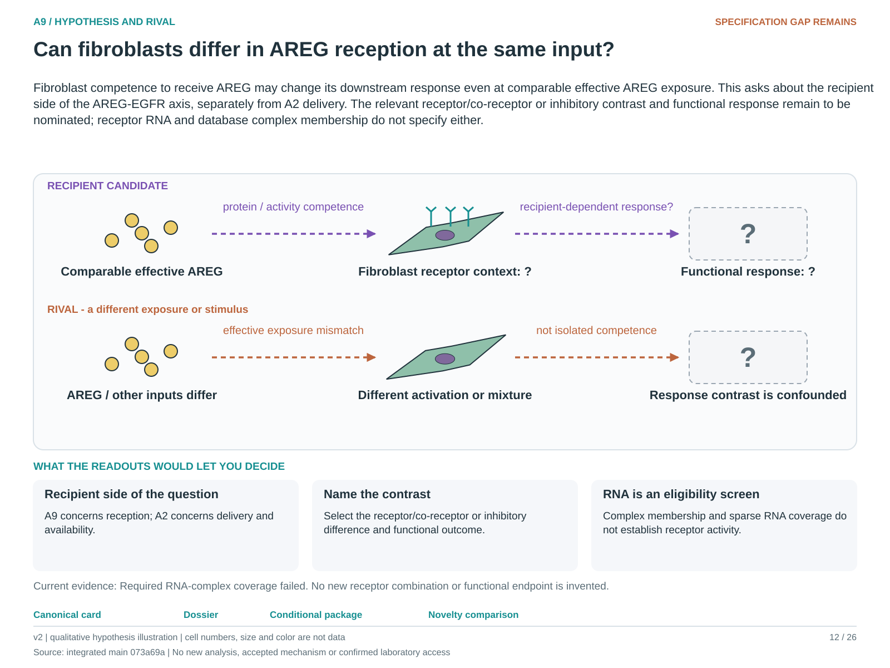

# A9: literature context and hypothesis schematic

Reviewed 3 October 2026. This note connects published findings to the current proposed question. It is a bounded synthesis, not novelty clearance or scientific acceptance.

## Published starting point

Known AREG/EGFR biology suggests a recipient-competence question as well as a supply question. The ligand correction in this repository restricts what its source scores mean.

| Primary source | Inspected locator and access record |
|---|---|
| [Cardoso 2026](https://www.nature.com/articles/s41586-026-10399-6) | Primary abstract, AREG/EGFR niche finding. [Access / prior review](../review_2026-10-03/SOURCES.md#s10) |
| [Kaiser 2023 (online 2022)](https://pmc.ncbi.nlm.nih.gov/articles/PMC9767680/) | Mesenchymal EGFR/AREG niche results; indexed text and primary record. [Access / prior review](../review_2026-10-03/SOURCES.md#s15) |

Sources above reuse the named review unless the update ledger explicitly records a fresh inspection. Published-source evidence and reanalysis of the same material are not independent replication.

## Repository observation

The primary resource/complex-coverage observation is in the corrected ligand report; the Nb3 screen is adjacent EGF/compartment context. EGFR_ERBB2 coverage was only 7 of 22 donors, below the specified 11-donor eligibility floor. This establishes neither receptor competence nor an EGFR homodimer mechanism.

Exact current result locators:

- [analysis/corrections/ligand/RESULTS.md](../../../analysis/corrections/ligand/RESULTS.md)
- [Research Article/gate2_N2_nabhan_2026/README.md](../../../Research%20Article/gate2_N2_nabhan_2026/README.md)
- [docs/research_dossiers/qualification_2026-10-03/RESULTS.md](../qualification_2026-10-03/RESULTS.md)
- [docs/research_dossiers/followup_2026-10-03/NOVELTY.md](../followup_2026-10-03/NOVELTY.md)
- [docs/research_dossiers/followup_2026-10-03/METADATA.md](../followup_2026-10-03/METADATA.md)

## What this question could add

A9 would compare a named recipient consequence at comparable effective input. This complements A2 delivery attribution; it does not rescue a score as proof of pathway engagement or invent a functional endpoint.

## Current hypothesis and rival

Fibroblast competence to receive AREG may change its downstream response even at comparable effective AREG exposure. This asks about the recipient side of the AREG-EGFR axis, separately from A2 delivery. The relevant receptor/co-receptor or inhibitory contrast and functional response remain to be nominated; receptor RNA and database complex membership do not specify either.

**Strongest rival:** Recipient differences arise from other ligands, general activation, different fibroblast mixtures or ligand exposure rather than receptor competence.

## What the comparison would teach

Protein/activity evidence and a receptor-dependent response at comparable input would support recipient competence. RNA-only association, differences in ligand availability or a response equally explained by other stimuli would not. Existing sparse complex coverage remains an eligibility hold.

## Hypothesis schematic

[Editable hypothesis schematic](../schematics/A9_v2.svg). Original explanatory artwork. Dashed arrows denote the labelled proposal or rival; shapes, colours and cell counts are qualitative, not observations. The three readout cards explain which uncertainty a measurement could resolve. Missing features/endpoints remain marked.

A0–A23 artwork is preserved from the checked v2 atlas at source revision `073a69a758f25f988ecc18402477efa268c00927`. Its full hypothesis was compared with the current dossier. Later literature and scope context are supplied by this note.

## Next literature check

Planned query (not reported as newly executed): `AREG EGFR fibroblast recipient competence matched effective ligand function`. Expand to synonyms, nearest source references/citations and conflicting results using the [literature workflow](../../LITERATURE_WORKFLOW.md). Recheck the exact population, comparison, timing, unit and endpoint before making a stronger contribution claim.

**Current unresolved specification:** Receptor-dependent response has not been separated from ligand availability, other growth factors or recipient-state composition.

**Interpretation limit:** Ligand-receptor resource membership establishes neither binding in the experiment nor pathway activity or functional response.

[Current dossier](../A9.md) · [All-question context index](README.md)
